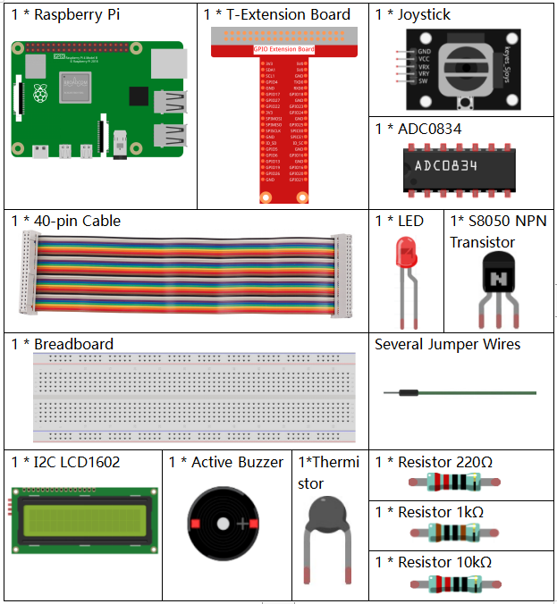
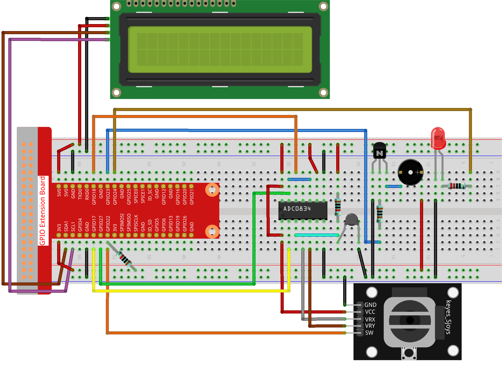

.. note::

    こんにちは、SunFounderのRaspberry Pi & Arduino & ESP32愛好家コミュニティへようこそ！Facebook上でRaspberry Pi、Arduino、ESP32についてもっと深く掘り下げ、他の愛好家と交流しましょう。

    **参加する理由は？**

    - **エキスパートサポート**：コミュニティやチームの助けを借りて、販売後の問題や技術的な課題を解決します。
    - **学び＆共有**：ヒントやチュートリアルを交換してスキルを向上させましょう。
    - **独占的なプレビュー**：新製品の発表や先行プレビューに早期アクセスしましょう。
    - **特別割引**：最新製品の独占割引をお楽しみください。
    - **祭りのプロモーションとギフト**：ギフトや祝日のプロモーションに参加しましょう。

    👉 私たちと一緒に探索し、創造する準備はできていますか？[|link_sf_facebook|]をクリックして今すぐ参加しましょう！

.. _3.1.8_py_pi5_monitor:

3.1.8 過熱モニター
================================

概要
-------------------

あなたは過熱監視デバイスを作成したいかもしれません。例えば、工場内で回路の過熱がある場合にアラームと機械の自動シャットダウンをしたい場合です。このプロジェクトでは、サーミスタ、ジョイスティック、ブザー、LED、およびLCDを使用して、しきい値が調整可能なスマートな温度監視デバイスを作成します。

必要なコンポーネント
------------------------------

このプロジェクトには、以下のコンポーネントが必要です。

回路図
--------------------------

.. image:: ../python_pi5/img/4.1.13_overheat_monitor_schematic.png
   :align: center

実験手順
-----------------------------

**ステップ 1:** 回路を組み立てます。

**ステップ 2:** コードのフォルダに移動します。

.. raw:: html

   <run></run>

.. code-block:: 

    cd ~/raphael-kit/python-pi5

**ステップ 3:** 実行可能ファイルを実行します。

.. raw:: html

   <run></run>

.. code-block:: 

    sudo python3 3.1.8_OverheatMonitor_zero.py

コードが実行されると、現在の温度と高温閾値 **40** が **I2C LCD1602** に表示されます。現在の温度が閾値を超える場合、ブザーとLEDがアラームを鳴らします。

ここでの **ジョイスティック** は、高温閾値を調整するためのボタンです。 **ジョイスティック** をX軸およびY軸の方向に切り替えると（上下に動かすと）現在の高温閾値を調整できます。 **ジョイスティック** をもう一度押すと、閾値が初期値にリセットされます。

.. note::

    * エラーが発生した場合、 ``FileNotFoundError: [Errno 2] No such file or directory: '/dev/i2c-1'`` 、I2Cを有効にするために :ref:`i2c_config` を参照してください。
    * ``ModuleNotFoundError: No module named 'smbus2'`` エラーが発生した場合は、 ``sudo pip3 install smbus2`` を実行してください。
    * エラー ``OSError: [Errno 121] Remote I/O error`` が表示された場合、モジュールが誤って配線されているか、モジュールが壊れていることを意味します。
    * コードと配線が正常であるにもかかわらず、LCDにコンテンツが表示されない場合、裏側のポテンショメーターを回してコントラストを調整できます。

**コード**

.. note::
    以下のコードを **修正/リセット/コピー/実行/停止** できます。ただし、それより前に、 ``raphael-kit/python`` のようなソースコードのパスに移動する必要があります。コードを修正した後、効果を確認するために直接実行できます。

.. raw:: html

    <run></run>

.. code-block:: python

   #!/usr/bin/env python3

   import LCD1602
   from gpiozero import LED, Buzzer, Button
   import ADC0834
   import time
   import math

   # ジョイスティックボタン、ブザー、LEDの初期化
   Joy_BtnPin = Button(22)
   buzzPin = Buzzer(23)
   ledPin = LED(24)

   # 初期の高温閾値を設定
   upperTem = 40

   # ADCとLCDモジュールのセットアップ
   ADC0834.setup()
   LCD1602.init(0x27, 1)

   def get_joystick_value():
       """
       ジョイスティックの値を読み取り、ジョイスティックの位置に基づいて変更値を返します。
       """
       x_val = ADC0834.getResult(1)
       y_val = ADC0834.getResult(2)
       if x_val > 200:
           return 1
       elif x_val < 50:
           return -1
       elif y_val > 200:
           return -10
       elif y_val < 50:
           return 10
       else:
           return 0

   def upper_tem_setting():
       """
       ジョイスティックの入力を使用して高温閾値を調整し、LCDに表示します。
       """
       global upperTem
       LCD1602.write(0, 0, '上限調整: ')
       change = int(get_joystick_value())
       upperTem += change
       strUpperTem = str(upperTem)
       LCD1602.write(0, 1, strUpperTem)
       LCD1602.write(len(strUpperTem), 1, '              ')
       time.sleep(0.1)

   def temperature():
       """
       センサーから現在の温度を読み取り、摂氏で返します。
       """
       analogVal = ADC0834.getResult()
       Vr = 5 * float(analogVal) / 255
       Rt = 10000 * Vr / (5 - Vr)
       temp = 1 / (((math.log(Rt / 10000)) / 3950) + (1 / (273.15 + 25)))
       Cel = temp - 273.15
       return round(Cel, 2)

   def monitoring_temp():
       """
       現在の温度と上限温度閾値を監視および表示します。温度が上限を超える場合、ブザーとLEDが作動します。
       """
       global upperTem
       Cel = temperature()
       LCD1602.write(0, 0, '温度: ')
       LCD1602.write(0, 1, '上限: ')
       LCD1602.write(6, 0, str(Cel))
       LCD1602.write(7, 1, str(upperTem))
       time.sleep(0.1)
       if Cel >= upperTem:
           buzzPin.on()
           ledPin.on()
       else:
           buzzPin.off()
           ledPin.off()

   # メイン実行ループ
   try:
       lastState = 1
       stage = 0
       while True:
           currentState = Joy_BtnPin.value
           # 設定モードと監視モードを切り替えます
           if currentState == 1 and lastState == 0:
               stage = (stage + 1) % 2
               time.sleep(0.1)
               LCD1602.clear()
           lastState = currentState
           if stage == 1:
               upper_tem_setting()
           else:
               monitoring_temp()
   except KeyboardInterrupt:
       # クリーンアップして終了
       LCD1602.clear()
       ADC0834.destroy()

**代码解释**

#. このセクションでは、プロジェクトに必要なライブラリをインポートします。 ``LCD1602`` はLCDディスプレイ用、 ``gpiozero`` はLED、ブザー、およびボタン用のクラスを提供します。 ``ADC0834`` はアナログデジタル変換用で、 ``time`` および ``math`` は時間関連の関数と数学操作のためのPython標準ライブラリです。

   .. code-block:: python

       #!/usr/bin/env python3

       import LCD1602
       from gpiozero import LED, Buzzer, Button
       import ADC0834
       import time
       import math

#. ここで、ジョイスティックのボタン、ブザー、LEDを初期化します。 ``Button(22)`` はGPIOピン22に接続されたボタンオブジェクトを作成します。 ``Buzzer(23)`` と ``LED(24)`` はそれぞれGPIOピン23と24にブザーとLEDを初期化します。

   .. code-block:: python

       # ジョイスティックボタン、ブザー、LEDの初期化
       Joy_BtnPin = Button(22)
       buzzPin = Buzzer(23)
       ledPin = LED(24)

#. 初期の上限温度を設定し、ADCとLCDモジュールを初期化します。LCDはアドレス（ ``0x27`` ）とモード（ ``1`` ）で初期化されます。

   .. code-block:: python

       # 初期の上限温度閾値を設定
       upperTem = 40

       # ADCとLCDモジュールのセットアップ
       ADC0834.setup()
       LCD1602.init(0x27, 1)

#. この関数はジョイスティックのXとYの値をADC0834を使用して読み取り、ジョイスティックの位置に基づいて変更値を返します。この変更値は温度の閾値を調整するために使用されます。

   .. code-block:: python

       def get_joystick_value():
           """
           ジョイスティックの値を読み取り、ジョイスティックの位置に基づいて変更値を返します。
           """
           x_val = ADC0834.getResult(1)
           y_val = ADC0834.getResult(2)
           if x_val > 200:
               return 1
           elif x_val < 50:
               return -1
           elif y_val > 200:
               return -10
           elif y_val < 50:
               return 10
           else:
               return 0

#. ジョイスティックの入力を使用して上限温度を調整し、新しい閾値をLCDに表示します。

   .. code-block:: python

       def upper_tem_setting():
           """
           ジョイスティックの入力を使用して上限温度閾値を調整し、LCDに表示します。
           """
           global upperTem
           LCD1602.write(0, 0, '上限調整: ')
           change = int(get_joystick_value())
           upperTem += change
           strUpperTem = str(upperTem)
           LCD1602.write(0, 1, strUpperTem)
           LCD1602.write(len(strUpperTem), 1, '              ')
           time.sleep(0.1)

#. センサーから現在の温度を読み取り、摂氏に変換します。

   .. code-block:: python

       def temperature():
           """
           センサーから現在の温度を読み取り、摂氏で返します。
           """
           analogVal = ADC0834.getResult()
           Vr = 5 * float(analogVal) / 255
           Rt = 10000 * Vr / (5 - Vr)
           temp = 1 / (((math.log(Rt / 10000)) / 3950) + (1 / (273.15 + 25)))
           Cel = temp - 273.15
           return round(Cel, 2)

#. 現在の温度と上限温度閾値を監視し、LCDに表示します。温度が上限を超える場合、ブザーとLEDが作動します。

   .. code-block:: python

       def monitoring_temp():
           """
           現在の温度と上限温度閾値を監視し、LCDに表示します。温度が上限を超える場合、ブザーとLEDが作動します。
           """
           global upperTem
           Cel = temperature()
           LCD1602.write(0, 0, '温度: ')
           LCD1602.write(0, 1, '上限: ')
           LCD1602.write(6, 0, str(Cel))
           LCD1602.write(7, 1, str(upperTem))
           time.sleep(0.1)
           if Cel >= upperTem:
               buzzPin.on()
               ledPin.on()
           else:
               buzzPin.off()
               ledPin.off()

#. メイン実行ループはジョイスティックボタンの押下に基づいて設定モードと監視モードを切り替えます。設定または温度の監視を継続的に更新します。

   .. code-block:: python

       # メイン実行ループ
       try:
           lastState = 1
           stage = 0
           while True:
               currentState = Joy_BtnPin.value
               # 設定モードと監視モードを切り替える
               if currentState == 1 and lastState == 0:
                   stage = (stage + 1) % 2
                   time.sleep(0.1)
                   LCD1602.clear()
               lastState = currentState
               if stage == 1:
                   upper_tem_setting()
               else:
                   monitoring_temp()
       except KeyboardInterrupt:
           # クリーンアップして終了
           LCD1602.clear()
           ADC0834.destroy()
