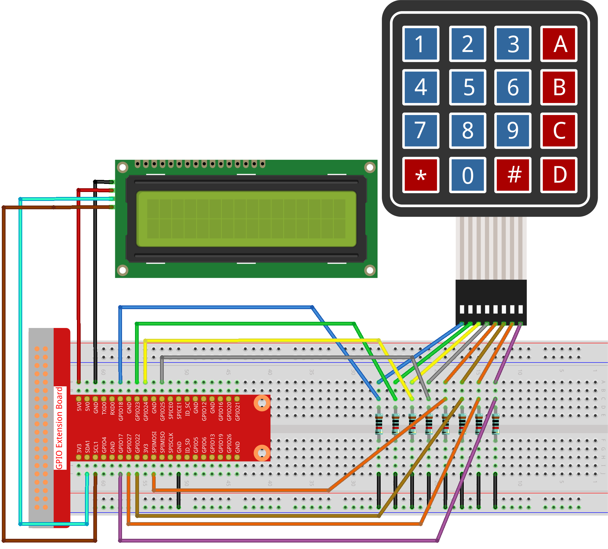

.. _py_pi5_password_lock:

3.1.9 パスワードロック
================================

はじめに
-------------

このプロジェクトでは、キーパッドとLCDを使用して組み合わせ錠を作成します。LCDには、キーパッドにパスワードを入力するための対応するプロンプトが表示されます。パスワードが正しく入力されると、「正しい」と表示されます。

このプロジェクトを基に、ブザーやLEDなどの追加の電子コンポーネントを追加して、パスワードの入力に異なる実験現象を追加することができます。

必要な部品
------------------------------

このプロジェクトでは、次の部品が必要です。

.. image:: ../python_pi5/img/4.1.14_password_lock_list.png
    :width: 800
    :align: center

回路図
------------------

============ ======== ======== ===
T-Board Name physical wiringPi BCM
GPIO18       Pin 12   1        18
GPIO23       Pin 16   4        23
GPIO24       Pin 18   5        24
GPIO25       Pin 22   6        25
GPIO17       Pin 11   0        17
GPIO27       Pin 13   2        27
GPIO22       Pin 15   3        22
SPIMOSI      Pin 19   12       10
SDA1         Pin 3             
SCL1         Pin 5             
============ ======== ======== ===

.. image:: ../python_pi5/img/4.1.14_password_lock_schematic.png
   :align: center

実験手順
-------------------------

**ステップ1：** 回路を組み立てます。

**ステップ2：** ディレクトリを変更します。

.. raw:: html

   <run></run>

.. code-block:: 

    cd ~/raphael-kit/python-pi5

**ステップ3：** 実行します。

.. raw:: html

   <run></run>

.. code-block:: 

    sudo python3 3.1.9_PasswordLock_zero.py

コードが実行されると、キーパッドを使用してパスワード（1984）を入力します。LCD1602に「CORRECT」が表示された場合、パスワードは正しいです。それ以外の場合、「WRONG KEY」が表示されます。

.. note::

    * 「FileNotFoundError: [Errno 2] No such file or directory: '/dev/i2c-1'」というエラーが表示される場合は、I2Cを有効にするために :ref:`i2c_config` を参照してください。
    * 「ModuleNotFoundError: No module named 'smbus2'」エラーが表示される場合は、「sudo pip3 install smbus2」を実行してください。
    * エラー「OSError: [Errno 121] Remote I/O error」が表示される場合、モジュールが配線されていないか、モジュールが壊れていることを意味します。
    * コードと配線が正常であるが、LCDに内容が表示されない場合、背面のポテンショメータを回してコントラストを上げることができます。

**コード**

.. note::
    以下のコードを **変更/リセット/コピー/実行/停止** することができます。ただし、それを行う前に ``raphael-kit/python-pi5`` のようなソースコードパスに移動する必要があります。コードを変更した後、それを直接実行して効果を確認できます。

.. raw:: html

    <run></run>

.. code-block:: python

   #!/usr/bin/env python3

   from gpiozero import DigitalOutputDevice, Button
   from time import sleep
   import LCD1602

   class Keypad:
       def __init__(self, rows_pins, cols_pins, keys):
           """
           指定された行と列のピンおよびキーでキーパッドを初期化します。
           :param rows_pins: 行のGPIOピンのリスト。
           :param cols_pins: 列のGPIOピンのリスト。
           :param keys: キーパッドのレイアウト内のキーのリスト。
           """
           self.rows = [DigitalOutputDevice(pin) for pin in rows_pins]  # 行ピンの設定
           self.cols = [Button(pin, pull_up=False) for pin in cols_pins]  # 列ピンの設定
           self.keys = keys  # キーパッドのキーレイアウト

       def read(self):
           """
           現在押されているキーのリストを読み取り、返します。
           :return: 押されているキーのリスト。
           """
           pressed_keys = []
           for i, row in enumerate(self.rows):
               row.on()  # 現在の行をアクティブにする
               for j, col in enumerate(self.cols):
                   if col.is_pressed:
                       index = i * len(self.cols) + j
                       pressed_keys.append(self.keys[index])
               row.off()  # チェック後に行を非アクティブにする
           return pressed_keys

   # パスワードの検証設定
   LENS = 4
   password = ['1', '9', '8', '4']  # プリセットのパスワード
   testword = ['0', '0', '0', '0']  # ユーザーの入力を格納
   keyIndex = 0  # 入力キーのインデックス

   def check():
       """
       入力されたパスワードがプリセットのパスワードと一致するか確認します。
       :return: 一致する場合は1、それ以外の場合は0。
       """
       for i in range(LENS):
           if password[i] != testword[i]:
               return 0
       return 1

   def setup():
       """
       キーパッドとLCDディスプレイのセットアップを行います。
       """
       global keypad, last_key_pressed
       # キーパッドのピン設定
       rows_pins = [18, 23, 24, 25]
       cols_pins = [10, 22, 27, 17]
       keys = ["1", "2", "3", "A",
               "4", "5", "6", "B",
               "7", "8", "9", "C",
               "*", "0", "#", "D"]

       # キーパッドとLCDの初期化
       keypad = Keypad(rows_pins, cols_pins, keys)
       last_key_pressed = []
       LCD1602.init(0x27, 1)  # LCDの初期化
       LCD1602.clear()
       LCD1602.write(0, 0, 'WELCOME!')
       LCD1602.write(2, 1, 'パスワードを入力してください')
       sleep(2)

   def loop():
       """
       キーパッドの入力とパスワードの検証を処理するメインループです。
       """
       global keyIndex, LENS, keypad, last_key_pressed
       while True:
           pressed_keys = keypad.read()
           if pressed_keys and pressed_keys != last_key_pressed:
               if keyIndex < LENS:
                   LCD1602.clear()
                   LCD1602.write(0, 0, "パスワードを入力:")
                   LCD1602.write(15 - keyIndex, 1, pressed_keys[0])
                   testword[keyIndex] = pressed_keys[0]
                   keyIndex += 1

               if keyIndex == LENS:
                   if check() == 0:
                       LCD1602.clear()
                       LCD1602.write(3, 0, "WRONG KEY!")
                       LCD1602.write(0, 1, "もう一度お試しください")
                   else:
                       LCD1602.clear()
                       LCD1602.write(4, 0, "CORRECT!")
                       LCD1602.write(2, 1, "お帰りなさい")
                   keyIndex = 0  # チェック後にキーインデックスをリセット

           last_key_pressed = pressed_keys
           sleep(0.1)

   try:
       setup()
       loop()
   except KeyboardInterrupt:
       LCD1602.clear()  # インタラクト時にLCD表示をクリア

**コードの説明**

#. スクリプトはgpiozeroライブラリからデジタル出力デバイスとボタンの管理クラスをインポートします。また、timeモジュールからsleep関数をインポートし、スクリプトの実行中に遅延を追加します。さらに、LCD1602ライブラリもインポートして、LCD1602ディスプレイを制御します。

   .. code-block:: python

       #!/usr/bin/env python3
       from gpiozero import DigitalOutputDevice, Button
       from time import sleep
       import LCD1602

#. キーパッドを管理するためのカスタムクラスを定義します。指定された行と列のピンでキーパッドを初期化し、押されたキーを検出する ``read`` メソッドを提供します。

   .. code-block:: python

       class Keypad:
           def __init__(self, rows_pins, cols_pins, keys):
               """
               指定された行と列のピンおよびキーでキーパッドを初期化します。
               :param rows_pins: 行のGPIOピンのリスト。
               :param cols_pins: 列のGPIOピンのリスト。
               :param keys: キーパッドのレイアウト内のキーのリスト。
               """
               self.rows = [DigitalOutputDevice(pin) for pin in rows_pins]  # 行ピンの設定
               self.cols = [Button(pin, pull_up=False) for pin in cols_pins]  # 列ピンの設定
               self.keys = keys  # キーパッドのキーレイアウト

           def read(self):
               """
               現在押されているキーのリストを読み取り、返します。
               :return: 押されているキーのリスト。
               """
               pressed_keys = []
               for i, row in enumerate(self.rows):
                   row.on()  # 現在の行をアクティブにする
                   for j, col in enumerate(self.cols):
                       if col.is_pressed:
                           index = i * len(self.cols) + j
                           pressed_keys.append(self.keys[index])
                   row.off()  # チェック後に行を非アクティブにする
               return pressed_keys

#. パスワードの検証システムをセットアップします。 ``LENS`` はパスワードの長さを定義します。 ``password`` はプリセットの正しいパスワードで、 ``testword`` はユーザーの入力を保存するために使用されます。 ``keyIndex`` はユーザーの入力の現在位置を追跡します。

   .. code-block:: python

       # パスワードの検証設定
       LENS = 4
       password = ['1', '9', '8', '4']  # プリセットのパスワード
       testword = ['0', '0', '0', '0']  # ユーザーの入力を格納
       keyIndex = 0  # 入力キーのインデックス

#. 入力されたパスワード（``testword``）とプリセットのパスワード（``password``）を比較し、結果を返す関数。

   .. code-block:: python

       def check():
           """
           入力されたパスワードがプリセットのパスワードと一致するか確認します。
           :return: 一致する場合は1、それ以外の場合は0。
           """
           for i in range(LENS):
               if password[i] != testword[i]:
                   return 0
           return 1

#. キーパッドとLCDディスプレイの初期化を行います。歓迎メッセージとパスワード入力の指示を表示します。

   .. code-block:: python

       def setup():
           """
           キーパッドとLCDディスプレイのセットアップを行います。
           """
           global keypad, last_key_pressed
           # キーパッドのピン設定
           rows_pins = [18, 23, 24, 25]
           cols_pins = [10, 22, 27, 17]
           keys = ["1", "2", "3", "A",
                   "4", "5", "6", "B",
                   "7", "8", "9", "C",
                   "*", "0", "#", "D"]

           # キーパッドとLCDの初期化
           keypad = Keypad(rows_pins, cols_pins, keys)
           last_key_pressed = []
           LCD1602.init(0x27, 1)  # LCDの初期化
           LCD1602.clear()
           LCD1602.write(0, 0, 'WELCOME!')
           LCD1602.write(2, 1, 'パスワードを入力してください')
           sleep(2)

#. キーパッド入力とパスワードの検証を処理するメインループです。入力されたパスワードに基づいてLCDディスプレイを更新し、パスワードが正しいかどうかに応じてフィードバックを提供します。

   .. code-block:: python

       def loop():
           """
           キーパッドの入力とパスワードの検証を処理するメインループです。
           """
           global keyIndex, LENS, keypad, last_key_pressed
           while True:
               pressed_keys = keypad.read()
               if pressed_keys and pressed_keys != last_key_pressed:
                   if keyIndex < LENS:
                       LCD1602.clear()
                       LCD1602.write(0, 0, "パスワードを入力:")
                       LCD1602.write(15 - keyIndex, 1, pressed_keys[0])
                       testword[keyIndex] = pressed_keys[0]
                       keyIndex += 1

                   if keyIndex == LENS:
                       if check() == 0:
                           LCD1602.clear()
                           LCD1602.write(3, 0, "WRONG KEY!")
                           LCD1602.write(0, 1, "もう一度お試しください")
                       else:
                           LCD1602.clear()
                           LCD1602.write(4, 0, "CORRECT!")
                           LCD1602.write(2, 1, "お帰りなさい")
                       keyIndex = 0  # チェック後にキーインデックスをリセット

               last_key_pressed = pressed_keys
               sleep(0.1)

#. セットアップを実行し、メインループに入ります。キーボード割り込み（Ctrl+C）を使用してプログラムをクリーンに終了させることができます。LCD表示をクリアします。

   .. code-block:: python

       try:
           setup()
           loop()
       except KeyboardInterrupt:
           LCD1602.clear()  # インタラクト時にLCD表示をクリア
