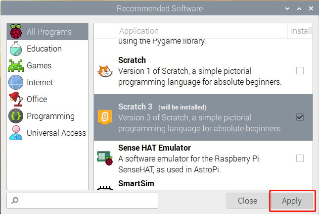
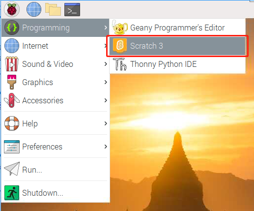
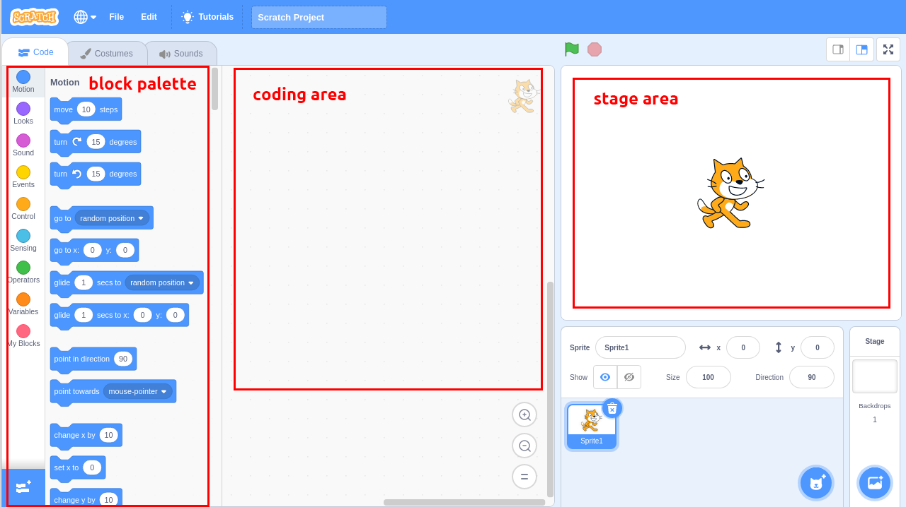
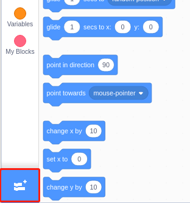
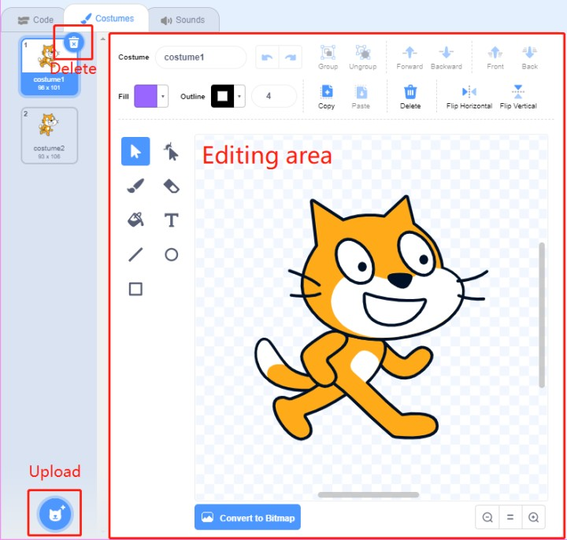
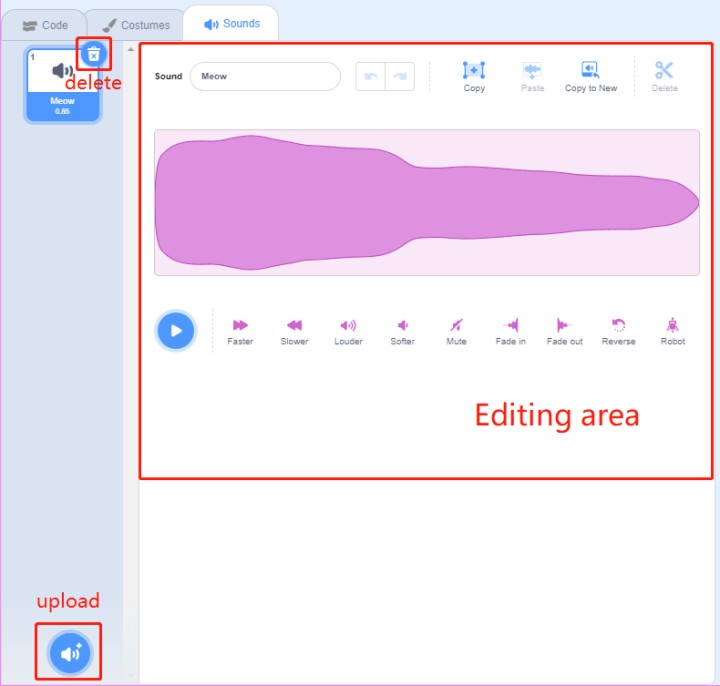

.. note::

    Bonjour et bienvenue dans la communauté des passionnés de Raspberry Pi, Arduino et ESP32 de SunFounder sur Facebook ! Plongez plus profondément dans l'univers du Raspberry Pi, d'Arduino et de l'ESP32 avec d'autres passionnés.

    **Pourquoi nous rejoindre ?**

    - **Support d'experts** : Résolvez les problèmes après-vente et surmontez les défis techniques avec l'aide de notre communauté et de notre équipe.
    - **Apprendre & Partager** : Échangez des conseils et des tutoriels pour améliorer vos compétences.
    - **Aperçus exclusifs** : Bénéficiez d'un accès anticipé aux annonces de nouveaux produits et de présentations en avant-première.
    - **Réductions spéciales** : Profitez de réductions exclusives sur nos produits les plus récents.
    - **Promotions festives et cadeaux** : Participez à des concours et à des promotions spéciales à l'occasion des fêtes.

    👉 Prêt à explorer et à créer avec nous ? Cliquez sur [|link_sf_facebook|] et rejoignez-nous dès aujourd'hui !

Guide rapide sur Scratch
============================

.. note::

    Lors de la programmation avec Scratch 3, il est recommandé d'utiliser un écran pour une meilleure expérience. Bien sûr, si vous n'avez pas d'écran, vous pouvez utiliser **VNC** pour accéder au bureau du Raspberry Pi à distance. Pour un tutoriel détaillé, veuillez vous référer à :ref:`VNC`.

De plus, Scratch 3 nécessite au moins 1 Go de RAM pour fonctionner, et nous recommandons un Raspberry Pi 4 avec au moins 2 Go de RAM. Bien que vous puissiez exécuter Scratch 3 sur un Raspberry Pi 2, 3, 3B+ ou un Raspberry Pi 4 avec 1 Go de RAM, les performances sur ces modèles seront réduites et, selon le nombre de logiciels exécutés simultanément, Scratch 3 pourrait ne pas se lancer par manque de mémoire.

Installation de Scratch 3
----------------------------
Lors de l'installation de Raspberry Pi OS (:ref:`install_os`), vous devez choisir la version avec un bureau, soit uniquement avec le bureau, soit avec le bureau et les logiciels recommandés.

Si vous installez la version avec les logiciels recommandés, vous trouverez Scratch 3 dans le menu du système sous **Programmation**.

Si vous avez installé uniquement la version de bureau, vous devrez installer Scratch 3 manuellement, comme décrit ci-dessous.

Ouvrez le menu, cliquez sur **Préférences** -> **Logiciels recommandés**.

.. image:: img/quick_scratch1.png

Trouvez Scratch 3 et cochez-le, puis cliquez sur **Appliquer** et attendez la fin de l'installation.

Une fois l'installation terminée, vous devriez le voir sous **Programmation** dans le menu du système.

À propos de l'interface de Scratch 3
----------------------------------------

Scratch 3 est conçu pour être amusant, éducatif et facile à apprendre. Il dispose d'outils pour créer des histoires interactives, des jeux, des œuvres d'art, des simulations et bien plus encore, en utilisant une programmation basée sur des blocs. Scratch inclut également son propre éditeur de peinture et éditeur de sons intégrés.

Le haut de l'interface de Scratch 3 propose quelques options de base. La première, de gauche à droite, est l'option de langue, vous permettant de choisir différentes langues pour la programmation. La deuxième est l'option **Fichier**, qui permet de créer de nouveaux fichiers, de lire des fichiers locaux et de sauvegarder les fichiers en cours. La troisième est l'option **Édition**, qui permet de reprendre certaines opérations de suppression et d'activer le mode accélération (où le mouvement des sprites devient particulièrement rapide). La quatrième est l'option **Tutoriels**, qui vous permet de visionner des tutoriels pour certains projets. La cinquième est l'option de nommage de fichier, où vous pouvez renommer le projet.

.. image:: img/quick_scratch13.png

**Code**

Il est divisé en trois sections principales : une zone de scène, une palette de blocs et une zone de codage. Programmez en cliquant et en faisant glisser les blocs de la palette de blocs vers la zone de codage, et enfin, vos résultats de programmation seront affichés sur la zone de scène.

Voici la zone des sprites de Scratch 3. Au-dessus de cette zone se trouvent les paramètres de base des sprites. Vous pouvez ajouter des sprites fournis par Scratch 3 ou télécharger des sprites locaux.

.. image:: img/quick_scratch5.png

Voici la zone de décors de Scratch 3, principalement utilisée pour ajouter un fond approprié à votre scène. Vous pouvez ajouter les décors fournis par Scratch 3 ou télécharger des décors locaux.

.. image:: img/quick_scratch6.png

Voici le bouton **Ajouter une extension**.

Dans Scratch 3, nous pouvons ajouter toutes sortes d'extensions utiles. Prenons par exemple **Détection de mouvement vidéo** et cliquez dessus.

.. image:: img/quick_scratch8.png

Vous verrez cette extension dans la palette de blocs et vous pourrez utiliser les fonctions associées à cette extension. Si vous avez une caméra connectée, vous verrez l'affichage de la caméra dans la zone de scène.

.. image:: img/quick_scratch9.png

**Costumes**

Cliquez sur l'option **Costumes** dans le coin supérieur gauche pour accéder à la palette de costumes. Différents costumes permettent aux sprites d'avoir différentes animations statiques, et lorsque ces animations sont assemblées, elles forment un mouvement dynamique cohérent.

**Sons**

Vous pourriez avoir besoin d'utiliser des clips musicaux pour rendre vos projets plus intéressants. Cliquez sur l'option **Sons** dans le coin supérieur gauche pour éditer le son actuel ou sélectionner/télécharger un nouveau son.

