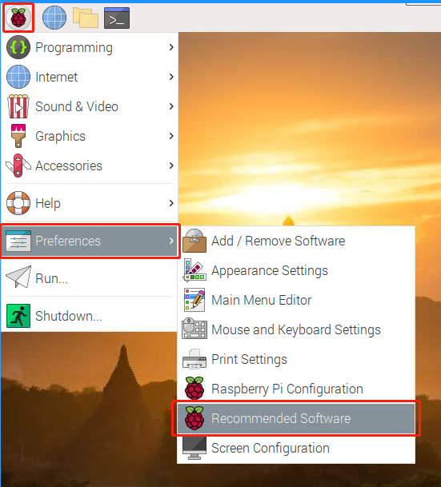
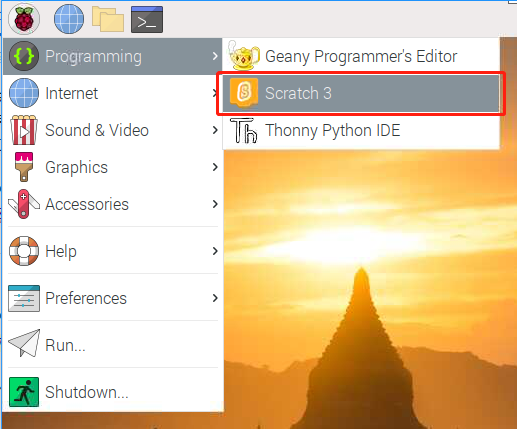
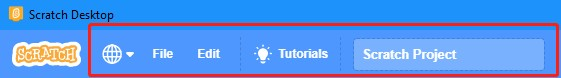
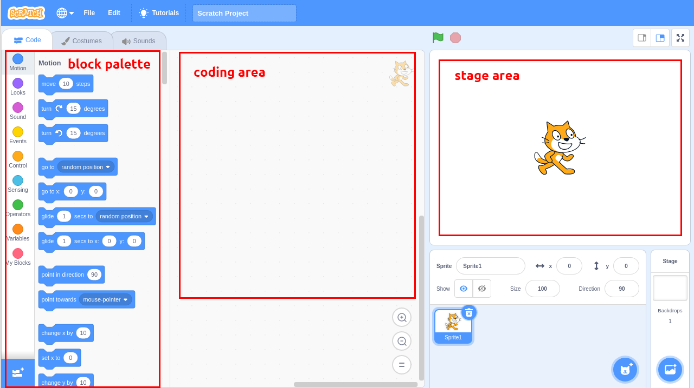
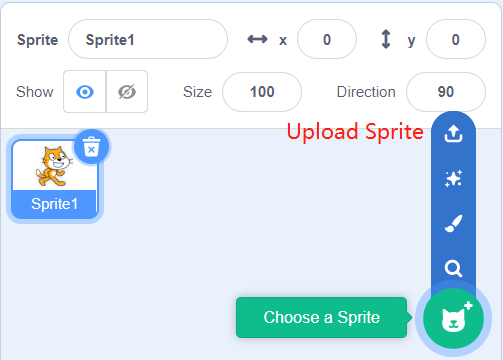
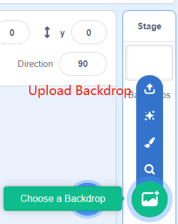
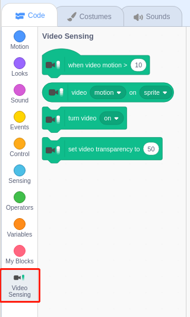
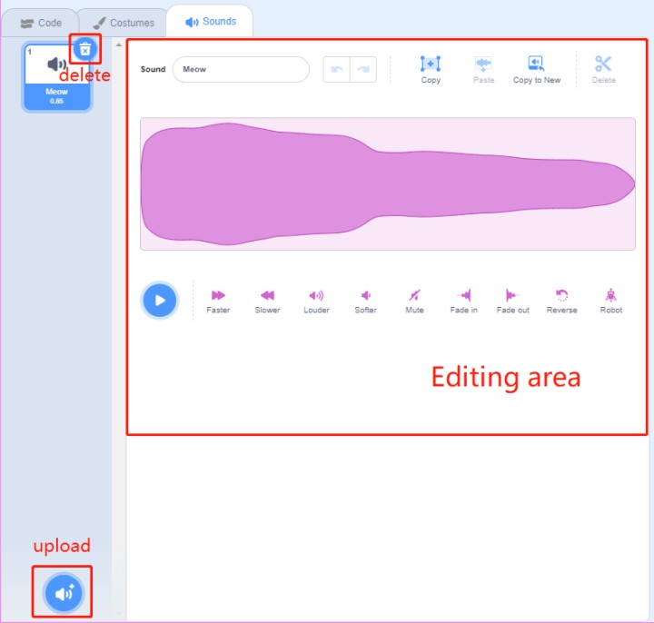

Kurzanleitung zu Scratch
==========================

.. note::

    Wenn Sie mit Scratch 3 programmieren, benötigen Sie möglicherweise einen Bildschirm, um eine bessere Erfahrung zu machen. Wenn Sie keinen Bildschirm haben, können Sie natürlich auch VNC verwenden, um aus der Ferne auf den Raspberry Pi-Desktop zuzugreifen; eine detaillierte Anleitung finden Sie unter :ref:`VNC`.

Darüber hinaus benötigt Scratch 3 mindestens 1 GB RAM, und wir empfehlen einen Raspberry Pi 4 mit mindestens 2 GB RAM. Sie können Scratch 3 zwar auf einem Raspberry Pi 2, 3, 3B+ oder einem Raspberry 4 mit 1 GB RAM ausführen, aber die Leistung ist bei diesen Modellen reduziert und je nachdem, welche andere Software Sie gleichzeitig ausführen, kann Scratch 3 aufgrund von Speichermangel nicht starten.

Scratch 3 installieren
---------------------------
Bei der Installation von Raspberry Pi OS (:ref:`install_os`)müssen Sie die Version mit Desktop auswählen, entweder nur mit Desktop oder mit Desktop und empfohlener Software.

Wenn Sie die Version mit der empfohlenen Software installieren, können Sie Scratch 3 im Systemmenü unter **Programming** sehen.

Wenn Sie die reine Desktop-Version installiert haben, müssen Sie Scratch 3 manuell installieren, wie unten beschrieben.

Öffnen Sie das Menü und klicken Sie auf **Preferences** -> **Recommended Software**.

Suchen Sie Scratch 3 und markieren Sie es, klicken Sie dann auf **Apply** und warten Sie schließlich, bis die Installation abgeschlossen ist.

.. image:: media/quick_scratch2.png

Sobald die Installation abgeschlossen ist, sollten Sie sie unter **Programming** im Systemmenü finden.

Über die Benutzeroberfläche von Scratch 3
--------------------------------------------

Scratch 3 ist so konzipiert, dass es Spaß macht, lehrreich und leicht zu erlernen ist. Es verfügt über Werkzeuge zum Erstellen von interaktiven Geschichten, Spielen, Kunst, Simulationen und mehr, die auf blockbasierter Programmierung basieren. Scratch hat auch einen eigenen Mal- und Sound-Editor integriert.

Oben in Scratch 3 gibt es einige grundlegende Optionen, 
die erste von links nach rechts ist die Sprachoption, 
mit der Sie verschiedene Sprachen für die Programmierung auswählen können. 
Die zweite ist die Option **File** . Mit dieser Option können Sie neue Dateien erstellen, 
lokale Dateien lesen und aktuelle Dateien speichern. 
Die dritte ist die Option **Edit** , 
mit der Sie einige Löschvorgänge fortsetzen und den Beschleunigungsmodus aktivieren können (in dem die Sprite-Bewegung besonders schnell wird). 
Die vierte Option ist die Option **Tutorials** , 
mit der Sie sich Tutorials für einige Projekte ansehen können. 
Die fünfte Option ist die Option Dateinamen, mit der Sie das Projekt umbenennen können.

**Code**

Es besteht aus drei Hauptbereichen: einem Bühnenbereich, 
einer Blockpalette und einem Codierbereich. 
Programmierung durch Anklicken und Ziehen des Blocks auf der Blockpalette in den Codierbereich und schließlich werden Ihre Programmierergebnisse im Bühnenbereich angezeigt.

Hier ist der Sprites-Bereich von Scratch 3. Oberhalb des Bereichs befinden sich die Grundparameter der Sprites. 
Sie können Sprites hinzufügen, die mit Scratch 3 geliefert werden, oder lokale Sprites hochladen.

Hier ist der Scratch 3 Hintergrundbereich, 
hauptsächlich um einen passenden Hintergrund für deine Bühne hinzuzufügen. Du kannst den Hintergrund, 
der mit Scratch 3 geliefert wird, hinzufügen oder einen lokalen Hintergrund hochladen.

Dies ist eine Schaltfläche **Add Extension** .

.. image:: media/quick_scratch7.png

In Scratch 3 können wir alle Arten von nützlichen Erweiterungen hinzufügen, 
hier nehmen wir **Video Sensing** als Beispiel und klicken es an.

.. image:: media/quick_scratch8.png

Sie wird in der Blockpalette angezeigt und Sie können die mit dieser Erweiterung verbundenen Funktionen nutzen. Wenn Sie eine Kamera angeschlossen haben, sehen Sie den Kamerabildschirm im Bühnenbereich.

**Costumes**

Klicken Sie auf die Option **Costumes** in der oberen linken Ecke, 
um die Kostümpalette zu öffnen. 
Verschiedene Kostüme ermöglichen den Sprites unterschiedliche statische Bewegungen, 
und wenn diese statischen Bewegungen zusammengefügt werden, bilden sie eine kohärente dynamische Bewegung.

.. image:: media/quick_scratch10.png

**Sounds**

Möglicherweise müssen Sie einige Musikclips verwenden, um Ihre Experimente interessanter zu gestalten. 
Klicken Sie auf die Option **Sounds** in der oberen linken Ecke und Sie können den aktuellen Sound bearbeiten oder einen neuen Sound auswählen bzw. hochladen.

