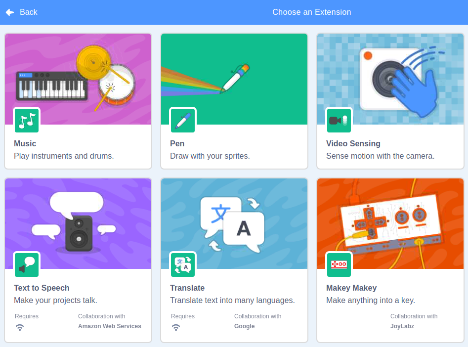

.. note::

    ¡Hola! Bienvenido a la comunidad de entusiastas de SunFounder para Raspberry Pi, Arduino y ESP32 en Facebook. Únete a otros apasionados para profundizar en el mundo de Raspberry Pi, Arduino y ESP32.

    **쯇or qué unirte?**

    - **Soporte Experto**: Resuelve problemas posventa y supera desafíos técnicos con el apoyo de nuestra comunidad y equipo.
    - **Aprende y Comparte**: Intercambia consejos y tutoriales para mejorar tus habilidades.
    - **Acceso Exclusivo**: Obtén acceso anticipado a anuncios y adelantos de nuevos productos.
    - **Descuentos Especiales**: Disfruta de descuentos exclusivos en nuestros productos más recientes.
    - **Promociones Festivas y Sorteos**: Participa en sorteos y promociones especiales durante las festividades.

    游녤 쯃isto para explorar y crear con nosotros? Haz clic en [|link_sf_facebook|] y únete hoy.

Guía Rápida de Scratch
==========================

.. note::

    Al programar con Scratch 3, es recomendable usar una pantalla para una mejor experiencia. Si no tienes una pantalla, también puedes utilizar **VNC** para acceder al escritorio de Raspberry Pi de forma remota; para obtener un tutorial detallado, consulta :ref:`VNC`.

Además, Scratch 3 necesita al menos 1 GB de RAM para funcionar, y recomendamos una Raspberry Pi 4 con al menos 2 GB de RAM. Aunque puedes ejecutar Scratch 3 en modelos como Raspberry Pi 2, 3, 3B+ o una Raspberry Pi 4 con 1 GB de RAM, el rendimiento en estos modelos es menor, y dependiendo de otros programas en ejecución, Scratch 3 podría no iniciarse por falta de memoria.

Instalar Scratch 3
----------------------
Al instalar Raspberry Pi OS (:ref:`install_os`), elige la versión con escritorio, ya sea solo con escritorio o con escritorio y software recomendado.

Si instalas la versión con software recomendado, verás Scratch 3 en el menú del sistema bajo **Programación**.

Si instalaste solo la versión de escritorio, necesitarás instalar Scratch 3 manualmente, como se describe a continuación.

Abre el menú, haz clic en **Preferencias** -> **Software Recomendado**.

.. image:: img/quick_scratch1.png

Busca Scratch 3 y márcalo, luego haz clic en **Aplicar** y espera a que finalice la instalación.

Una vez completada la instalación, deberías verlo en el menú del sistema en **Programación**.

.. image:: img/quick_scratch3.png

Acerca de la Interfaz de Scratch 3
-------------------------------------------

Scratch 3 está diseñado para ser divertido, educativo y fácil de aprender. Cuenta con herramientas para crear historias interactivas, juegos, arte, simulaciones y más, usando programación basada en bloques. Scratch también incluye un editor de pintura y un editor de sonido integrados.

La parte superior de Scratch 3 contiene algunas opciones básicas: la primera de izquierda a derecha es la opción de idioma, donde puedes elegir el idioma de programación. La segunda es la opción **Archivo**, para crear, abrir y guardar archivos. La tercera es la opción **Editar**, que permite revertir algunas operaciones y habilitar el modo de aceleración (haciendo que el movimiento de los personajes sea más rápido). La cuarta es la opción **Tutoriales**, que permite ver tutoriales de algunos proyectos. La quinta es la opción de nombrar el archivo, donde puedes renombrar el proyecto.

.. image:: img/quick_scratch13.png

**Código**

Scratch 3 tiene tres secciones principales: un área de escenario, una paleta de bloques y un área de programación. Programa haciendo clic y arrastrando bloques desde la paleta a la zona de programación, y el resultado de tu programación se mostrará en el área de escenario.

.. image:: img/quick_scratch4.png

Aquí está el área de personajes de Scratch 3. Arriba están los parámetros básicos de los personajes; puedes añadir personajes que vienen con Scratch 3 o subir personajes locales.

.. image:: img/quick_scratch5.png

Aquí está el área de fondos de Scratch 3, principalmente para agregar un fondo adecuado a tu escenario. Puedes añadir los fondos predeterminados de Scratch 3 o subir uno local.

.. image:: img/quick_scratch6.png

Este es el botón **Añadir Extensión**.

.. image:: img/quick_scratch7.png

En Scratch 3, podemos añadir diferentes extensiones útiles; aquí tomamos **Detección de Video** como ejemplo y hacemos clic en ella.

La verás en la paleta de bloques y podrás usar las funciones asociadas con esta extensión. Si tienes una cámara conectada, verás la pantalla de la cámara en el área de escenario.

.. image:: img/quick_scratch9.png

**Disfraces**

Haz clic en la opción **Disfraces** en la esquina superior izquierda para acceder a la paleta de disfraces. Diferentes disfraces permiten que los personajes tengan distintos movimientos estáticos, y al unir estos movimientos se crea una animación fluida.

.. image:: img/quick_scratch10.png

**Sonidos**

Es posible que necesites usar algunos clips de música para hacer tus experimentos más interesantes. Haz clic en la opción **Sonidos** en la esquina superior izquierda y podrás editar el sonido actual o seleccionar/subir uno nuevo.

.. image:: img/quick_scratch11.png

