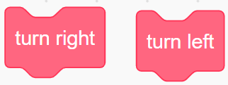
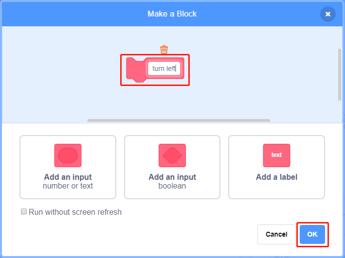
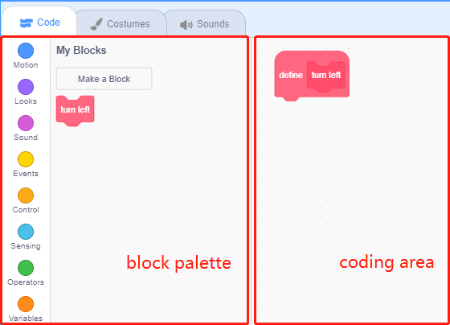
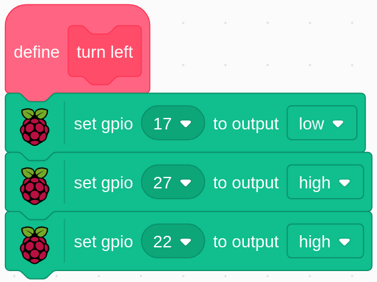
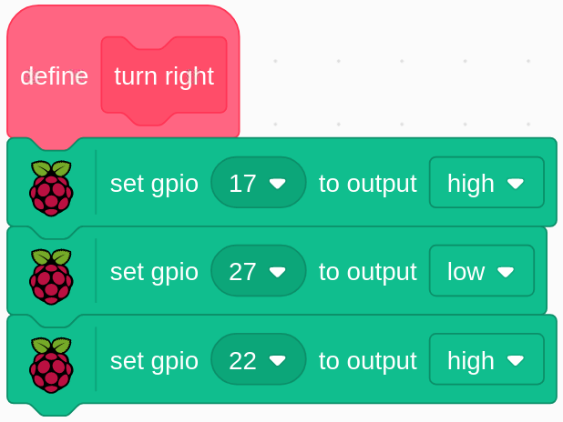

.. note::

    Ciao, benvenuto nella Community di appassionati di SunFounder per Raspberry Pi, Arduino e ESP32 su Facebook! Approfondisci le tue conoscenze su Raspberry Pi, Arduino ed ESP32 insieme ad altri appassionati.

    **Perché unirti a noi?**

    - **Supporto Esperto**: Risolvi problemi post-vendita e sfide tecniche con il supporto della nostra community e del nostro team.
    - **Impara e Condividi**: Scambia suggerimenti e tutorial per migliorare le tue abilità.
    - **Anteprime Esclusive**: Ottieni accesso anticipato ai nuovi annunci di prodotto e alle anteprime.
    - **Sconti Speciali**: Approfitta di sconti esclusivi sui nostri prodotti più recenti.
    - **Promozioni Festive e Concorsi**: Partecipa a concorsi e promozioni durante le festività.

    👉 Pronto a esplorare e creare con noi? Clicca su [|link_sf_facebook|] e unisciti oggi!

1.10 Ventilatore Rotante
========================

In questo progetto, realizzeremo uno sprite di stella rotante e un ventilatore.

.. image:: img/1.17_header.png

Componenti Necessari
-----------------------

.. image:: img/1.17_list.png

Costruisci il Circuito
-----------------------

.. image:: img/1.17_image117.png

Carica il Codice e Guarda cosa Succede
--------------------------------------

Carica il file di codice (``1.10_rotating_fan.sb3``) in Scratch 3.

Dopo aver cliccato sulla bandiera verde sul palco, clicca sullo sprite della stella: sia la stella che il motore ruoteranno in senso orario; puoi cambiare la direzione di rotazione cliccando sui due sprite **freccia**. Clicca di nuovo sulla **stella** per fermare la rotazione.

Suggerimenti sugli Sprite
-------------------------

Elimina lo sprite predefinito, quindi seleziona lo sprite **Star** e **Arrow1** e copia Arrow1 una volta.

.. image:: img/1.17_motor1.png

Nell'opzione **Costumi**, cambia la direzione dello sprite Arrow2 con un costume di direzione diversa.

.. image:: img/1.17_motor2.png

Regola la dimensione e la posizione degli sprite in modo appropriato.

.. image:: img/1.17_motor3.png

Suggerimenti sui Codici
-----------------------

**Diagramma di Flusso**

.. image:: img/1.17_scratch.png

In questo codice, vedrai 2 blocchi rosa: turn left e turn right, che sono i nostri blocchi personalizzati (funzioni).

**Come Creare un Blocco?**

Impariamo a creare un blocco (funzione). I blocchi (funzioni) possono semplificare il programma, specialmente quando si eseguono più volte le stesse operazioni. Raggruppare queste operazioni in un nuovo blocco dichiarato è molto conveniente.

Trova innanzitutto **I Miei Blocchi** nella palette dei blocchi, quindi seleziona **Crea un Blocco**.

.. image:: img/1.17_motor4.png

Inserisci il nome del nuovo blocco.

Dopo aver scritto la funzione del nuovo blocco nell'area di codice, salvala e troverai il blocco nella palette dei blocchi.

**turn left**

Questo è il codice all'interno del blocco turn left, che fa ruotare il motore in senso antiorario.

**turn right**

Questo è il codice all'interno del blocco turn right, che fa ruotare il motore in senso orario.

