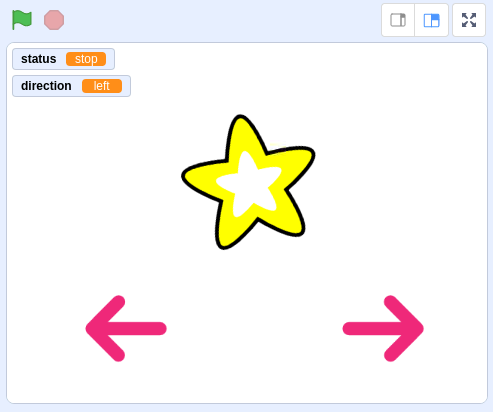
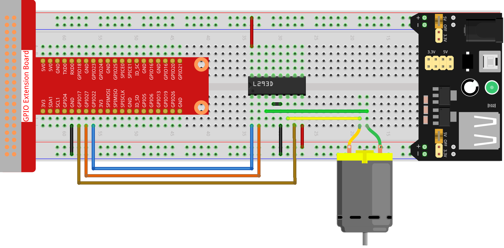
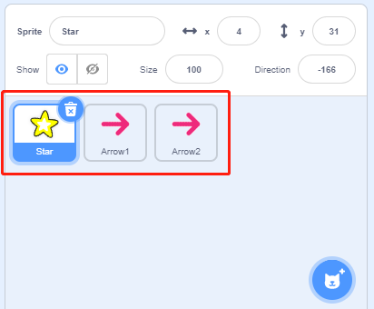
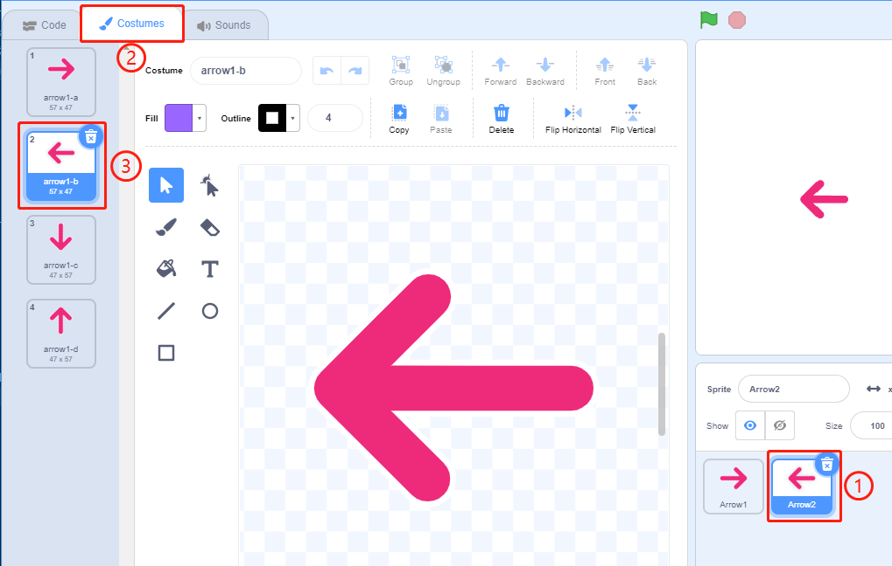
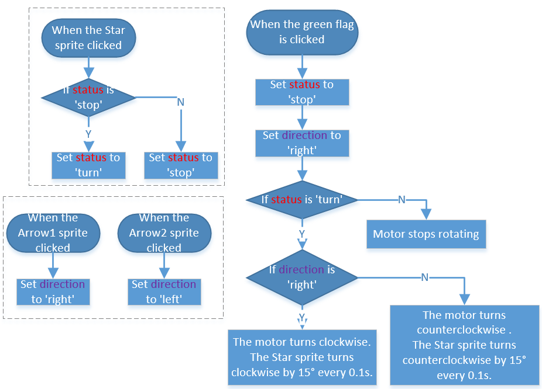
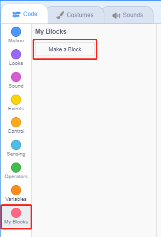
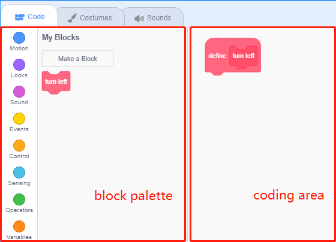
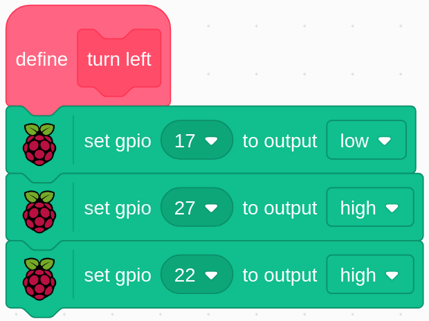

1.10 Rotating fan
==================

In this project, we will make a spinning star sprite and fan.

Required Components
-----------------------

.. image:: media/1.17_list.png

Build the Circuit
---------------------

Load the Code and See What Happens
---------------------------------------

Load the code file (``1.10_rotating_fan.sb3``) to Scratch 3.

After clicking the green flag on the stage, click on the star sprite，then it and the motor will rotate clockwise; you can change the direction of rotation by clicking on the two **arrow** sprites. When you click on the **star** sprite again, it and the motor will stop rotating.

Tips on Sprite
----------------
Delete the default sprite, then select the **Star** sprite and the **Arrow1** sprite, and copy Arrow1 once.

In the **Costumes** option, change the Arrow2 sprite to a different direction costume.

Adjust the size and position of the sprite appropriately.

.. image:: media/1.17_motor3.png

Tips on Codes
--------------

**Flow Chart**

In this code, you will see 2 pink blocks, turn left and turn right, which are our custom blocks (functions).

.. image:: media/1.17_new_block.png

**How to Make a Block?**

Let's learn how to make a block (function). The block (function) can be used to simplify your program, especially if you perform the same operation multiple times. Putting these operations into a newly declared block can be very convenient for you.

First find **My Blocks** in the block palette, then select **Make a Block**.

Enter the name of the new block.

.. image:: media/1.17_motor5.png

After writing the function of the new block in the coding area, save it and then you can find the block in the blocks palette.

**turn left**

This is the code inside the turn left block to make the motor rotate counterclockwise.

**turn right**

This is the code inside the turn right block to make the motor rotate clockwise.

.. image:: media/1.17_motor11.png
  :width: 400

