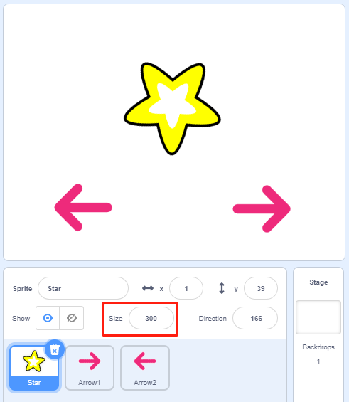

.. note::

    Hallo und willkommen in der SunFounder Raspberry Pi & Arduino & ESP32 Enthusiasten-Gemeinschaft auf Facebook! Tauchen Sie tiefer ein in die Welt von Raspberry Pi, Arduino und ESP32 mit anderen Enthusiasten.

    **Warum beitreten?**

    - **Expertenunterstützung**: Lösen Sie Nachverkaufsprobleme und technische Herausforderungen mit Hilfe unserer Gemeinschaft und unseres Teams.
    - **Lernen & Teilen**: Tauschen Sie Tipps und Anleitungen aus, um Ihre Fähigkeiten zu verbessern.
    - **Exklusive Vorschauen**: Erhalten Sie frühzeitigen Zugang zu neuen Produktankündigungen und exklusiven Einblicken.
    - **Spezialrabatte**: Genießen Sie exklusive Rabatte auf unsere neuesten Produkte.
    - **Festliche Aktionen und Gewinnspiele**: Nehmen Sie an Gewinnspielen und Feiertagsaktionen teil.

    👉 Sind Sie bereit, mit uns zu erkunden und zu erschaffen? Klicken Sie auf [|link_sf_facebook|] und treten Sie heute bei!

1.10 Rotierender Lüfter
=========================

In diesem Projekt werden wir ein sich drehendes Stern-Sprite und einen Fächer herstellen.

.. image:: media/1.17_header.png

Erforderliche Komponenten
--------------------------------------

.. image:: media/1.17_list.png

Baue die Schaltung
---------------------

.. image:: media/1.17_image117.png

Laden Sie den Code und sehen Sie, was passiert
--------------------------------------------------------

Laden Sie die Codedatei (``1.10_rotating_fan.sb3``) in Scratch 3.

Nachdem Sie auf die grüne Flagge auf der Bühne geklickt haben, klicken Sie auf das Stern-Sprite, dann dreht sich der Motor im Uhrzeigersinn. Sie können die Drehrichtung ändern, indem Sie auf die beiden Pfeil-Sprites klicken. Wenn Sie erneut auf das Stern-Sprite klicken, hören es und der Motor auf zu drehen.

Tipps zu Figur
----------------

Löschen Sie das Standard-Sprite, wählen Sie dann das **Star** -Sprite und das **Arrow1** -Sprite aus und kopieren Sie Arrow1 einmal.

Ändern Sie in der Option **Costumes** das **Arrow2** -Sprite in ein anderes Richtungskostüm.

.. image:: media/1.17_motor2.png

Passen Sie die Größe und Position des Sprites entsprechend an.

Tipps zu Codes
------------------------

**Flussdiagramm**

In diesem Code sehen Sie 2 rosa Blöcke, biegen Sie links ab und biegen Sie rechts ab, die unsere benutzerdefinierten Blöcke (Funktionen) sind.

.. image:: media/1.17_new_block.png

**Wie erstelle ich einen Block?**

Lassen Sie uns lernen, wie man einen Block (eine Funktion) erstellt. Der Block (Funktion) kann verwendet werden, um Ihr Programm zu vereinfachen, insbesondere wenn Sie dieselbe Operation mehrmals ausführen. Das Einfügen dieser Operationen in einen neu deklarierten Block kann für Sie sehr praktisch sein.

Suchen Sie zuerst **My Blocks** in der Blockpalette und wählen Sie dann **Make a Block**.

.. image:: media/1.17_motor4.png

Geben Sie den Namen des neuen Blocks ein.

.. image:: media/1.17_motor5.png

Nachdem Sie die Funktion des neuen Blocks in den Codierbereich geschrieben haben, speichern Sie diese und Sie finden den Block dann in der Blockpalette.

.. image:: media/1.17_motor6.png

**Biegen Sie links ab**

Dies ist der Code innerhalb des Linksabbiegeblocks, um den Motor gegen den Uhrzeigersinn drehen zu lassen.

.. image:: media/1.17_motor12.png
  :width: 400

**Biegen Sie rechts ab**

Dies ist der Code im Block rechts drehen, um den Motor im Uhrzeigersinn drehen zu lassen.

.. image:: media/1.17_motor11.png
  :width: 400

