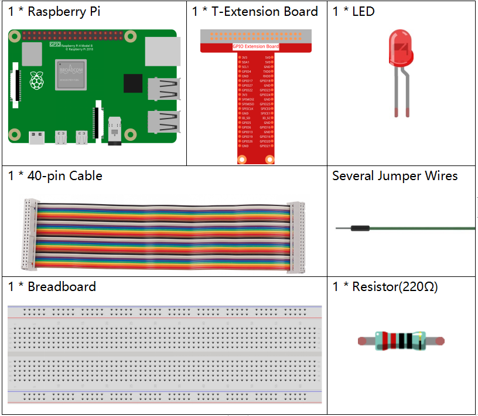
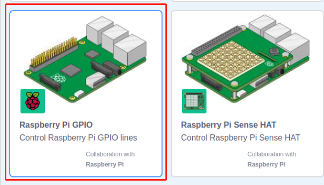
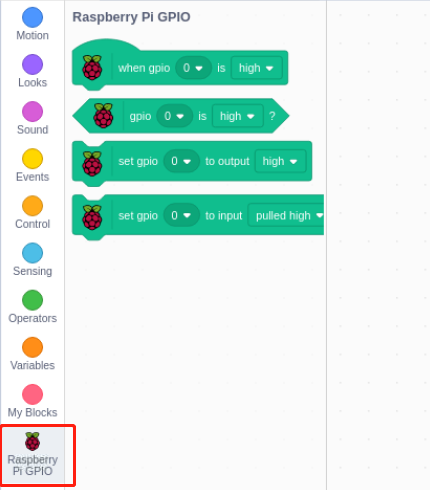
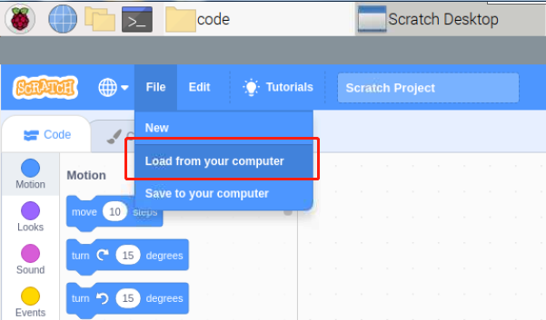
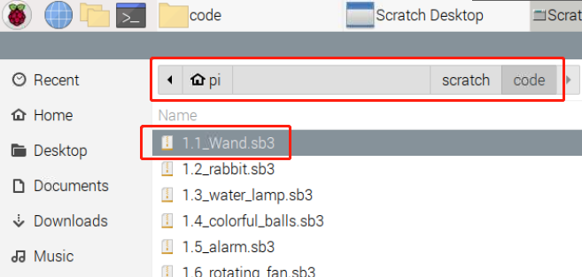
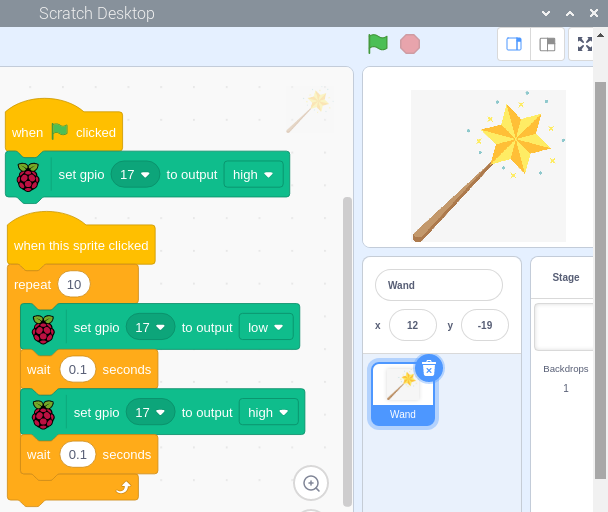
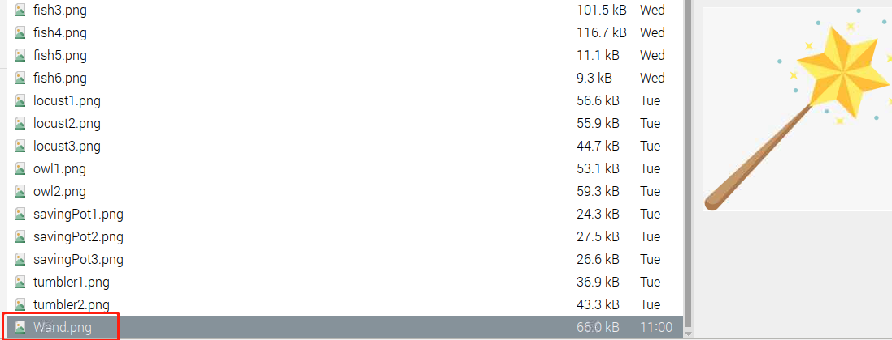

.. note::

    Bonjour et bienvenue dans la communauté SunFounder dédiée aux passionnés de Raspberry Pi, Arduino et ESP32 sur Facebook ! Plongez plus profondément dans l'univers du Raspberry Pi, d'Arduino et de l'ESP32 avec d'autres passionnés.

    **Pourquoi nous rejoindre ?**

    - **Support d'experts** : Résolvez les problèmes post-vente et surmontez les défis techniques grâce à l'aide de notre communauté et de notre équipe.
    - **Apprendre & Partager** : Échangez des conseils et des tutoriels pour améliorer vos compétences.
    - **Aperçus exclusifs** : Bénéficiez d'un accès anticipé aux annonces de nouveaux produits et de présentations en avant-première.
    - **Réductions spéciales** : Profitez de réductions exclusives sur nos produits les plus récents.
    - **Promotions festives et cadeaux** : Participez à des concours et à des promotions spéciales lors des fêtes.

    👉 Prêt à explorer et créer avec nous ? Cliquez sur [|link_sf_facebook|] et rejoignez-nous dès aujourd'hui !

1.1 Baguette Magique
=========================

Aujourd'hui, nous allons utiliser une LED, un Raspberry Pi et Scratch pour créer un jeu amusant. Lorsque nous agiterons la baguette magique, la LED clignotera.

.. image:: img/1.1_header.png

Composants Requis
-------------------------

Construire le Circuit
-------------------------

.. image:: img/1.1_image49.png

Ajouter l'Extension GPIO
--------------------------

Cliquez sur le bouton **Ajouter une extension** en bas à gauche, puis ajoutez l'extension **Raspberry Pi GPIO**, que nous utiliserons pour tous nos projets Scratch.

Charger le Code et Voir le Résultat
---------------------------------------

Chargez le fichier de code depuis votre ordinateur (`home/pi/davinci-kit-for-raspberry-pi/scratch/code`) vers Scratch 3.

Après avoir cliqué sur la baguette magique dans la zone de scène, vous verrez la LED clignoter pendant deux secondes.

Conseils pour les Sprites
-------------------------

Cliquez sur **Télécharger un sprite**.

.. image:: img/1.1_upload_sprite.png

Téléchargez **Wand.png** depuis le chemin ``home/pi/davinci-kit-for-raspberry-pi/scratch/picture`` vers Scratch 3.

Enfin, supprimez le sprite **Sprite1**.

.. image:: img/1.1_delete.png

Conseils pour le Code
-------------------------

Ceci est un bloc d'événement dont la condition de déclenchement est de cliquer sur le drapeau vert dans la zone de scène. Un événement de déclenchement est requis au début de tous les scripts, et vous pouvez sélectionner d'autres événements de déclenchement dans la catégorie **Événements** de la **palette de blocs**.

.. image:: img/1.1_events.png
  :width: 300

Par exemple, nous pouvons maintenant changer l'événement de déclenchement pour un clic sur le sprite.

.. image:: img/1.1_LED2.png
  :width: 300

Ceci est un bloc avec un nombre défini de cycles. Lorsque nous indiquons le nombre 10, les événements dans le bloc seront exécutés 10 fois.

.. image:: img/1.1_LED4.png
  :width: 300

Ce bloc est utilisé pour mettre le programme en pause pendant une période donnée en secondes.

.. image:: img/1.1_LED3.png
  :width: 500

Comme Scratch utilise la méthode de dénomination BCM, ce code définit GPIO17 (BCM17) à 0V (niveau bas). Comme la cathode de la LED est connectée à GPIO17, la LED s'allumera. À l'inverse, si vous définissez GPIO(BCM17) à un niveau haut, la LED s'éteindra.
