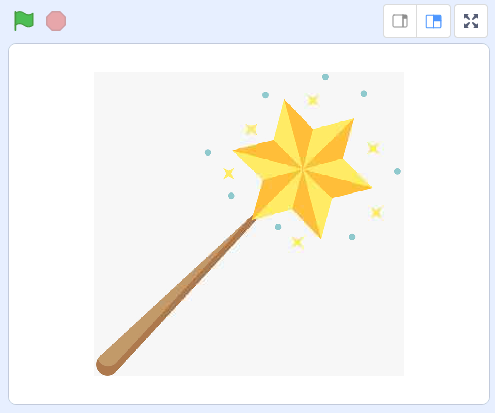
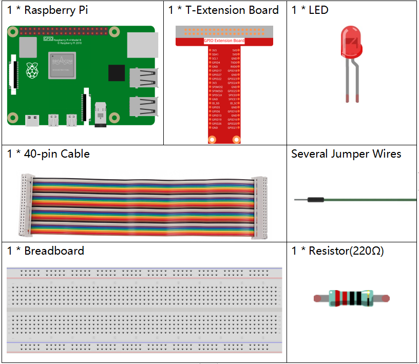
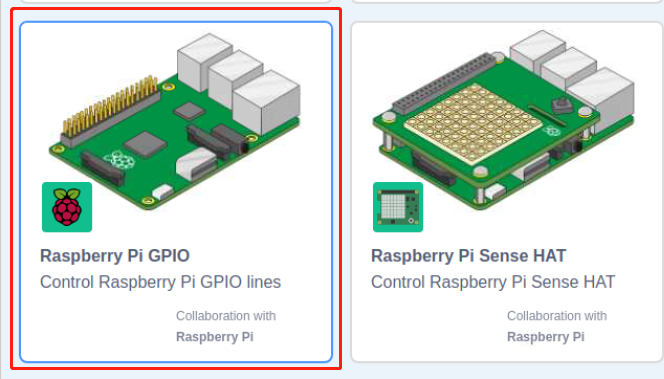
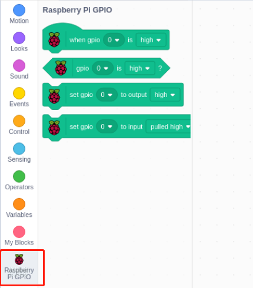
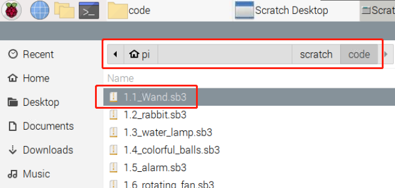
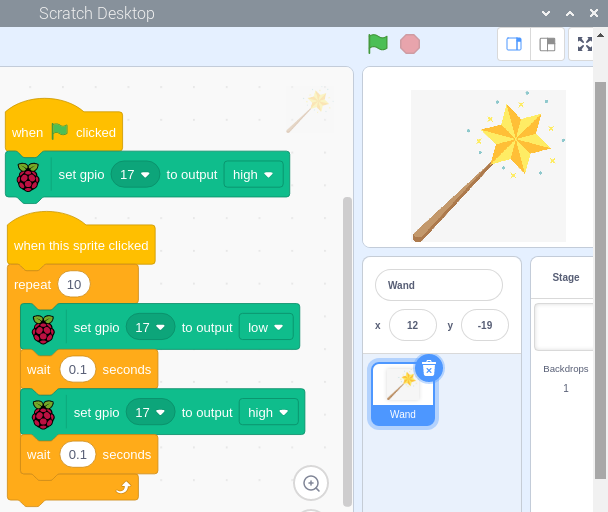
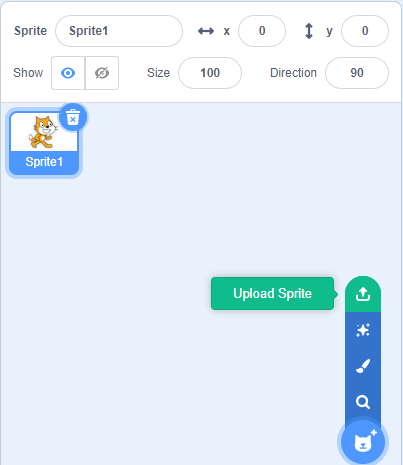
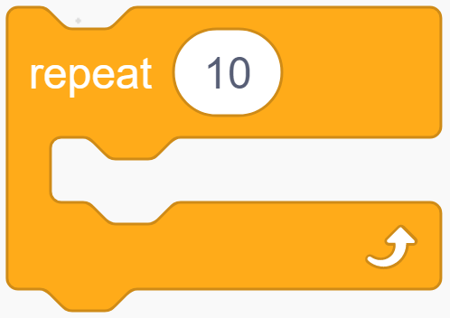

1.1 Zauberstab
=================

Heute werden wir LED, Raspberry Pi und Scratch verwenden, um ein lustiges Spiel zu machen. Wenn wir den Zauberstab schwingen, blinkt die LED.

Erforderliche Komponenten
------------------------------------

Bauen Sie den Stromkreis auf
------------------------------------

.. image:: media/1.1_image49.png

GPIO-Erweiterung hinzufügen
--------------------------------------

Klicken Sie auf die Schaltfläche **Add Extension** in der unteren linken 
Ecke und fügen Sie dann **Raspberry Pi GPIO** hinzu, eine Erweiterung, die wir für alle unsere Scratch-Projekte verwenden.

.. image:: media/1.1_scratchled1.png
    :align: center

Load the Code and See What Happens
-----------------------------------------

Lade die Code-Datei von deinem Computer (``home/pi/davinci-kit-for-raspberry-pi/scratch/code``) in Scratch 3.

.. image:: media/1.1_scratch_step1.png

Nachdem du den Zauberstab im Bühnenbereich angeklickt hast, blinkt die LED zwei Sekunden lang.

Tipps zu Figur
----------------

Klicken Sie auf die Schaltfläche **Upload Sprite**.

Lade **Wand.png** aus dem Pfad ``home/pi/davinci-kit-for-raspberry-pi/scratch/picture`` in Scratch 3 hoch.

.. image:: media/1.1_upload.png

Löschen Sie schließlich die **Sprite1**.

.. image:: media/1.1_delete.png

Tipps zu Codes
----------------------

Dies ist ein Ereignisblock, 
dessen Auslösebedingung das Klicken auf die grüne Flagge auf der Bühne ist. Ein Auslöseereignis ist am Anfang aller Codes erforderlich, 
und Sie können andere Auslöseereignisse in der Kategorie **Events** der **block palette** auswählen.

Zum Beispiel können wir jetzt das Auslöseereignis in einen Klick auf das Figur ändern.

Dies ist ein Block mit einer bestimmten Anzahl von Zyklen. Wenn wir die Zahl 10 eingeben, werden die Ereignisse im Block 10 Mal ausgeführt.

Mit diesem Satz wird das Programm für eine bestimmte Zeitspanne in Sekunden angehalten.

Da in Scratch die BCM-Benennungsmethode verwendet wird, setzt dieser Code GPIO17(BCM17) auf 0V (Low Level). Da die Kathode der LED mit GPIO17 verbunden ist, wird die LED aufleuchten. Wenn Sie dagegen GPIO(BCM17) auf einen hohen Wert einstellen, wird die LED ausgeschaltet.