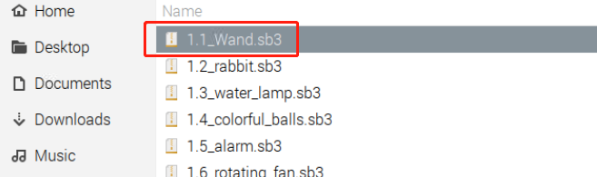
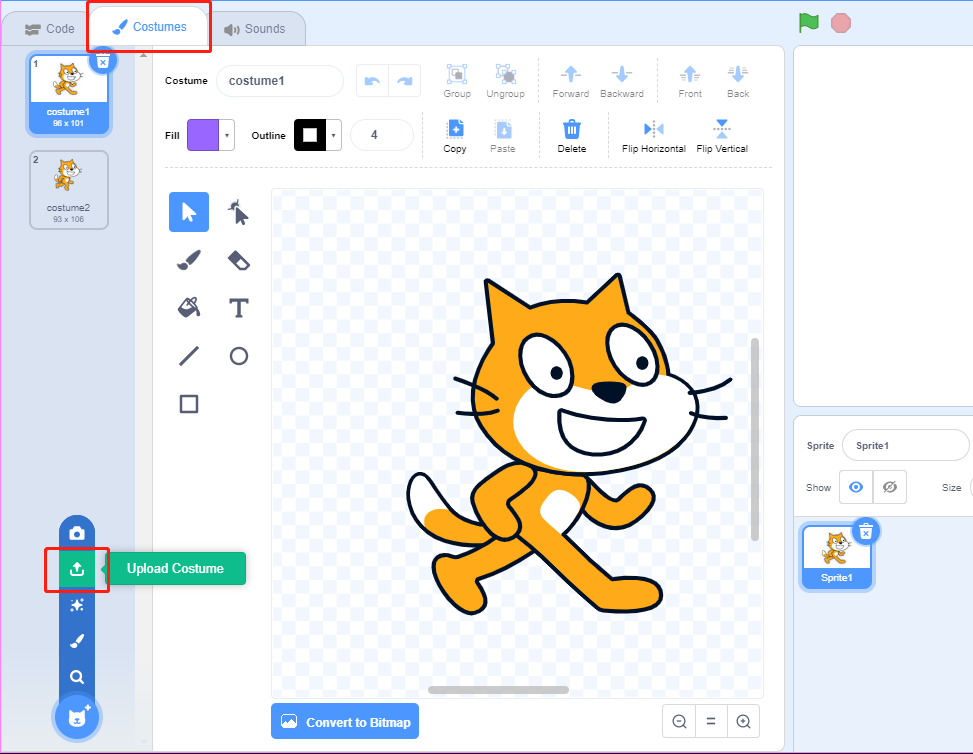
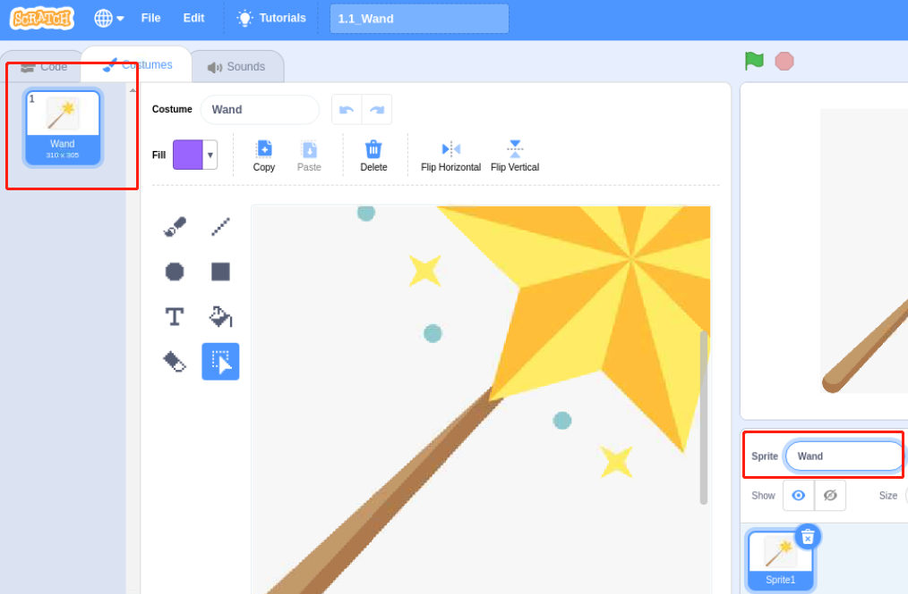

1.1 Wand
=================

Today we will use LED, Raspberry Pi and Scratch to make a fun game. When we wave the magic wand, the LED light will blink.

.. image:: media/1.1header.png

Required Components
-------------------------

.. image:: media/list_1.1.png

Build the Circuit
-----------------------

.. image:: media/image49.png

Add GPIO Extension
---------------------

Click on the **Add Extension** button in the bottom left corner，then add the **Raspberry Pi GPIO**, an extension we use for all of our Scratch projects.

.. image:: media/scratchled1.png
    :align: center

.. image:: media/scratchled2.png
    :align: center

.. image:: media/scratchled3.png
    :align: center

GPIO expansion boards give you the flexibility to connect and control a large number of electronic devices. In the Scratch project, the Raspberry Pi 40-pin GPIO expansion board uses the BCM nomenclature. For more information, please see: :ref:`GPIO Extension Board`.

Load the Code and See What Happens
-----------------------------------------

Load the code file from your computer(``home/pi/davinci-kit-for-raspberry-pi/scratch/code``) to Scratch 3.

.. image:: media/scratch_step1.png

After clicking the magic wand in the stage area, you will see the LED light will blink for two seconds.

.. image:: media/1.1_step3.png

Tips on Sprite
----------------

Click on the **Costumes** option in the top left, then select **Upload Costume**.

Upload **Wand.png** from the ``home/pi/davinci-kit-for-raspberry-pi/scratch/picture`` path to Scratch 3.

.. image:: media/1.1_upload.png

Delete the previous costume1 and costume2, then change the current sprite name to \"Wand\", so that we have a new **Wand** sprite.

Tips on Codes
--------------

.. image:: media/LED1.png
  :width: 300

This is an event block whose trigger condition is to click on the green flag on the stage. A trigger event is required at the beginning of all code, and you can select other trigger events in the **Events** function of the **block palette**.

.. image:: media/1.1_events.png
  :width: 300

For example, we can now change the trigger event to a click on the magic Wand in the stage area.

.. image:: media/LED2.png
  :width: 300

This is a block with a set number of cycles. When we fill in the number 10, the events in the block will be executed 10 times.

.. image:: media/LED4.png
  :width: 300

This block is used to pause the program for a period of time in seconds.

.. image:: media/LED3.png
  :width: 500

Since the BCM naming method is used in Scratch, this code is setting GPIO17(BCM17) as 0V (low level). Since the cathode of LED is connected to GPIO17, thus the LED will light up. On the contrary, if you set GPIO(BCM17) as high, the LED will turn off.