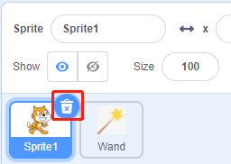

1.1 魔法の杖
=================

今日は、LED、Raspberry Pi、Scratchを使って楽しいゲームを作ります。 魔法の杖を振ると、LEDが点滅します。

.. image:: media/1.1_header.png

必要な部品
-------------------------

.. image:: media/1.1_list.png

回路を構築する
-----------------------

.. image:: media/1.1_image49.png

GPIO拡張機能を追加する
----------------------

左下隅にある **Add Extension** ボタンをクリックしてから、すべてのScratchプロジェクトに使用する拡張機能である **Raspberry Pi GPIO** を追加します。

.. image:: media/1.1_scratchled1.png
    :align: center

.. image:: media/1.1_scratchled2.png
    :align: center

.. image:: media/1.1_scratchled3.png
    :align: center

コードをロードして、何が起こるかを確認します
--------------------------------------------

コンピューター( ``home/pi/davinci-kit-for-raspberry-pi/scratch/code`` )からScratch3にコードファイルをロードします。

.. image:: media/1.1_scratch_step1.png

.. image:: media/1.1_scratch_step2.png

stage areaの魔法の杖をクリックすると、LEDが2秒間点滅します。

.. image:: media/1.1_step3.png

Spriteに関するヒント
----------------------------

Upload Sprite をクリックします。

.. image:: media/1.1_upload_sprite.png

**Wand.png** を ``home/pi/davinci-kit-for-raspberry-pi/scratch/picture`` パスからScratch3にアップロードします。

.. image:: media/1.1_upload.png

最後に、 **Sprite1** を削除します。

コードに関するヒント
--------------------------

.. image:: media/1.1_LED1.png
  :width: 300

これは、ステージ上の緑色の旗をクリックすることをトリガー条件とするイベントブロックです。 すべてのコードの先頭にトリガーイベントが必要です。block palette の Events カテゴリで他のトリガーイベントを選択できます。

.. image:: media/1.1_events.png
  :width: 300

たとえば、トリガーイベントをspriteのクリックに変更できるようになりました。

.. image:: media/1.1_LED2.png
  :width: 300

これは、設定されたサイクル数のブロックです。 数字の10を入力すると、ブロック内のイベントが10回実行されます。

.. image:: media/1.1_LED4.png
  :width: 300

このブロックは、プログラムを秒単位で一時停止するために使用されます。

.. image:: media/1.1_LED3.png
  :width: 500

ScratchではBCMの命名方法が使用されているため、このコードはGPIO17（BCM17）を0V（低レベル）に設定しています。 
LEDのカソードがGPIO17に接続されているため、LEDが点灯します。 
逆に、GPIO（BCM17）を高く設定すると、LEDが消灯します。