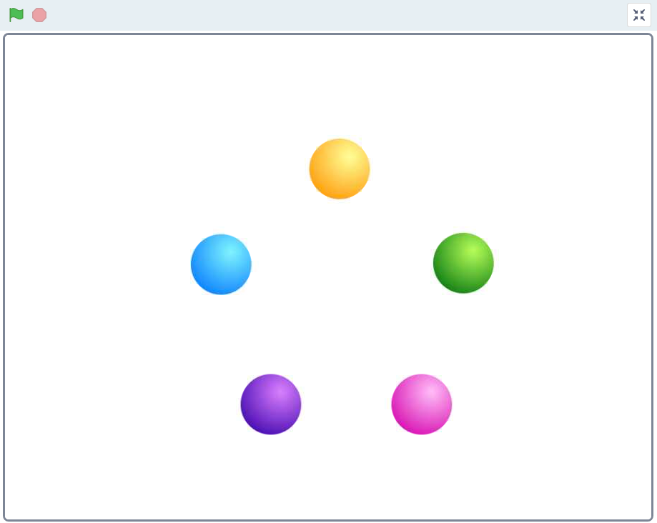
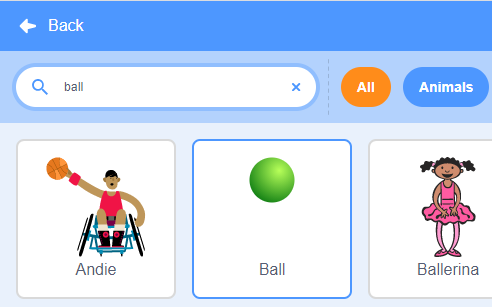
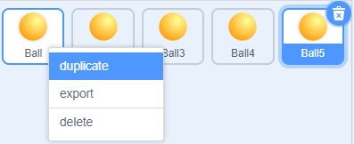
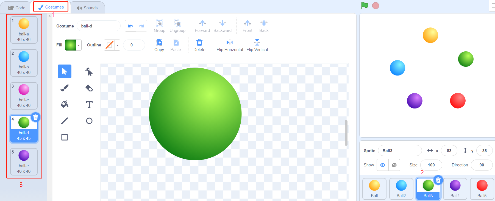
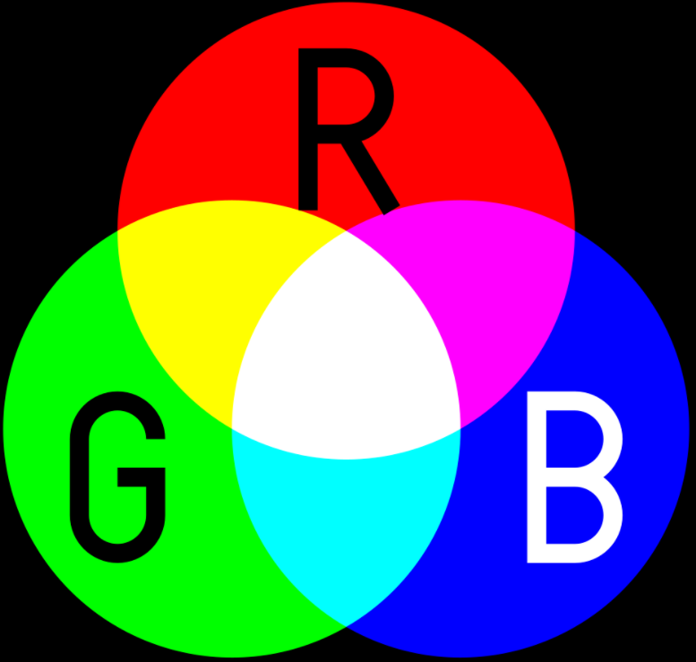
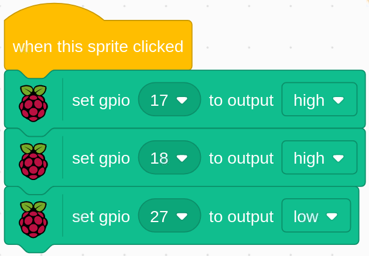

.. note::

    Ciao, benvenuto nella Community di appassionati di SunFounder Raspberry Pi & Arduino & ESP32 su Facebook! Approfondisci le tue conoscenze su Raspberry Pi, Arduino ed ESP32 insieme ad altri appassionati.

    **Perché unirti a noi?**

    - **Supporto Esperto**: Risolvi problemi post-vendita e sfide tecniche con l'aiuto della nostra community e del nostro team.
    - **Impara e Condividi**: Scambia suggerimenti e tutorial per migliorare le tue competenze.
    - **Anteprime Esclusive**: Ottieni accesso anticipato alle novità sui prodotti e alle anteprime esclusive.
    - **Sconti Speciali**: Approfitta di sconti esclusivi sui nostri prodotti più recenti.
    - **Promozioni Festive e Giveaway**: Partecipa a concorsi e promozioni speciali durante le festività.

    👉 Sei pronto a esplorare e creare con noi? Clicca su [|link_sf_facebook|] e unisciti oggi stesso!

1.2 Palline Colorate
========================

Cliccando su diverse palline colorate nell'area della scena, il LED RGB si illuminerà con colori diversi.

Componenti Necessari
------------------------

.. image:: img/1.2_list.png

Costruisci il Circuito
------------------------

.. image:: img/1.2_image61.png

Carica il Codice e Guarda Cosa Succede
--------------------------------------

Dopo aver caricato il file di codice (``1.2_colorful_balls.sb3``) in Scratch 3, il LED RGB si illuminerà di giallo, blu, rosso, verde o viola rispettivamente quando clicchi sulla pallina corrispondente.

Suggerimenti sugli Sprite
-------------------------

Elimina lo sprite predefinito, quindi scegli lo sprite **Ball**.

Duplica lo sprite **Ball** per un totale di 5 volte.

Scegli costumi diversi per questi 5 sprite **Ball** e posizionali nelle posizioni desiderate.

Suggerimenti sul Codice
---------------------------

Prima di comprendere il codice, è utile familiarizzare con il `RGB color model <https://it.wikipedia.org/wiki/RGB>`_.

Il modello di colore RGB è un modello di colore additivo in cui le luci rossa, verde e blu vengono combinate in vari modi per riprodurre una vasta gamma di colori.

La miscelazione additiva dei colori: aggiungendo rosso a verde si ottiene il giallo; aggiungendo verde a blu si ottiene il ciano; aggiungendo blu a rosso si ottiene il magenta; combinando insieme i tre colori primari si ottiene il bianco.

Un LED RGB è composto da 3 LED (rosso, verde e blu) in un solo package, e puoi ottenere quasi ogni colore combinando questi tre colori. Ha 4 pin: uno è il GND, e gli altri 3 controllano rispettivamente i LED.

Il codice per far illuminare il LED RGB di giallo è il seguente.

Quando viene cliccato lo sprite (pallina gialla), impostiamo gpio17 su alto (LED rosso acceso), gpio18 su alto (LED verde acceso) e gpio27 su basso (LED blu spento), in modo che il LED RGB si illumini di giallo.

Puoi scrivere i codici per gli altri sprite nello stesso modo per far illuminare i LED RGB nei colori corrispondenti.

