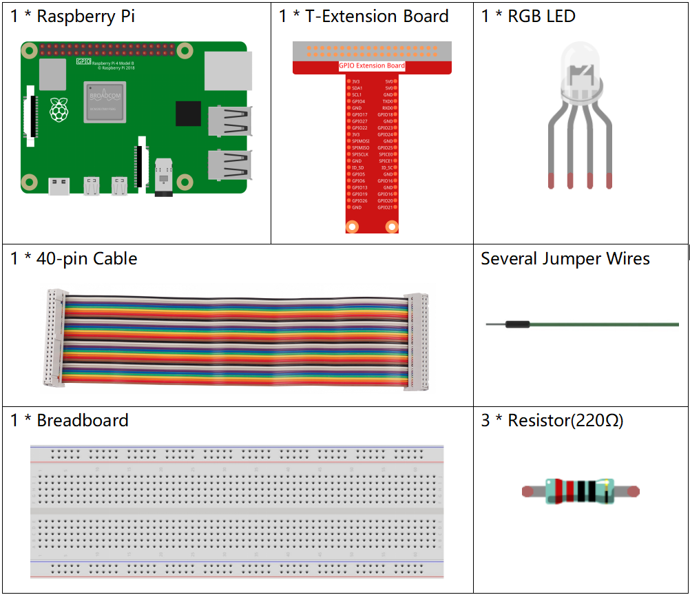
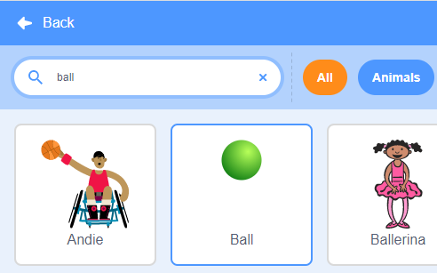
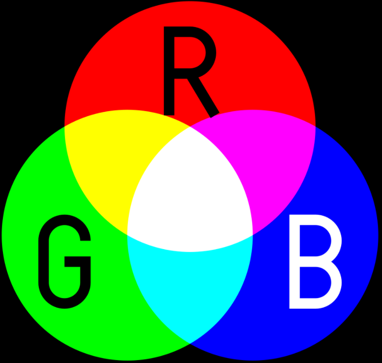

1.2 五色の玉
=====================

stage areaの異なる色のボールをクリックすると、RGBLEDが異なる色で点灯します

.. image:: media/1.2_header.png

必要な部品
-----------------------

回路を構築する
---------------------

.. image:: media/1.2_image61.png

コードをロードして、何が起こるかを確認します
--------------------------------------------

コードファイル( ``1.2_colorful_balls.sb3`` )をScratch 3にロードした後、対応するボールをクリックすると、RGB LEDがそれぞれ黄色、青、赤、緑、または紫に点灯します。

Spriteに関するヒント
--------------------

デフォルトのspriteを削除してから、 **Ball** spriteを選択します。

そしてそれを5回複製します。

.. image:: media/1.2_duplicate_ball.png

これらの5つの **Ball** spriteに異なる **costumes** を選択し、対応する位置に移動します。

.. image:: media/1.2_rgb1.png

コードに関するヒント
--------------------

コードを理解する前に、 `RGB color model <https://en.wikipedia.org/wiki/RGB_color_model>`_ 。

RGBカラーモデルは、赤、緑、青の光をさまざまな方法で足し合わせて、さまざまな色を再現する加法色モデルです。

加法混色：緑に赤を加えると黄色になります。 青に緑を加えるとシアンになります。 赤に青を加えるとマゼンタになります。 3つの原色すべてを足し合わせると白になります。

RGB LEDは、3つのLED（赤色LED、緑色LED、青色LED）を1つのパッケージに組み合わせたもので、
これら3つの色を組み合わせることでほぼすべての色を生成できます。 
4つのピンがあり、そのうちの1つはGNDで、他の3つのピンはそれぞれ3つのLEDを制御します。

したがって、RGBLEDを明るい黄色にするコードは次のとおりです。

.. image:: media/1.2_rgb3.png

Ball sprite（黄色のボール）をクリックすると、GPIO17が高（赤のLEDがオン）、GPIO18が高（緑のLEDがオン）、GPIO27が低（青のLEDがオフ）に設定され、RGBLEDが黄色に点灯するように設定します。

同じ方法で他のspriteにコードを書き込んで、RGB LEDを対応する色で点灯させることができます。
