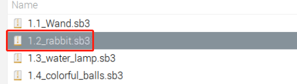

1.2 Rabbit
==============

Today, we will use Button, Raspberry Pi and Scratch to create a rabbit with various changes!

When we press the first button, the rabbit in the stage area will change its body color; when we press the second button, the rabbit will change its body size; when we press the third button, the rabbit will take a step forward.

.. image:: media/1.2header.png

Required Components
----------------------------

.. image:: media/list_1.2.png

Build the Circuit
---------------------

.. image:: media/scratch_button.png

Load the Code and See What Happens
-----------------------------------------

Load the code file from your computer(``home/pi/davinci-kit-for-raspberry-pi/scratch/code``) to Scratch 3.

.. image:: media/scratch_step1.png

Now you can try to press each of the 3 buttons to see how the Hare on the stage will change.

Tips on Sprite
----------------

Click the **Choose a Sprite** button in the lower right corner of the sprite area, enter **Hare** in the search box, and then click to add it.

.. image:: media/button1.png

Delete Sprite1.

.. image:: media/button2.png

Tips on Codes
--------------

.. image:: media/button3.png
  :width: 400

This is an event block that is triggered when the level of GPIO17 is high, which means that the button is pressed at that moment.

.. image:: media/button4.png
  :width: 400

This is a block to change the color of **Hare**, the range of the value is 0 ~ 199, beyond 199 will change from 0 again.

.. image:: media/button5.png
  :width: 250

This is a change size block that changes the size of the **Hare** sprite; the higher the value, the larger the sprite.

.. note::
  The sprite is also not infinitely large, and its maximum size is related to the original image size.

.. image:: media/button6.png
  :width: 200

This is a block that switches sprite costumes, and when **Hare**'s costume keeps switching, it does a series of coherent actions. For example, in this project, make **Hare** take a step forward.
