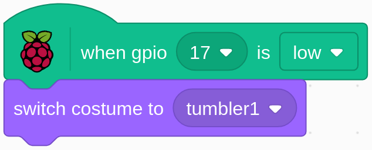

.. note::

    こんにちは、SunFounderのRaspberry Pi & Arduino & ESP32愛好家コミュニティへようこそ！Facebook上でRaspberry Pi、Arduino、ESP32についてもっと深く掘り下げ、他の愛好家と交流しましょう。

    **参加する理由は？**

    - **エキスパートサポート**：コミュニティやチームの助けを借りて、販売後の問題や技術的な課題を解決します。
    - **学び＆共有**：ヒントやチュートリアルを交換してスキルを向上させましょう。
    - **独占的なプレビュー**：新製品の発表や先行プレビューに早期アクセスしましょう。
    - **特別割引**：最新製品の独占割引をお楽しみください。
    - **祭りのプロモーションとギフト**：ギフトや祝日のプロモーションに参加しましょう。

    👉 私たちと一緒に探索し、創造する準備はできていますか？[|link_sf_facebook|]をクリックして今すぐ参加しましょう！

1.3 不倒翁
==================

In this project, we will make a tilt switch controlled tumbler toy.

.. image:: media/1.3_header.png

必要な部品
-----------------------

.. image:: media/1.3_component.png

回路を構築する
---------------------

.. image:: media/1.3_fritzing.png

コードをロードして、何が起こるかを確認します
--------------------------------------------

コードファイル( ``1.3_tumbler.sb3`` )をScratch3にロードします。

チルトスイッチを直立させると、タンブラーは立ったままになります。 傾けるとタンブラーも落ちます。 再び直立させると、タンブラーが再び立ち上がります。

Spriteに関するヒント
--------------------

Sprite1を選択し、左上隅の **Costumes** をクリックします。
**Upload Costume** ボタンを使用して、 ``home/pi/davinci-kit-for-raspberry-pi/scratch/picture`` パスから **tumbler1.png** と **tumbler2.png** をアップロードします。 
デフォルトの2つのcostumesを削除し、 spriteの名前を **tumbler** に変更します。

コードに関するヒント
--------------------

.. image:: media/1.3_title2.png
  :width: 400

緑の旗をクリックすると、GPIO17の初期状態がlowに設定されます。

pin17が低い場合（チルトスイッチが直立している場合）、tumbler sprite の costume を tumbler1（直立状態）に切り替えます。

.. image:: media/1.3_title3.png
  :width: 400

pin17がハイ（チルトスイッチが傾いている）のとき、tumbler sprite の costume を tumbler2（チルト状態）に切り替えます。