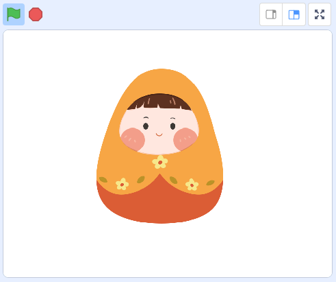
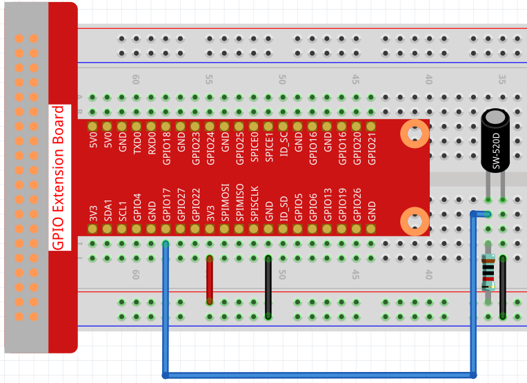
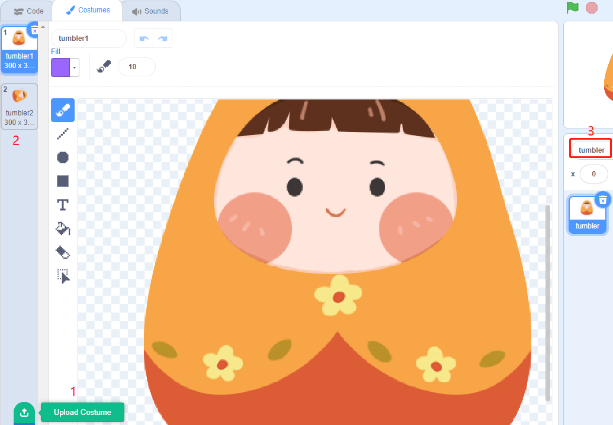

1.3 Becher
==================

In diesem Projekt werden wir ein kippschaltergesteuertes Tumbler-Spielzeug bauen.

Erforderliche Komponenten
--------------------------------

.. image:: media/1.3_component.png

Bauen Sie den Stromkreis auf
-----------------------------------

Laden Sie den Code und sehen Sie, was passiert s
------------------------------------------------------

Lade die Code-Datei (``1.3_tumbler.sb3``) in Scratch 3.

Wenn der Kippschalter senkrecht steht, bleibt der Becher stehen. Wenn Sie ihn kippen, fällt auch der Becher um. Stellen Sie ihn wieder aufrecht, und der Becher steht wieder aufrecht.

Tipps zu Figur
----------------

Wähle Sprite1 und klicke oben links auf **Costumes**; Laden Sie ``tumbler1.png`` und ``tumbler2.png`` aus dem 
Pfad ``home/pi/davinci-kit-for-raspberry-pi/scratch/picture`` über die Schaltfläche Kostüm hochladen hoch; 
Löschen Sie die 2 Standardkostüme und benennen Sie das Sprite in Tumbler um.

Tipps zu Codes
------------------------

.. image:: media/1.3_title2.png
  :width: 400

Wenn die grüne Flagge angeklickt wird, wird der Ausgangszustand von gpio17 auf low gesetzt.

.. image:: media/1.3_title4.png
  :width: 400

Wenn Pin17 niedrig ist (der Kippschalter ist aufrecht), schalten wir das Kostüm des Tumbler-Sprites auf Tumbler1 (aufrechter Zustand).

.. image:: media/1.3_title3.png
  :width: 400

Wenn Pin17 High ist (Kippschalter ist gekippt), schaltet das Kostüm des Tumbler-Sprites auf Tumbler2 (Kippzustand).