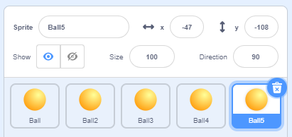
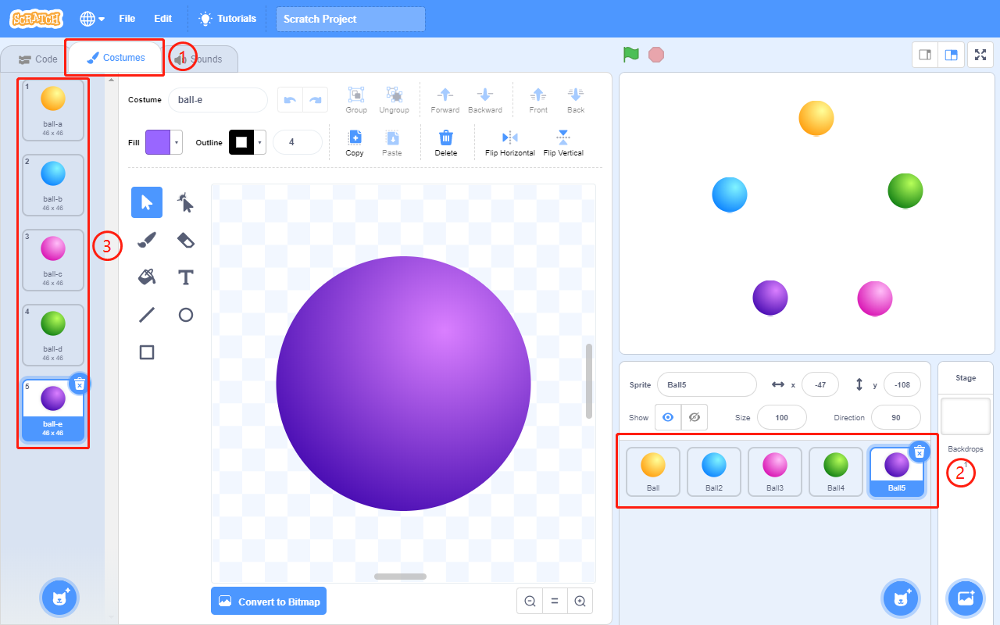
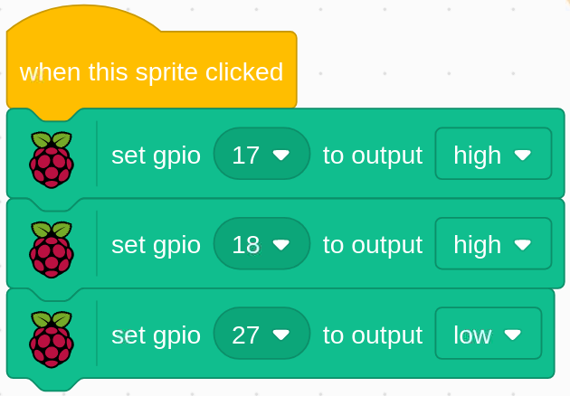

1.4 Colorful Balls
=====================

Clicking the balls of different colors on the stage area will make the RGB LED light up in different colors.

.. image:: media/1.4header.png

Required Components
-----------------------

.. image:: media/list_rgb_led.png

Build the Circuit
---------------------

.. image:: media/image61.png

Load the Code and See What Happens
-----------------------------------------

After loading the code file (``1.4_colorful_balls.sb3``) into Scratch 3, the RGB will display red, green, blue, yellow and magenta when you click on the corresponding ball.

Tips on Sprite
----------------

Delete the default sprite, then choose the **ball** sprite and duplicate it 5 times.

Then choose different costumes for the 5 **ball** sprites.

Tips on Codes
--------------
Before understanding the code, we need to understand the `RGB color model <https://en.wikipedia.org/wiki/RGB_color_model>`_.

The RGB color model is an additive color model in which red, green, and blue light are added together in various ways to reproduce a broad array of colors. 

Additive color mixing: adding red to green yields yellow; adding green to blue yields cyan; adding blue to red yields magenta; adding all three primary colors together yields white.

.. image:: media/1.4_rgb_addition.png
  :width: 400

An RGB LED is a combination of 3 LEDs(red LED, green LED, blue LED ) in just one package, you can produce almost any color by combining those three colors.
It has 4 pins, one of which is GND, and the other 3 pins control 3 LEDs respectively.

So the code to make the RGB LED light yellow is as follows.

When the Ball sprite (yellow ball) is clicked, we set gpio17 high (red LED on), gpio18 high (green LED on) and gpio27 low (blue LED off) so that the RGB LED will light yellow.

You can Write codes to other sprites in the same way to make the RGB LEDs light up in the corresponding colors.

