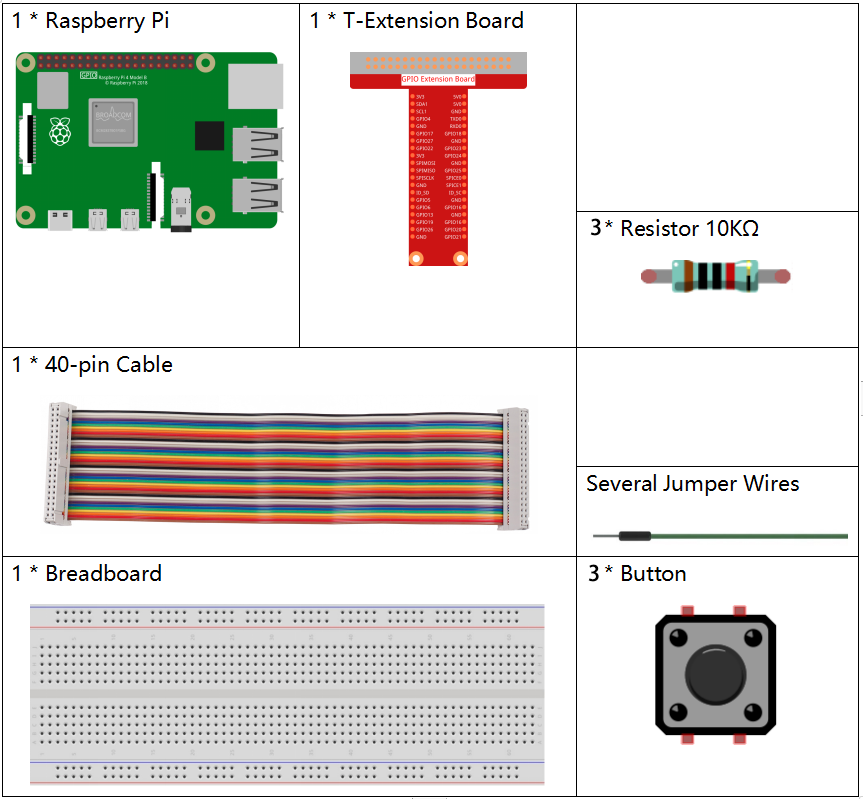
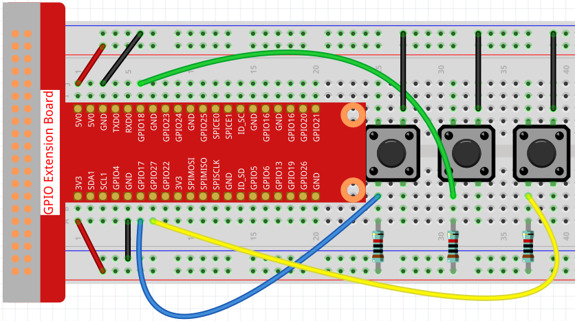
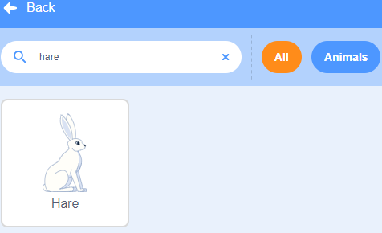
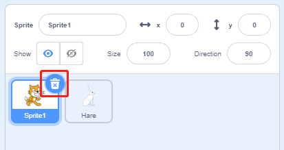
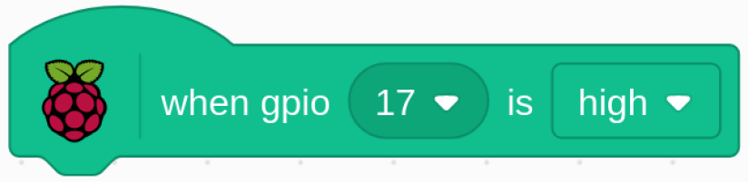
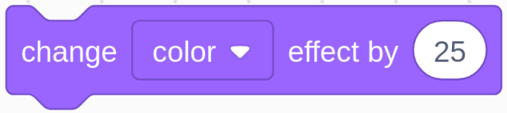
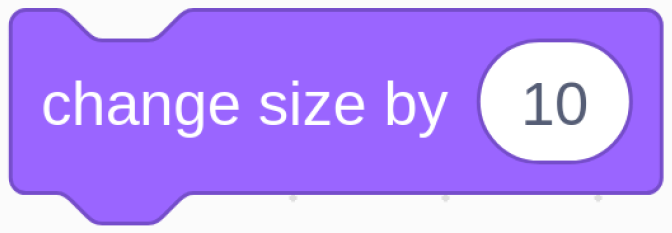

1.4 Hase
==============

Heute werden wir Button, Raspberry Pi und Scratch verwenden, um einen Hasen mit verschiedenen Veränderungen zu erstellen!

Wenn wir den ersten Knopf drücken, ändert der Hase im Bühnenbereich seine Körperfarbe; wenn wir den zweiten Knopf drücken, ändert der Hase seine Körpergröße; wenn wir den dritten Knopf drücken, macht der Hase einen Schritt nach vorne.

.. image:: media/1.4_header.png

Erforderliche Komponenten
----------------------------

Bauen Sie den Stromkreis auf
-----------------------------------

Laden Sie den Code und sehen Sie, was passiert
--------------------------------------------------------

Lade die Code-Datei (``1.4_hare.sb3``) in Scratch 3.

Jetzt kannst du versuchen, jeden der 3 Knöpfe zu drücken, um zu sehen, wie sich der Hase auf der Bühne verändert.

Tipps zu Figur
----------------

Klicken Sie auf die Schaltfläche **Choose a Sprite** in der unteren rechten Ecke des Sprite-Bereichs, geben Sie **Hare** in das Suchfeld ein, und klicken Sie dann, um es hinzuzufügen.

Löschen Sie Figur1.

Tipps zu Codes
-----------------------

Dies ist ein Ereignisblock, der ausgelöst wird, wenn der Pegel von GPIO17 hoch ist, was bedeutet, dass die Taste zu diesem Zeitpunkt gedrückt wird.

Dies ist ein Block, um die Farbe von **Hare** zu ändern, der Bereich des Wertes ist 0 ~ 199, über 199 wird wieder von 0 geändert.

Dies ist ein Block, der verwendet wird, um die Größe für das Sprite zu ändern. Je höher der Wert, desto größer das Sprite.

.. note::
  Das Sprite ist auch nicht unendlich groß, und seine maximale Größe hängt von der Größe des Originalbildes ab.

Dies ist ein Block, der die Kostüme der Sprites wechselt. Wenn **Hare**
sein Kostüm wechselt, führt er eine Reihe von kohärenten Aktionen aus. In diesem Projekt soll **Hare** zum Beispiel einen Schritt nach vorne machen.
