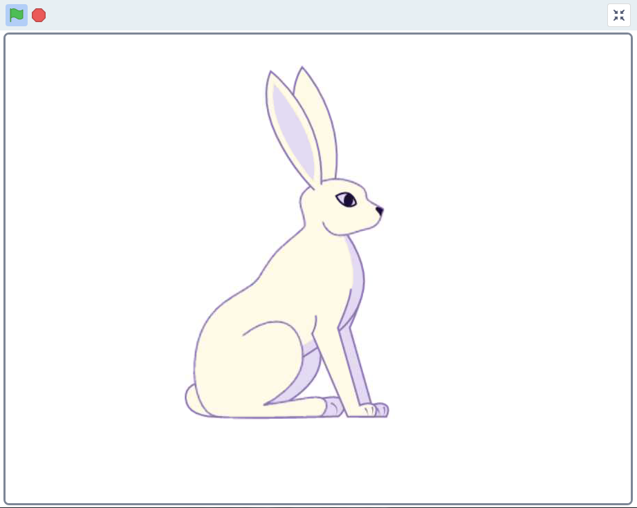
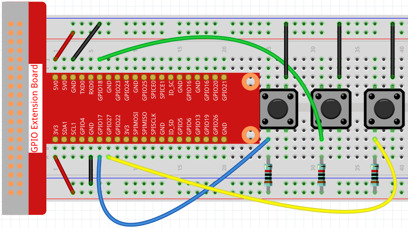
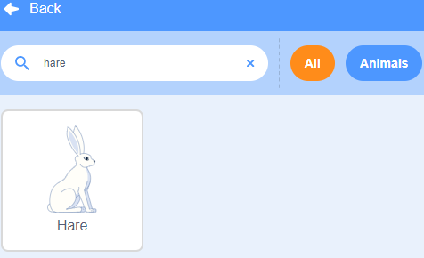
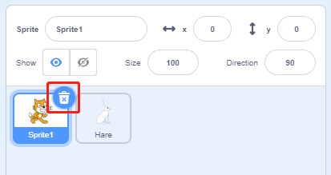
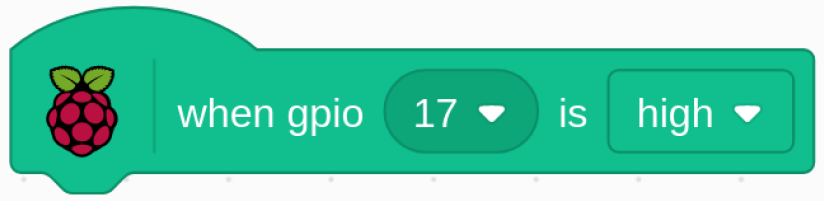
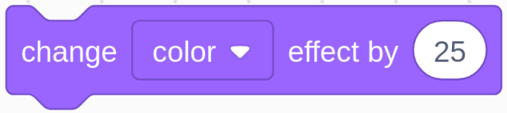
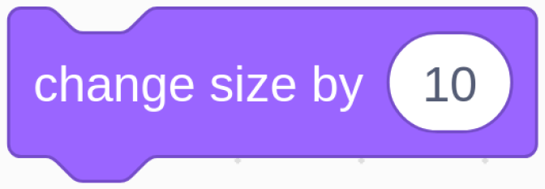

.. note::

    ¡Hola! Bienvenido a la comunidad de entusiastas de SunFounder para Raspberry Pi, Arduino y ESP32 en Facebook. Únete a otros apasionados y profundiza en el mundo de Raspberry Pi, Arduino y ESP32.

    **¿Por qué unirte?**

    - **Soporte Experto**: Resuelve problemas posventa y supera desafíos técnicos con el apoyo de nuestra comunidad y equipo.
    - **Aprende y Comparte**: Intercambia consejos y tutoriales para mejorar tus habilidades.
    - **Acceso Exclusivo**: Obtén acceso anticipado a anuncios de nuevos productos y adelantos especiales.
    - **Descuentos Especiales**: Disfruta de descuentos exclusivos en nuestros productos más recientes.
    - **Promociones Festivas y Sorteos**: Participa en sorteos y promociones durante las festividades.

    👉 ¿Listo para explorar y crear con nosotros? Haz clic en [|link_sf_facebook|] y únete hoy.

1.4 Liebre
==============

Hoy usaremos un botón, Raspberry Pi y Scratch para crear una liebre con varios cambios.

Al presionar el primer botón, la liebre en el área del escenario cambiará el color de su cuerpo; al presionar el segundo botón, cambiará el tamaño de su cuerpo; y al presionar el tercer botón, dará un paso hacia adelante.

Componentes Necesarios
----------------------------

.. image:: img/1.4_list.png

Construye el Circuito
------------------------

Carga el Código y Observa Qué Sucede
----------------------------------------

Carga el archivo de código (``1.4_hare.sb3``) en Scratch 3.

Ahora puedes intentar presionar cada uno de los 3 botones para ver cómo cambia la liebre en el escenario.

Consejos sobre el Objeto
---------------------------

Haz clic en el botón **Elegir un Objeto** en la esquina inferior derecha del área de sprites, escribe **Hare** en el cuadro de búsqueda y haz clic para agregarlo.

Elimina Sprite1.

Consejos sobre el Código
-------------------------

Este es un bloque de evento que se activa cuando el nivel de GPIO17 está en alto, lo que indica que el botón ha sido presionado en ese momento.

Este es un bloque para cambiar el color de **Hare**. El rango del valor es de 0 a 199; al superar 199, el color volverá a 0 nuevamente.

Este bloque se utiliza para cambiar el tamaño del sprite; cuanto mayor sea el valor, más grande será el sprite.

.. note::
  El sprite no puede ser infinitamente grande, y su tamaño máximo está relacionado con el tamaño de la imagen original.

Este es un bloque que cambia los disfraces del sprite. Cuando el disfraz de **Hare** se sigue cambiando, realiza una serie de acciones coherentes. Por ejemplo, en este proyecto, hace que **Hare** dé un paso hacia adelante.

