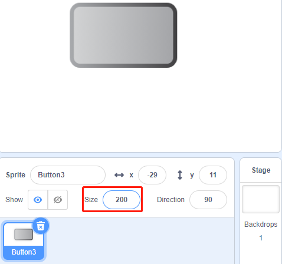

1.5 Doorbell
==================

Today we will make a doorbell, click the button 3 sprite on the stage, the buzzer will sound; click again, the Buzzer will stop sounding.

.. image:: media/1.5header.png

Required Components
-----------------------

.. image:: media/list_1.5.png

Build the Circuit
---------------------

.. image:: media/image106.png

Load the Code and See What Happens
-----------------------------------------

Load the code file (``1.5_doorbell.sb3``) to Scratch 3.

Click on the green flag on the stage. When we click on the Button 3 sprite, it will turn blue and then the buzzer will sound; when we click again, the Button 3 sprite reverts to gray and the buzzer stops sounding.

Tips on Sprite
----------------

Delete the default sprite, then choose the **Button 3** sprite.

.. image:: media/1.5_scratch_button3.png

Then set the size to 200.

Tips on Codes
--------------

.. image:: media/buzzer4.png
  :width: 400

This block allows you to switch the sprite's costume.

.. image:: media/buzzer5.png
  :width: 400

Set gpio17 to low to make the buzzer sound; set it to high and the buzzer will not sound.

The status switch is used here, and we will use a flowchart to help you understand the whole code.

When the green flag is clicked, the status will be set to 0 first, and wait for the sprite to be clicked at this time; if button 3 sprite is clicked, it will switch to costume as button-b (blue) and the status will be set to 1. When the main program receives the status as 1, it will let the buzzer sound at 0.1s interval.
If button-3 is clicked again, it will switch to button-a (gray) and status will be set to 0 again.

.. image:: media/1.5_scratch_code.png

