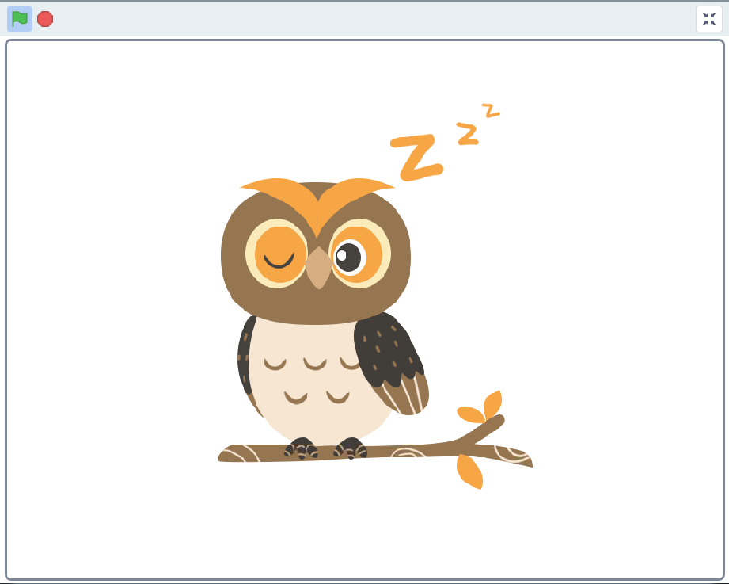
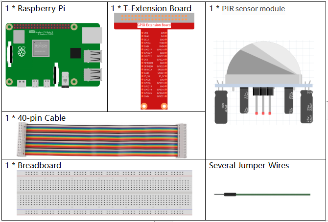
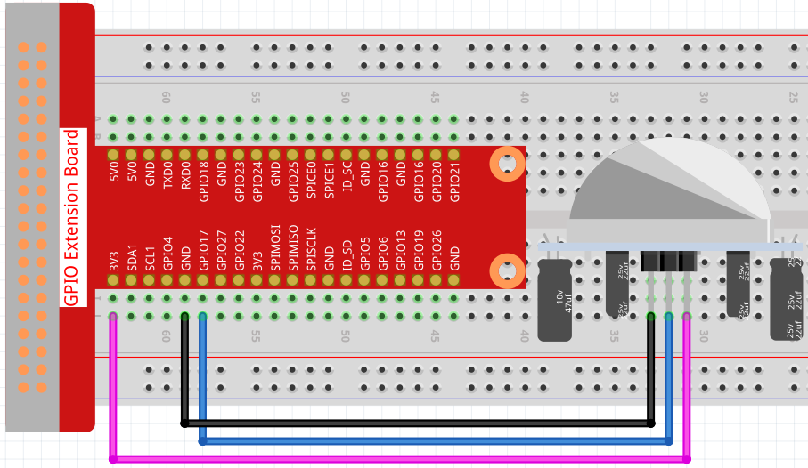

1.5 Wake up the Owl
====================

Today we are going to play a game of waking up the owl.

When someone approaches the PIR sensor module, the owl will wake up from sleep.

There are two potentiometers on
the PIR module: one is to adjust sensitivity and the other is to adjust
the detection distance. To make the PIR module work better, you
You need to turn both of them counterclockwise to the end.

Required Components
-----------------------

Build the Circuit
---------------------

Load the Code and See What Happens
---------------------------------------

Load the code file (``1.5_wake_up_the_owl.sb3``) to Scratch 3.

When you approach the PIR sensor module, you will see the owl on the stage area open its wings and wake up, and when you leave, the owl will go back to sleep again.

Tips on Sprite
----------------

Select Sprite1 and click **Costumes** in the top left corner; upload **owl1.png** and **owl2.png** from the ``home/pi/davinci-kit-for-raspberry-pi/scratch/picture`` path via the **Upload Costume** button; delete the default 2 costumes, and rename the sprite to **owl**.

.. image:: media/1.5_pir1.png

Tips on Codes
--------------

.. image:: media/1.3_title2.png

When the green flag is clicked, the initial state of gpio17 is set to low.

.. image:: media/1.5_owl1.png
  :width: 400

When pin17 is low (no one is approaching), switch the costume of the owl sprite to owl1 (sleeping state).

.. image:: media/1.5_owl2.png
  :width: 400

When pin17 is high (someone is approaching), we switch the costume of owl sprite to owl2 (wake up state).