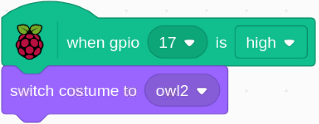

.. note::

    Bonjour, bienvenue dans la communauté SunFounder pour les passionnés de Raspberry Pi, Arduino et ESP32 sur Facebook ! Plongez plus profondément dans l’univers du Raspberry Pi, d’Arduino et d’ESP32 avec d’autres passionnés.

    **Pourquoi nous rejoindre ?**

    - **Support d'experts** : Résolvez les problèmes après-vente et relevez les défis techniques avec l'aide de notre communauté et de notre équipe.
    - **Apprendre et Partager** : Échangez des astuces et des tutoriels pour améliorer vos compétences.
    - **Aperçus exclusifs** : Profitez d'un accès anticipé aux annonces de nouveaux produits et aux aperçus en avant-première.
    - **Réductions spéciales** : Bénéficiez de remises exclusives sur nos derniers produits.
    - **Promotions festives et concours** : Participez à des tirages au sort et à des promotions spéciales pendant les fêtes.

    👉 Prêt à explorer et créer avec nous ? Cliquez sur [|link_sf_facebook|] et rejoignez-nous dès aujourd'hui !

1.5 Réveiller le Hibou
======================

Aujourd'hui, nous allons jouer à un jeu pour réveiller le hibou.

Lorsque quelqu'un s'approche du module capteur PIR, le hibou se réveillera de son sommeil.

Le module PIR possède deux potentiomètres : l’un permet de régler la sensibilité et l’autre 
la distance de détection. Pour que le module PIR fonctionne de manière optimale, il est 
conseillé de tourner les deux potentiomètres dans le sens antihoraire jusqu'à la butée.

.. image:: img/1.5_header.png

Composants Requis
------------------

.. image:: img/1.5_component.png

Construire le Circuit
---------------------

.. image:: img/1.5_fritzing.png

Charger le Code et Observer le Résultat
---------------------------------------

Chargez le fichier de code (``1.5_wake_up_the_owl.sb3``) dans Scratch 3.

Lorsque vous vous approchez du module capteur PIR, vous verrez le hibou sur la scène ouvrir ses ailes et se réveiller. Lorsque vous vous éloignez, le hibou se rendormira.

Conseils pour le Sprite
--------------------------

Sélectionnez Sprite1 et cliquez sur **Costumes** en haut à gauche ; téléchargez les images **owl1.png** et **owl2.png** depuis le répertoire ``davinci-kit-for-raspberry-pi/scratch/picture`` via le bouton **Télécharger un Costume** ; supprimez les 2 costumes par défaut et renommez le sprite en **owl**.

.. image:: img/1.5_pir1.png

Conseils pour le Code
------------------------

.. image:: img/1.3_title2.png

Lorsque le drapeau vert est cliqué, l’état initial de gpio17 est défini sur bas.

.. image:: img/1.5_owl1.png
  :width: 400

Lorsque la broche 17 est en position basse (personne ne s'approche), le costume du sprite hibou change pour **owl1** (état endormi).

Lorsque la broche 17 est en position haute (quelqu'un s'approche), le costume du sprite hibou change pour **owl2** (état réveillé).
