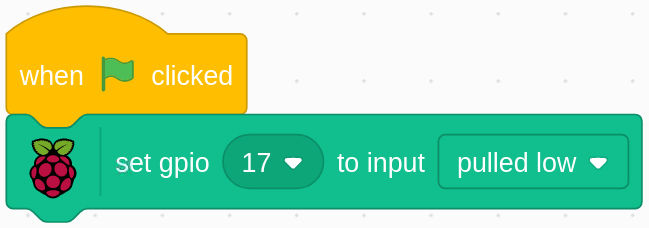

.. note::

    Ciao, benvenuto nella Community di appassionati di SunFounder Raspberry Pi & Arduino & ESP32 su Facebook! Esplora più a fondo Raspberry Pi, Arduino ed ESP32 insieme ad altri appassionati.

    **Perché unirsi?**

    - **Supporto Esperto**: Risolvi problemi post-vendita e sfide tecniche con l'aiuto della nostra community e del nostro team.
    - **Impara e Condividi**: Scambia suggerimenti e tutorial per migliorare le tue competenze.
    - **Anteprime Esclusive**: Ottieni accesso anticipato agli annunci dei nuovi prodotti e anteprime.
    - **Sconti Speciali**: Goditi sconti esclusivi sui nostri prodotti più recenti.
    - **Promozioni Festive e Giveaway**: Partecipa a concorsi e promozioni per le festività.

    👉 Pronto a esplorare e creare con noi? Clicca su [|link_sf_facebook|] e unisciti oggi!

1.5 Sveglia il Gufo
=======================

Oggi giocheremo a un gioco per svegliare il gufo.

Quando qualcuno si avvicina al modulo sensore PIR, il gufo si sveglierà dal sonno.

Sul modulo PIR ci sono due potenziometri: uno per regolare la sensibilità e 
l'altro per regolare la distanza di rilevamento. Per far funzionare al meglio 
il modulo PIR, è necessario girarli entrambi in senso antiorario fino alla fine.

.. image:: img/1.5_header.png

Componenti Necessari
------------------------

.. image:: img/1.5_component.png

Costruisci il Circuito
-----------------------

.. image:: img/1.5_fritzing.png

Carica il Codice e Guarda cosa Succede
----------------------------------------

Carica il file del codice (``1.5_wake_up_the_owl.sb3``) in Scratch 3.

Quando ti avvicini al modulo sensore PIR, vedrai il gufo nell'area della scena aprire le ali e svegliarsi; quando ti allontani, il gufo tornerà a dormire.

Suggerimenti sullo Sprite
----------------------------

Seleziona Sprite1 e clicca su **Costumi** in alto a sinistra; carica **owl1.png** e **owl2.png** dal percorso ``home/pi/davinci-kit-for-raspberry-pi/scratch/picture`` tramite il pulsante **Carica Costume**; elimina i 2 costumi predefiniti e rinomina lo sprite in **gufo**.

.. image:: img/1.5_pir1.png

Suggerimenti sui Codici
----------------------------

Quando viene cliccata la bandierina verde, lo stato iniziale di gpio17 è impostato su basso.

.. image:: img/1.5_owl1.png
  :width: 400

Quando il pin17 è basso (nessuno si sta avvicinando), cambia il costume dello sprite gufo in owl1 (stato di sonno).

.. image:: img/1.5_owl2.png
  :width: 400

Quando il pin17 è alto (qualcuno si avvicina), cambiamo il costume dello sprite gufo in owl2 (stato di veglia).
