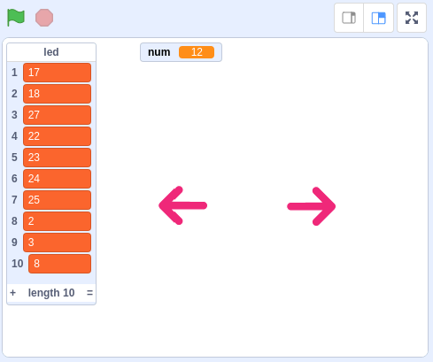
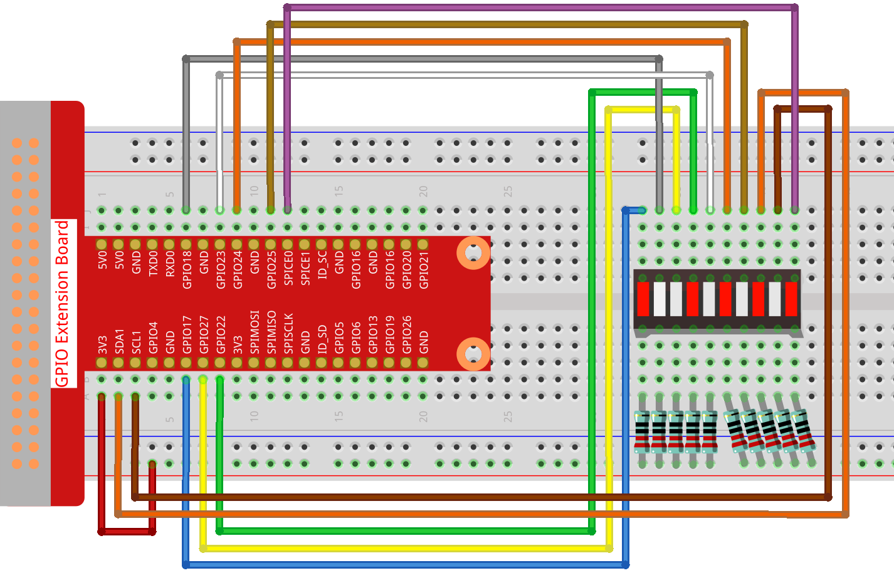
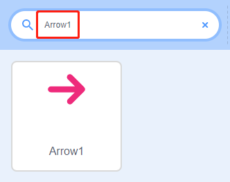
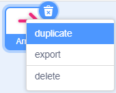
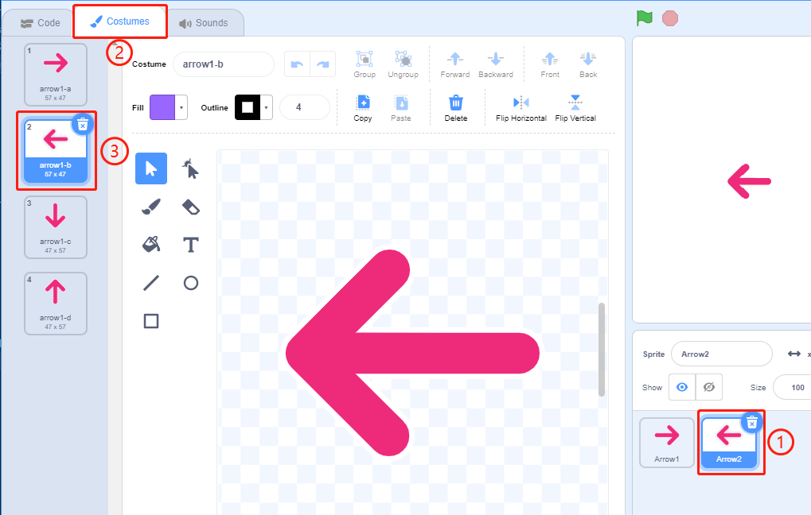
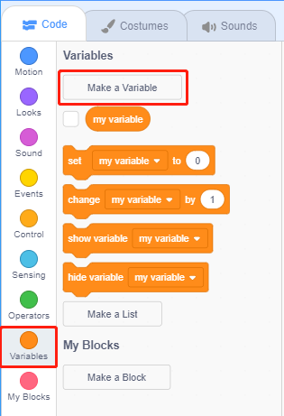
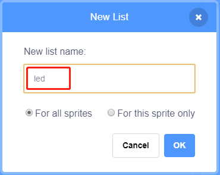
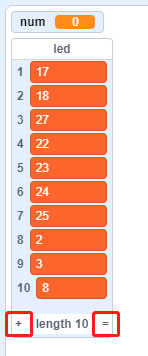
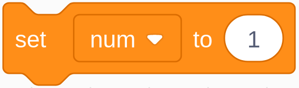

.. note::

    Hallo und willkommen in der SunFounder Raspberry Pi & Arduino & ESP32 Enthusiasten-Gemeinschaft auf Facebook! Tauchen Sie tiefer ein in die Welt von Raspberry Pi, Arduino und ESP32 mit anderen Enthusiasten.

    **Warum beitreten?**

    - **Expertenunterstützung**: Lösen Sie Nachverkaufsprobleme und technische Herausforderungen mit Hilfe unserer Gemeinschaft und unseres Teams.
    - **Lernen & Teilen**: Tauschen Sie Tipps und Anleitungen aus, um Ihre Fähigkeiten zu verbessern.
    - **Exklusive Vorschauen**: Erhalten Sie frühzeitigen Zugang zu neuen Produktankündigungen und exklusiven Einblicken.
    - **Spezialrabatte**: Genießen Sie exklusive Rabatte auf unsere neuesten Produkte.
    - **Festliche Aktionen und Gewinnspiele**: Nehmen Sie an Gewinnspielen und Feiertagsaktionen teil.

    👉 Sind Sie bereit, mit uns zu erkunden und zu erschaffen? Klicken Sie auf [|link_sf_facebook|] und treten Sie heute bei!

1.6 Water Lamp
================

Heute werden wir mit LED-Balkengrafik, Raspberry Pi und Scratch eine Wasserlampe bauen.

Die LED-Balkenanzeige leuchtet in der Reihenfolge der Pfeile auf der Bühne auf.

Erforderliche Komponenten
-----------------------------------

.. image:: media/1.12_list.png

Bauen Sie den Stromkreis auf
------------------------------------

Laden Sie den Code und sehen Sie, was passiert
-------------------------------------------------------

Lade die Code-Datei (``1.6_water_lamp.sb3``) von deinem Computer in Scratch 3.

Wenn Sie auf **Arrow1** klicken, leuchten die LEDs auf der LED-Leiste nacheinander von links nach rechts auf (eine nach der anderen) und gehen dann aus. Klicken Sie auf **Arrow2** und die LEDs leuchten in der umgekehrten Reihenfolge auf.

Tipps zu Figur
----------------

Löschen Sie das Standard-Figur und wählen Sie das Figur **Arrow1** .

Hier benötigen wir 2 **Arrow1** -Sprites, die mit dem Duplikat-Button erstellt werden können.

Klicken Sie auf das Sprite **Arrow 2** und ändern Sie die Richtung des Pfeils, indem Sie Kostüm 2 wählen.

Nun wollen wir eine Variable erstellen.

Benennen Sie es als ``num`` .

.. image:: media/1.12_graph4.png

Gehen Sie genauso vor, um eine Liste namens ``led`` zu erstellen.

Nach dem Hinzufügen sollten Sie die Variable ``num`` und die Liste ``led`` im Bühnenbereich sehen.

Klicken Sie auf +, um 10 Listenelemente hinzuzufügen, und geben Sie die Pin-Nummern der Reihe nach ein (17,18,27,22,23,24,25,2,3,8).

Tipps zu Codes
------------------------

.. image:: media/1.12_graph10.png
  :width: 300

Dies ist ein Ereignisblock, der ausgelöst wird, wenn das aktuelle Sprite angeklickt wird.

Der Anfangswert der Variablen ``num`` bestimmt, welche LED zuerst leuchtet.

.. image:: media/1.12_graph9.png

Setzen Sie den Pin mit der Nummer ``num`` in der LED-Liste auf low, um die LED zum Leuchten zu bringen, und setzen Sie dann den Pin mit der Nummer ``num-1`` auf high, um die vorherige LED auszuschalten.

