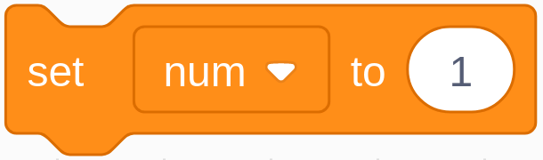

.. note::

    Hello, welcome to the SunFounder Raspberry Pi & Arduino & ESP32 Enthusiasts Community on Facebook! Dive deeper into Raspberry Pi, Arduino, and ESP32 with fellow enthusiasts.

    **Why Join?**

    - **Expert Support**: Solve post-sale issues and technical challenges with help from our community and team.
    - **Learn & Share**: Exchange tips and tutorials to enhance your skills.
    - **Exclusive Previews**: Get early access to new product announcements and sneak peeks.
    - **Special Discounts**: Enjoy exclusive discounts on our newest products.
    - **Festive Promotions and Giveaways**: Take part in giveaways and holiday promotions.

    👉 Ready to explore and create with us? Click [|link_sf_facebook|] and join today!

1.6 Water Lamp
================

Today, we will use LED Bar Graph, Raspberry Pi and scratch to make a Water Lamp.

The LED Bar Graph will light up in order with the direction of the arrows on the stage.

.. image:: img/1.12_header.png

Required Components
-------------------------

.. image:: img/1.12_list.png

Build the Circuit
-----------------------

.. image:: img/1.12_image66.png

Load the Code and See What Happens
-----------------------------------------

Load the code file (``1.6_water_lamp.sb3``) from your computer to Scratch 3.

By clicking on **Arrow1**, the LEDs on the LED bar are lit in sequence from the left to the right (one at a time) and then off. Click **Arrow2** and the LEDs light up in the opposite order.

Tips on Sprites
----------------

Delete the default sprite and choose the **Arrow1** sprite.

.. image:: img/1.12_graph1.png

Here we will need 2 **Arrow1** sprites, which can be done with the duplicate button.

.. image:: img/1.12_scratch_duplicate.png

Click on the **Arrow 2** sprite and change the direction of the arrow by selecting costume 2.

.. image:: img/1.12_graph2.png

Now let's make a variable.

.. image:: img/1.12_graph3.png

Name it as **num**.

.. image:: img/1.12_graph4.png

Follow the same method to create a list called **led**.

.. image:: img/1.12_graph6.png

After adding, you should see the **num** variable and the **led** list on the stage area. 

Click **+** to add 10 list items and enter the pin numbers in order (17,18,27,22,23,24,25,2,3,8).

.. image:: img/1.12_graph7.png

Tips on Codes
--------------

This is an event block that is triggered when the current sprite is clicked.

The initial value of the **num** variable determines which LED is lit first.

.. image:: img/1.12_graph9.png

Set the pin corresponding to **num** in the led list to low to light the LED, and then set the pin corresponding to **num-1** to high to turn off the previous LED.

