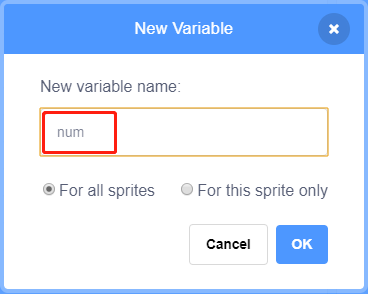

.. note::

    ¡Hola! Bienvenido a la comunidad de entusiastas de SunFounder para Raspberry Pi, Arduino y ESP32 en Facebook. Únete a otros apasionados y profundiza en el mundo de Raspberry Pi, Arduino y ESP32.

    **¿Por qué unirte?**

    - **Soporte Experto**: Resuelve problemas posventa y supera desafíos técnicos con el apoyo de nuestra comunidad y equipo.
    - **Aprende y Comparte**: Intercambia consejos y tutoriales para mejorar tus habilidades.
    - **Acceso Exclusivo**: Obtén acceso anticipado a anuncios de nuevos productos y adelantos especiales.
    - **Descuentos Especiales**: Disfruta de descuentos exclusivos en nuestros productos más recientes.
    - **Promociones Festivas y Sorteos**: Participa en sorteos y promociones durante las festividades.

    👉 ¿Listo para explorar y crear con nosotros? Haz clic en [|link_sf_facebook|] y únete hoy.

1.6 Lámpara de Agua
=======================

Hoy usaremos una Barra de LED, Raspberry Pi y Scratch para hacer una lámpara de agua.

La Barra de LED se encenderá en secuencia siguiendo la dirección de las flechas en el escenario.

.. image:: img/1.12_header.png

Componentes Necesarios
--------------------------

.. image:: img/1.12_list.png

Construye el Circuito
-------------------------

.. image:: img/1.12_image66.png

Carga el Código y Observa Qué Sucede
-----------------------------------------

Carga el archivo de código (``1.6_water_lamp.sb3``) desde tu computadora a Scratch 3.

Al hacer clic en **Arrow1**, los LED de la barra se encenderán en secuencia de izquierda a derecha (uno a la vez) y luego se apagarán. Al hacer clic en **Arrow2**, los LED se encenderán en el orden inverso.

Consejos sobre el Objeto
----------------------------

Elimina el sprite predeterminado y elige el sprite **Arrow1**.

.. image:: img/1.12_graph1.png

Aquí necesitaremos 2 sprites **Arrow1**, lo cual puedes hacer usando el botón de duplicar.

.. image:: img/1.12_scratch_duplicate.png

Haz clic en el sprite **Arrow2** y cambia la dirección de la flecha seleccionando el disfraz 2.

.. image:: img/1.12_graph2.png

Ahora, vamos a crear una variable.

.. image:: img/1.12_graph3.png

Nómbrala como **num**.

Sigue el mismo método para crear una lista llamada **led**.

.. image:: img/1.12_graph6.png

Después de añadirla, deberías ver la variable **num** y la lista **led** en el área del escenario.

Haz clic en **+** para agregar 10 elementos a la lista e introduce los números de pin en orden (17,18,27,22,23,24,25,2,3,8).

.. image:: img/1.12_graph7.png

Consejos sobre el Código
---------------------------

Este es un bloque de evento que se activa al hacer clic en el sprite actual.

.. image:: img/1.12_graph8.png
  :width: 300

El valor inicial de la variable **num** determina cuál LED se enciende primero.

.. image:: img/1.12_graph9.png

Configura el pin correspondiente a **num** en la lista **led** en bajo para encender el LED, y luego establece el pin correspondiente a **num-1** en alto para apagar el LED anterior.
