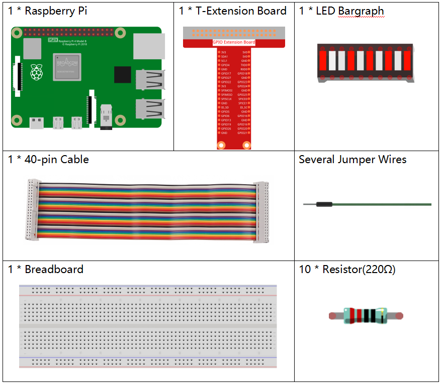

.. note::

    こんにちは、SunFounderのRaspberry Pi & Arduino & ESP32愛好家コミュニティへようこそ！Facebook上でRaspberry Pi、Arduino、ESP32についてもっと深く掘り下げ、他の愛好家と交流しましょう。

    **参加する理由は？**

    - **エキスパートサポート**：コミュニティやチームの助けを借りて、販売後の問題や技術的な課題を解決します。
    - **学び＆共有**：ヒントやチュートリアルを交換してスキルを向上させましょう。
    - **独占的なプレビュー**：新製品の発表や先行プレビューに早期アクセスしましょう。
    - **特別割引**：最新製品の独占割引をお楽しみください。
    - **祭りのプロモーションとギフト**：ギフトや祝日のプロモーションに参加しましょう。

    👉 私たちと一緒に探索し、創造する準備はできていますか？[|link_sf_facebook|]をクリックして今すぐ参加しましょう！

1.6 光が流れるLED
==================

今日はLED Bargraph、Raspberry Pi、Scratchを使ってストリーマーLEDを作ります。

LED棒グラフがstage上の矢印の方向に合わせて点灯します。

.. image:: media/1.12_header.png

必要な部品
-------------------------

回路を構築する
-----------------------

.. image:: media/1.12_image66.png

コードをロードして、何が起こるかを確認します
--------------------------------------------

コードファイル( ``1.6_water_lamp.sb3`` )をコンピューターからScratch3にロードします。

Arrow1 をクリックすると、LEDバーのLEDが左から右に（一度に1つずつ）順番に点灯し、その後消灯します。 Arrow2 をクリックすると、LEDが逆の順序で点灯します。

Spriteに関するヒント
--------------------

デフォルトのspriteを削除し、Arrow1 spriteを選択します。

.. image:: media/1.12_graph1.png

ここでは、2つの **Arrow1** spriteが必要です。これは、複製ボタンを利用し完成できます。

**Arrow 2** のSpriteをクリックし、costume2を選択して矢印の方向を変更します。

.. image:: media/1.12_graph2.png

それでは、変数を作成しましょう。

.. image:: media/1.12_graph3.png

**num** という名前を付けます。

.. image:: media/1.12_graph4.png

同じ方法に従って、 **led** というリストを作成します。

.. image:: media/1.12_graph6.png

追加すると、stage areaに num 変数と led リストが表示されます。

**+** をクリックして 10 個のリスト項目を追加し、ピン番号を順番に入力します (17、18、27、22、23、24、25、2、3、8)。

.. image:: media/1.12_graph7.png

コードに関するヒント
--------------------

.. image:: media/1.12_graph10.png
  :width: 300

これは、現在のspriteがクリックされたときにトリガーされるイベントブロックです。

.. image:: media/1.12_graph8.png
  :width: 300

num 変数の初期値は、どの LED が最初にオンになるかを決定します。

.. image:: media/1.12_graph9.png

LEDリストの num に対応するピンをlowに設定してLEDを点灯させ、
次に num-1 に対応するピンをhighに設定して前のLEDをオフにします。
