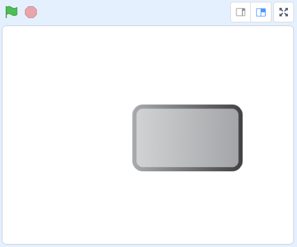
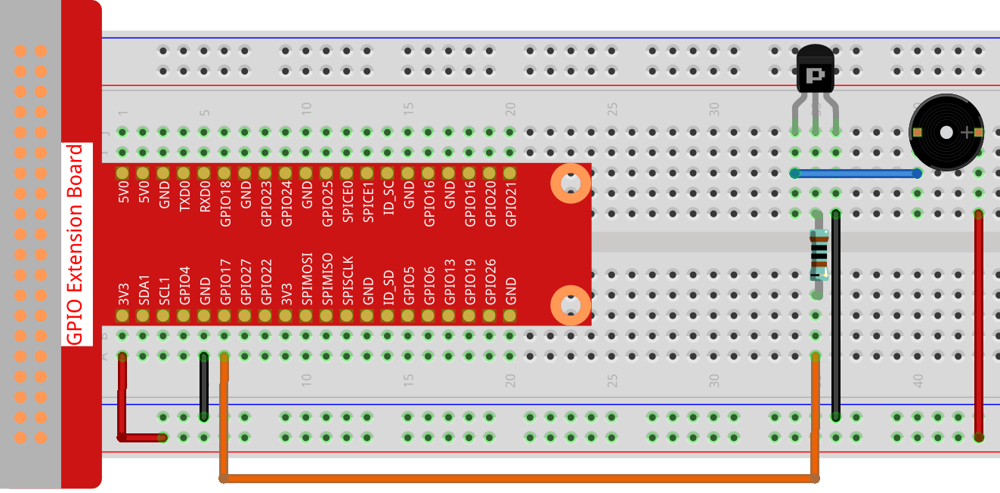
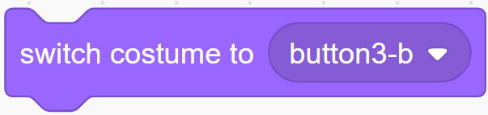
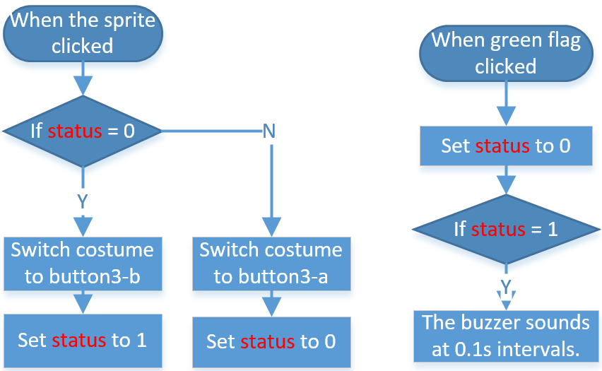

.. note::

    ¡Hola! Bienvenido a la comunidad de entusiastas de SunFounder para Raspberry Pi, Arduino y ESP32 en Facebook. Únete a otros apasionados y profundiza en el mundo de Raspberry Pi, Arduino y ESP32.

    **¿Por qué unirte?**

    - **Soporte Experto**: Resuelve problemas posventa y supera desafíos técnicos con el apoyo de nuestra comunidad y equipo.
    - **Aprende y Comparte**: Intercambia consejos y tutoriales para mejorar tus habilidades.
    - **Acceso Exclusivo**: Obtén acceso anticipado a anuncios de nuevos productos y adelantos especiales.
    - **Descuentos Especiales**: Disfruta de descuentos exclusivos en nuestros productos más recientes.
    - **Promociones Festivas y Sorteos**: Participa en sorteos y promociones durante las festividades.

    👉 ¿Listo para explorar y crear con nosotros? Haz clic en [|link_sf_facebook|] y únete hoy.

1.7 Timbre
============

Hoy crearemos un timbre. Haz clic en el sprite **Button 3** en el escenario y el zumbador sonará; haz clic nuevamente y el zumbador se detendrá.

Componentes Necesarios
-------------------------

.. image:: img/1.13_list.png

Construye el Circuito
------------------------

Carga el Código y Observa Qué Sucede
-------------------------------------

Carga el archivo de código (``1.7_doorbell.sb3``) en Scratch 3.

Haz clic en la bandera verde en el escenario. Cuando hagas clic en el sprite **Button 3**, este se volverá azul y el zumbador comenzará a sonar; si vuelves a hacer clic, el sprite **Button 3** volverá a gris y el zumbador dejará de sonar.

Consejos sobre el Sprite
--------------------------

Elimina el sprite predeterminado y selecciona el sprite **Button 3**.

.. image:: img/1.13_scratch_button3.png

Luego ajusta el tamaño a 200.

.. image:: img/1.13_scratch_button3_size.png

Consejos sobre el Código
--------------------------

Este bloque permite cambiar el disfraz del sprite.

Configura gpio17 en bajo para hacer sonar el zumbador; configúralo en alto y el zumbador se detendrá.

Aquí se utiliza el interruptor **status**, y usaremos un diagrama de flujo para ayudarte a entender el código completo.

Cuando se hace clic en la bandera verde, el **status** se establece primero en 0 y se espera a que se haga clic en el sprite; si el sprite **Button 3** es clicado, cambiará al disfraz **button-b** (azul) y el **status** se establecerá en 1. Cuando el programa principal reciba el **status** como 1, hará sonar el zumbador a intervalos de 0.1s. Si **Button 3** se vuelve a hacer clic, cambiará al disfraz **button-a** (gris) y el **status** volverá a 0.

