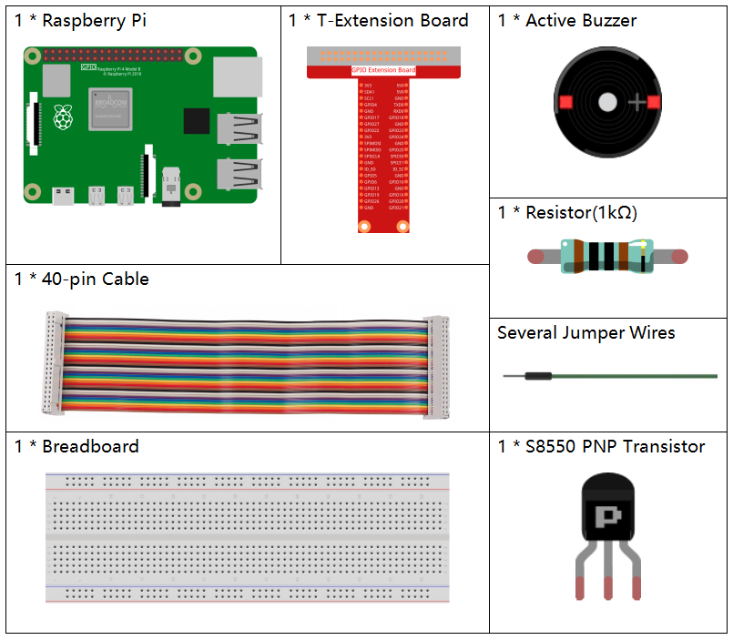

1.7 Doorbell
==================

Today we will make a doorbell, click the button3 sprite on the stage, the buzzer will sound; click again, the buzzer will stop sounding.

.. image:: img/1.13_header.png

Required Components
-----------------------

Build the Circuit
---------------------

.. image:: img/1.13_image106.png

Load the Code and See What Happens
-----------------------------------------

Load the code file (``1.7_doorbell.sb3``) to Scratch 3.

Click on the green flag on the stage. When we click on the Button 3 sprite, it will turn blue and then the buzzer will sound; when we click again, the **Button3** sprite reverts to gray and the buzzer stops sounding.

Tips on Sprite
----------------

Delete the default sprite, then choose the **Button 3** sprite.

.. image:: img/1.13_scratch_button3.png

Then set the size to 200.

.. image:: img/1.13_scratch_button3_size.png

Tips on Codes
--------------

.. image:: img/1.13_buzzer4.png
  :width: 400

This block allows you to switch the sprite's costume.

.. image:: img/1.13_buzzer5.png
  :width: 400

Set gpio17 to low to make the buzzer sound; set it to high and the buzzer will not sound.

The **status** switch is used here, and we will use a flowchart to help you understand the whole code.

When the green flag is clicked, the **status** will be set to 0 first, and wait for the sprite to be clicked at this time; if **button3** sprite is clicked, it will switch to costume as **button-b** costume (blue) and the **status** will be set to 1. When the main program receives the **status** as 1, it will let the buzzer sound at 0.1s interval.
If **button3** is clicked again, it will switch to **button-a** costume (gray) and **status** will be set to 0 again.

.. image:: img/1.13_scratch_code.png

