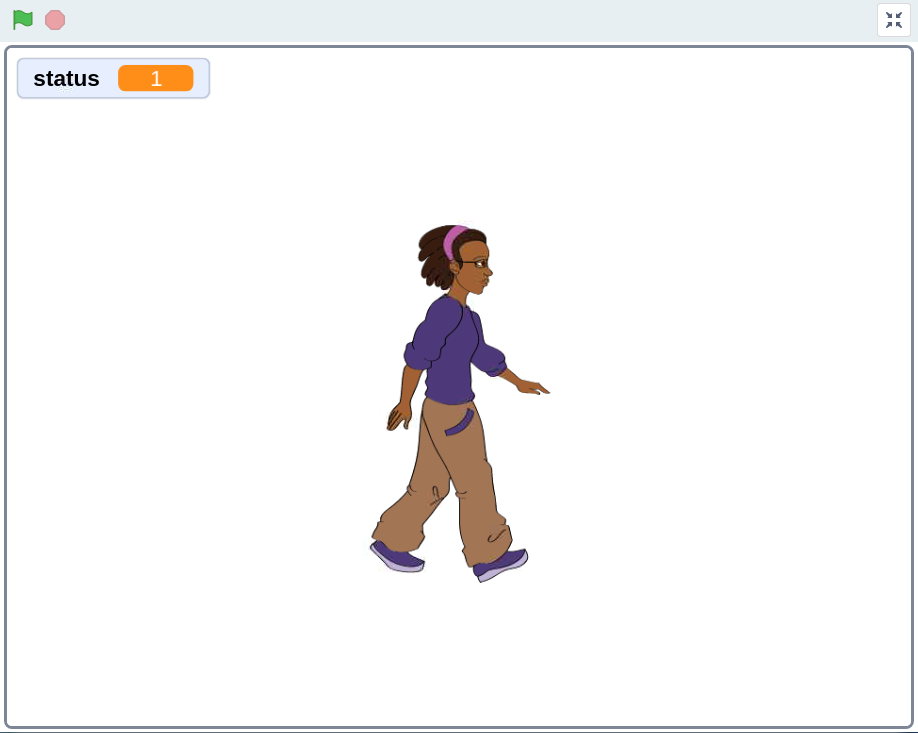
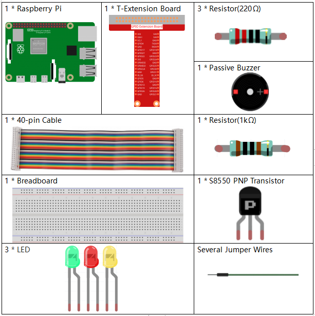
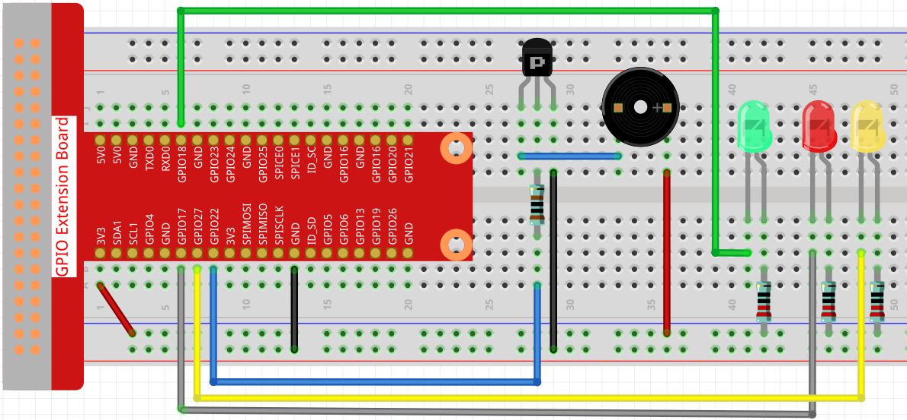
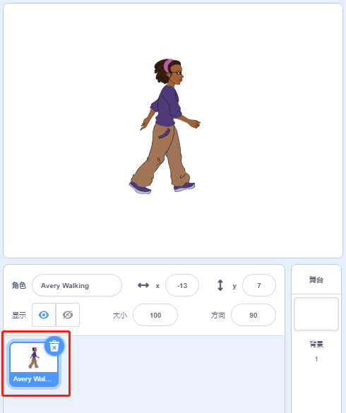
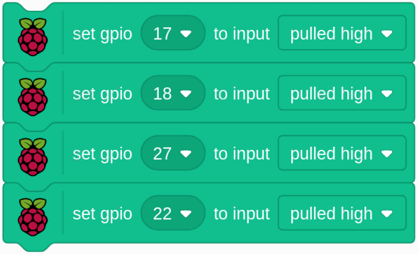
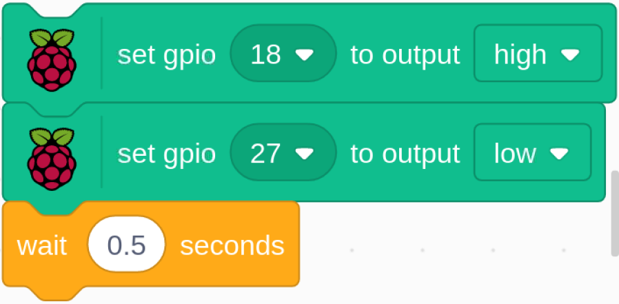

.. note::

    Hello, welcome to the SunFounder Raspberry Pi & Arduino & ESP32 Enthusiasts Community on Facebook! Dive deeper into Raspberry Pi, Arduino, and ESP32 with fellow enthusiasts.

    **Why Join?**

    - **Expert Support**: Solve post-sale issues and technical challenges with help from our community and team.
    - **Learn & Share**: Exchange tips and tutorials to enhance your skills.
    - **Exclusive Previews**: Get early access to new product announcements and sneak peeks.
    - **Special Discounts**: Enjoy exclusive discounts on our newest products.
    - **Festive Promotions and Giveaways**: Take part in giveaways and holiday promotions.

    👉 Ready to explore and create with us? Click [|link_sf_facebook|] and join today!

1.8 123 Wooden Man
===========================

Today, we are going to play a game of 123 wooden man.

Click on the green flag to start the game, hold down the right arrow key on the keyboard to make the sprite go right. If the green light is on, the sprite can move; but when the red LED is on, you have to stop the sprite from moving; otherwise the buzzer will keep ringing.

Required Components
------------------------

Build the Circuit
---------------------

Load the Code and See What Happens
---------------------------------------

Load the code file (``1.8_123_wooden_man.sb3``) to Scratch 3.

When the green LED is on, you can use the right arrow key to control **Avery** to walk to the right; when the red LED is on, if you continue to let **Avery** move to the right, then an alarm will sound.

Tips on Sprite
----------------
Delete the default sprite, then choose the **Avery Walking** sprite.

Tips on Codes
--------------

Initialize all pins to high.

.. image:: img/1.14_wooden3.png
  :width: 400

When the game starts, assign the status variable to 1, indicating that the Avery Walking sprite is movable, and then set gpio18 to low, which lights up the green LED for 5s.

Set gpio18 to high, then set gpio27 to low, which means turn off the green LED and light up the yellow LED for 0.5s.

.. image:: img/1.14_wooden5.png
  :width: 400

Assign the status variable to 0, which means the Avery Walking sprite is not moving; then set gpio27 to low and gpio17 to high, which turns off the yellow LED and then lights up the red LED for 3s. Finally, set gpio17 to high to turn off the red LED.

.. image:: img/1.14_wooden6.png
  :width: 400

When we press the right arrow key on the keyboard, we need to switch the **Avery Walking** sprite to the next costume so that we can see Avery walking to the right. Then we need to determine the value of the **status** variable. If it is 0, it means that the Avery Walking sprite is not moving at this moment, and the buzzer will sound to warn you that you cannot press the right arrow key again.
