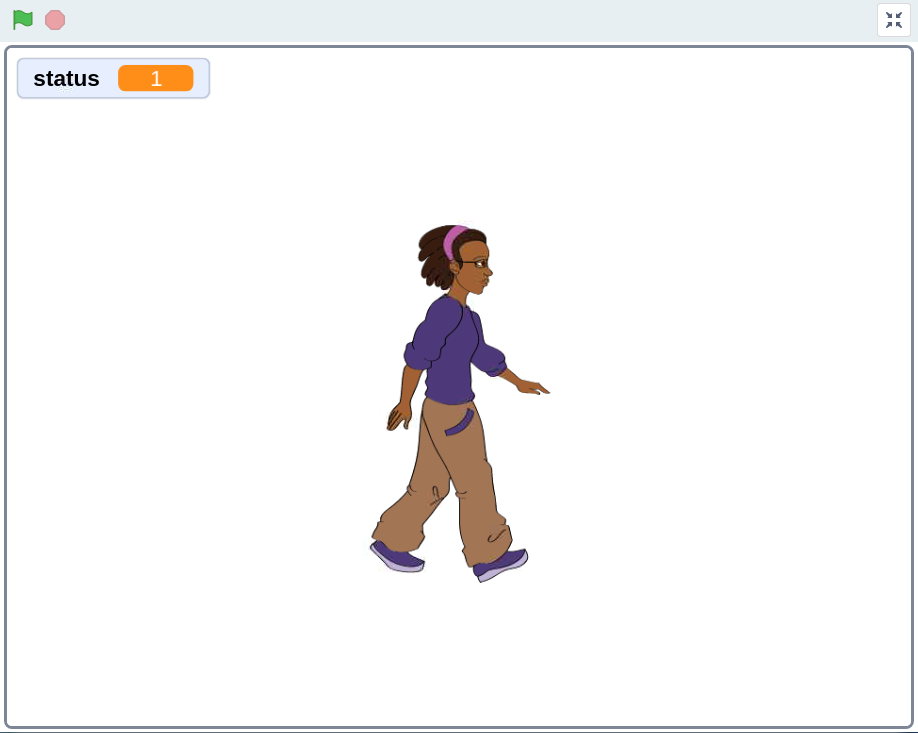
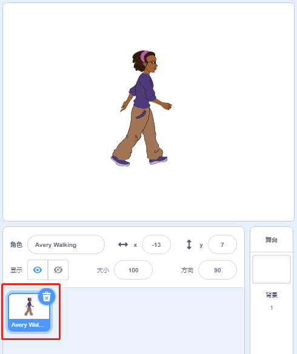
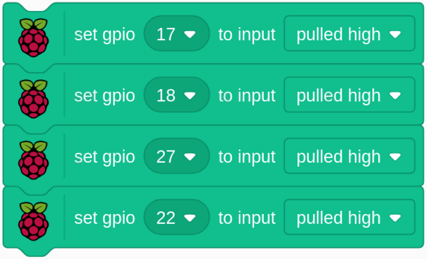
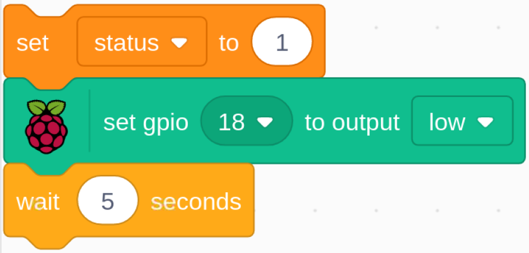
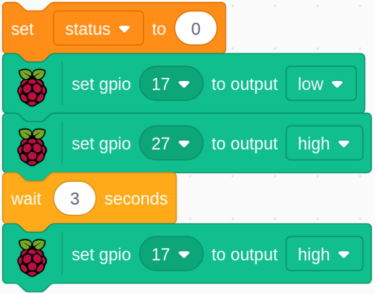
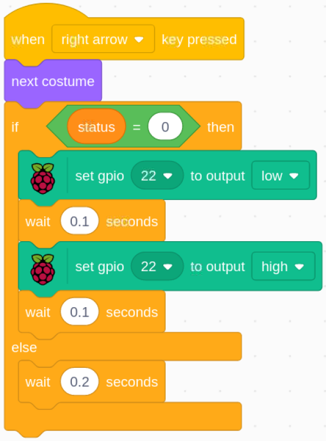

1.8 だるまさんがころんだ
===========================

今日はだるまさんがころんだのゲームをします。

緑の旗をクリックしてゲームを開始し、キーボードの右矢印キーを押したままにしてspriteを右に動かします。 緑色のライトが点灯している場合、スプライトは移動できます。 ただし、赤いLEDが点灯している場合は、スプライトの移動を停止する必要があります。 そうしないと、ブザーが鳴り続けます。

必要な部品
------------------------

.. image:: media/1.14_component.png

回路を構築する
---------------------

.. image:: media/1.14_fritzing.png

コードをロードして、何が起こるかを確認します
--------------------------------------------

コードをロードして、何が起こるかを確認します
コードファイル( ``1.8_123_wooden_man.sb3`` )をScratch3にロードします。

緑色のLEDが点灯している場合は、右矢印キーを使用して Avery を制御して右に歩くことができます。 赤いLEDが点灯しているときに、Avery を右に動かし続けると、アラームが鳴ります。

Spriteのヒント
----------------
デフォルトのSpriteを削除してから、Avery Walking spriteを選択します。

コードに関するヒント
--------------------

すべてのピンをHighに初期化します。

ゲームが開始したら、ステータス変数を1に割り当てて、Avery Walking spriteが移動可能であることを示します。次に、GPIO18を低に設定します。これにより、緑色のLEDが5秒間点灯します。

.. image:: media/1.14_wooden4.png
  :width: 400

GPIO18を高に設定してから、GPIO27を低に設定します。これは、緑色のLEDをオフにし、黄色のLEDを0.5秒間点灯させることを意味します。

ステータス変数を0に割り当てます。これは、Avery Walking spriteが移動していないことを意味します。 次に、GPIO27をlowに設定し、GPIO17をhighに設定します。これにより、黄色のLEDがオフになり、次に赤色のLEDが3秒間点灯します。 最後に、GPIO17をhighに設定して、赤いLEDをオフにします。

キーボードのright arrowキーを押すと、Averyが右に歩いているのが見えるように、Avery Walking spriteを次のcostumeに切り替える必要があります。 次に、status 変数の値を決定する必要があります。 0の場合は、現時点でAvery Walking spriteが動いていないことを意味し、right arrowキーを再度押すことができないことを警告するブザーが鳴ります。
