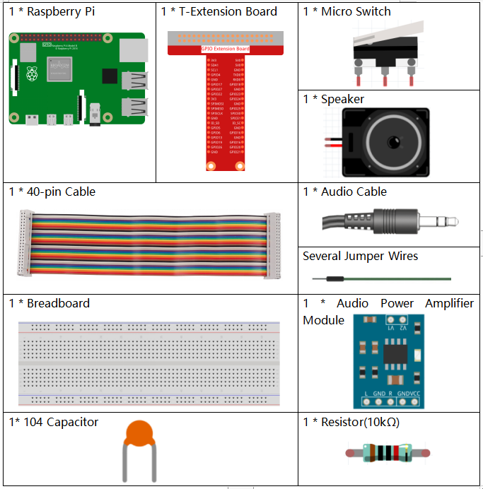

1.8 Tumbler
==================

In this project, we will make a tilt switch controlled tumbler toy.

.. image:: media/1.8header.png

Required Components
-----------------------

Build the Circuit
---------------------

.. image:: media/1.8_fritzing.png

Load the Code and See What Happens
-----------------------------------------

Load the code file (``1.8_tumbler.sb3``) to Scratch 3.

The tumbler is standing when the Tilt switch is placed horizontally. If you tilt it, the tumbler will also fall. Place it horizontally again, and the tumbler will stand up again.

Tips on Sprite
----------------
Select Sprite1 and click **Costumes** in the top left corner; upload **tumbler1.png** and **tumbler2.png** from the ``home/pi/davinci-kit-for-raspberry-pi/scratch/picture`` path via the **Upload Costume** button; delete the default 2 costumes, and rename the sprite to **tumbler**.

.. image:: media/title1.png

Tips on Codes
--------------

.. image:: media/title2.png
  :width: 400

When the green flag is clicked, the initial state of gpio17 is set to low.

.. image:: media/title4.png
  :width: 400

When pin17 is low (the tilt switch is placed upright), we switch the tumbler sprite's costume to tumbler1 (upright state).

.. image:: media/title3.png
  :width: 400

When pin17 is high (tilt switch is tilted), switch the tumbler wizard's costume to tumbler2 (tilt state).