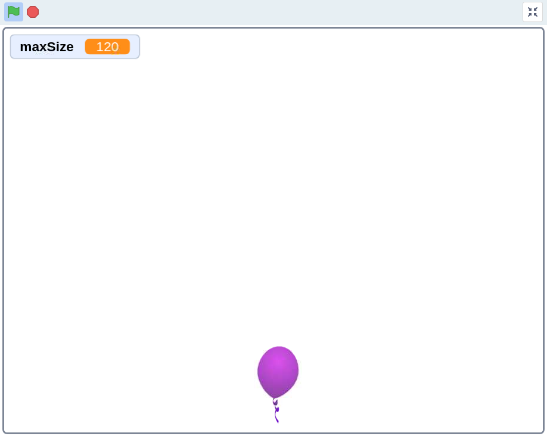
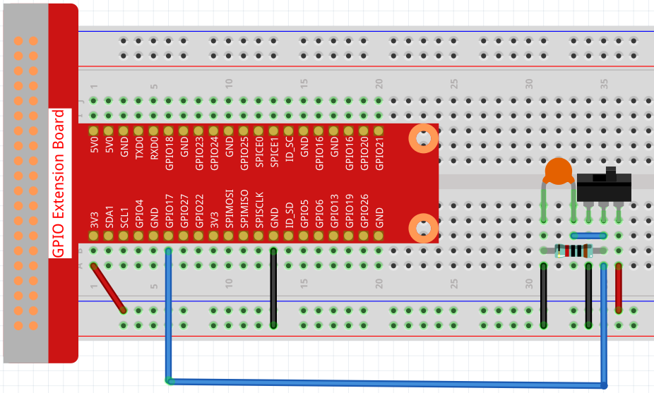
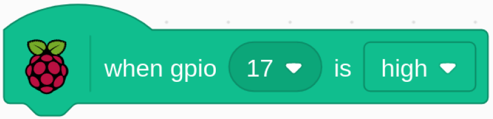
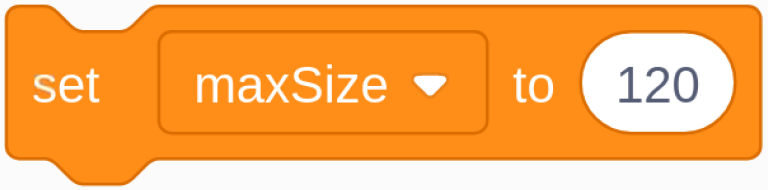
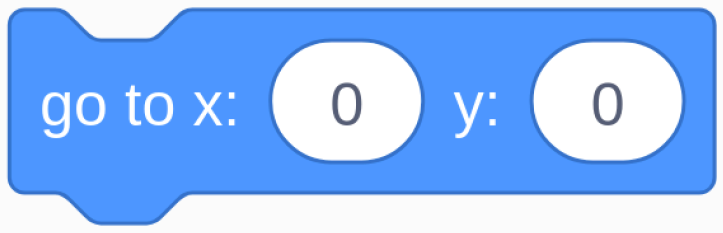

.. note::

    ¡Hola! Bienvenido a la comunidad de entusiastas de SunFounder para Raspberry Pi, Arduino y ESP32 en Facebook. Únete a otros apasionados y profundiza en el mundo de Raspberry Pi, Arduino y ESP32.

    **¿Por qué unirte?**

    - **Soporte Experto**: Resuelve problemas posventa y supera desafíos técnicos con el apoyo de nuestra comunidad y equipo.
    - **Aprende y Comparte**: Intercambia consejos y tutoriales para mejorar tus habilidades.
    - **Acceso Exclusivo**: Obtén acceso anticipado a anuncios de nuevos productos y adelantos especiales.
    - **Descuentos Especiales**: Disfruta de descuentos exclusivos en nuestros productos más recientes.
    - **Promociones Festivas y Sorteos**: Participa en sorteos y promociones durante las festividades.

    👉 ¿Listo para explorar y crear con nosotros? Haz clic en [|link_sf_facebook|] y únete hoy.

1.9 Inflar el Globo
=======================

Aquí jugaremos a inflar un globo.

Al mover el deslizador a la izquierda, comenzará a inflar el globo, que se hará cada vez más grande. Si el globo es demasiado grande, explotará; si es muy pequeño, no flotará en el aire. Debes decidir cuándo mover el interruptor a la derecha para dejar de inflarlo.

Componentes Necesarios
--------------------------

.. image:: img/1.15_component.png

Construye el Circuito
--------------------------

Carga el Código y Observa Qué Sucede
--------------------------------------

Carga el archivo de código (``1.9_inflating_the_balloon.sb3``) en Scratch 3.

Al mover el deslizador a la izquierda, comenzará a inflar el globo, que se hará cada vez más grande. Si el globo es demasiado grande, explotará; si es muy pequeño, no flotará en el aire. Debes decidir cuándo mover el interruptor a la derecha para dejar de inflarlo.

Consejos sobre el Sprite
---------------------------

Elimina el sprite Sprite1 anterior y agrega el sprite **Balloon1**.

.. image:: img/1.15_slide1.png

En este proyecto se utiliza un efecto de sonido de explosión de globo, así que veamos cómo se agregó.

Haz clic en la opción **Sonido** en la parte superior, luego en **Subir sonido** para cargar ``boom.wav`` desde la ruta ``davinci-kit-for-raspberry-pi/scratch/sound`` en Scratch 3.

.. image:: img/1.15_slide2.png

Consejos sobre el Código
----------------------------

Este es un bloque de evento, y la condición de activación es que gpio17 esté alto, es decir, el interruptor se ha movido a la izquierda.

Establece el tamaño máximo del sprite Balloon1 en 120.

Mueve las coordenadas del sprite Balloon1 a (0,0), que es el centro del área del escenario.

.. image:: img/1.15_slide8.png
  :width: 300

Configura el tamaño del sprite Balloon1 en 50 y muéstralo en el área del escenario.

.. image:: img/1.15_slide5.png

Configura un bucle para inflar el globo; este bucle se detiene cuando el interruptor del deslizador se mueve a la derecha.

Dentro de este bucle, el tamaño del globo aumenta en 1 cada 0.1s, y si es mayor que ``maxSize``, el globo explotará, en cuyo momento se activa el sonido de explosión y el código se termina.

.. image:: img/1.15_slide6.png
  :width: 600

Después de que el bucle finaliza (el deslizador se mueve a la derecha), se determina la posición del sprite Balloon1 en función de su tamaño. Si el tamaño del Balloon1 es mayor que 90, se eleva (mueve las coordenadas a (0, 90)), de lo contrario, aterriza (mueve las coordenadas a (0, -149)).

