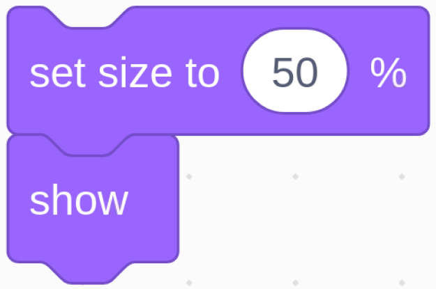

.. note::

    こんにちは、SunFounderのRaspberry Pi & Arduino & ESP32愛好家コミュニティへようこそ！Facebook上でRaspberry Pi、Arduino、ESP32についてもっと深く掘り下げ、他の愛好家と交流しましょう。

    **参加する理由は？**

    - **エキスパートサポート**：コミュニティやチームの助けを借りて、販売後の問題や技術的な課題を解決します。
    - **学び＆共有**：ヒントやチュートリアルを交換してスキルを向上させましょう。
    - **独占的なプレビュー**：新製品の発表や先行プレビューに早期アクセスしましょう。
    - **特別割引**：最新製品の独占割引をお楽しみください。
    - **祭りのプロモーションとギフト**：ギフトや祝日のプロモーションに参加しましょう。

    👉 私たちと一緒に探索し、創造する準備はできていますか？[|link_sf_facebook|]をクリックして今すぐ参加しましょう！

1.9 風船を膨らませる
==========================

ここでは、バルーニングのゲームをします。

スライドを左に切り替えてバルーンを膨らませ始めると、この時点でバルーンはどんどん大きくなります。 風船が大きすぎると爆発します。 気球が小さすぎると空中に浮きません。 ポンプを停止するには、スイッチを右に切り替えるタイミングを判断する必要があります。

.. image:: media/1.15_header.png

必要な部品
-----------------------

.. image:: media/1.15_component.png

回路を構築する
---------------------

.. image:: media/1.15_scratch_fritzing.png

コードをロードして、何が起こるかを確認します
--------------------------------------------

コードファイル( ``1.9_inflating_the_balloon.sb3`` )をScratch3にロードします。

スライダーを左に切り替えてバルーンを膨らませ始めると、この時点でバルーンはどんどん大きくなります。 風船が大きすぎると爆発します。 気球が小さすぎると空中に浮きません。 ポンプを停止するには、スイッチを右に切り替えるタイミングを判断する必要があります。

Spriteに関するヒント
--------------------------

前のSprite1 spriteを削除してから、Balloon1 spriteを追加します。

.. image:: media/1.15_slide1.png

このプロジェクトでは風船爆発効果音を使用しているので、どのように追加されたか見てみましょう。

上部の Sound オプションをクリックし、Upload Sound をクリックして、 ``boom.wav`` を ``davinci-kit-for-raspberry-pi/scratch/sound`` パスからScratch3にアップロードします。

.. image:: media/1.15_slide2.png

コードに関するヒント
--------------------

これはイベントブロックであり、トリガー条件はGPIO17がハイである、つまりスイッチが左に切り替えられることです。

.. image:: media/1.15_slide4.png
  :width: 400

Ballon1 spriteのサイズしきい値を120に設定します。

.. image:: media/1.15_slide7.png
  :width: 400

Balloon1 spriteの座標を、stage areaの中心である（0,0）に移動します。

Balloon1 spriteのサイズを50に設定し、stage areaに表示します。

.. image:: media/1.15_slide5.png

バルーンを膨らませるループを設定します。このループは、スライダースイッチを右に切り替えると停止します。

このループ内で、バルーンサイズは0.1秒ごとに1ずつ増加し、 ``maxSize`` より大きい場合はバルーンが破裂し、その時点でブーム音が鳴り、コードが終了します。

.. image:: media/1.15_slide6.png
  :width: 600

最後のループが終了した後（スライダーが右に切り替わります）、サイズに基づいてBalloon1 spriteの位置を決定します。 
Balloon1 spriteのサイズが90より大きい場合は、持ち上げて（座標を(0,90)に移動します）、
そうでない場合は着陸します（座標を(0,-149)に移動します）。

