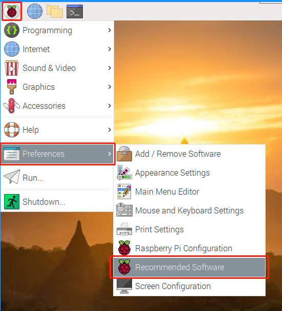
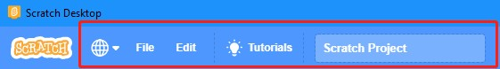
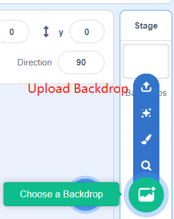
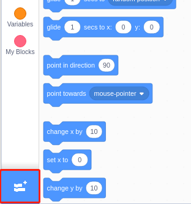
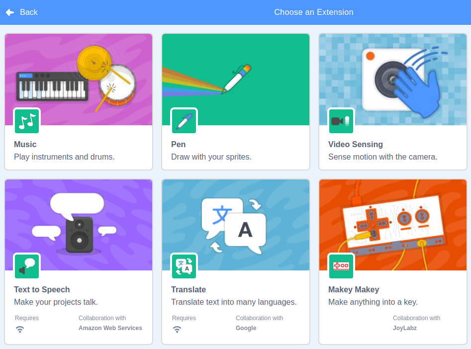
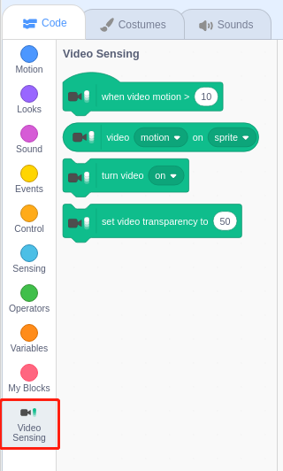
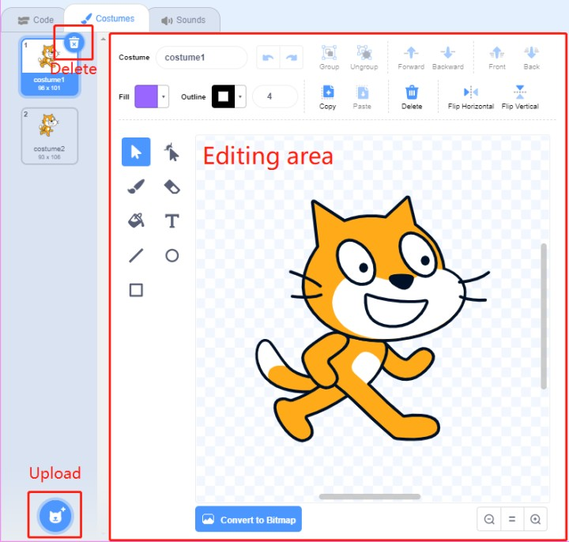

.. note::

    Ciao e benvenuto nella Community di appassionati di SunFounder Raspberry Pi, Arduino e ESP32 su Facebook! Approfondisci Raspberry Pi, Arduino e ESP32 insieme ad altri appassionati.

    **Perché Unirsi?**

    - **Supporto Esperto**: Risolvi problemi post-vendita e sfide tecniche con l’aiuto della nostra comunità e del nostro team.
    - **Impara e Condividi**: Scambia consigli e tutorial per migliorare le tue competenze.
    - **Anteprime Esclusive**: Ottieni accesso anticipato a nuovi annunci di prodotto e anteprime.
    - **Sconti Speciali**: Approfitta di sconti esclusivi sui nostri prodotti più recenti.
    - **Promozioni Festive e Giveaway**: Partecipa a giveaway e promozioni speciali.

    👉 Pronto a esplorare e creare con noi? Clicca su [|link_sf_facebook|] e unisciti oggi!

Guida Rapida a Scratch
==========================

.. note::

    Quando programmi con Scratch 3, potresti aver bisogno di uno schermo per una migliore esperienza. Naturalmente, se non hai uno schermo, puoi anche utilizzare **VNC** per accedere al desktop di Raspberry Pi da remoto. Per un tutorial dettagliato, consulta :ref:`VNC`.

Inoltre, Scratch 3 richiede almeno 1GB di RAM per funzionare correttamente. Raccomandiamo un Raspberry Pi 4 con almeno 2GB di RAM. Anche se Scratch 3 può essere eseguito su Raspberry Pi 2, 3, 3B+ o un Raspberry 4 con 1GB di RAM, le prestazioni su questi modelli sono ridotte. A seconda degli altri software in esecuzione contemporanea, Scratch 3 potrebbe non avviarsi per mancanza di memoria.

Installare Scratch 3
------------------------
Durante l’installazione di Raspberry Pi OS (:ref:`install_os`), è necessario scegliere una versione con desktop, sia con solo desktop che con desktop e software raccomandato.

Se installi la versione con il software raccomandato, troverai Scratch 3 nel menu di sistema sotto **Programmazione**.

Se hai installato solo la versione con desktop, dovrai installare Scratch 3 manualmente come descritto di seguito.

Apri il menu, clicca su **Preferenze** -> **Software Raccomandato**.

Trova Scratch 3, selezionalo, clicca su **Applica** e aspetta il completamento dell’installazione.

.. image:: img/quick_scratch2.png

Una volta completata l’installazione, dovresti vederlo in **Programmazione** nel menu di sistema.

.. image:: img/quick_scratch3.png

Interfaccia di Scratch 3
------------------------------

Scratch 3 è progettato per essere divertente, educativo e facile da imparare. Include strumenti per creare storie interattive, giochi, arte, simulazioni e molto altro, utilizzando la programmazione a blocchi. Scratch ha anche un proprio editor di immagini e suoni integrati.

Nella parte superiore di Scratch 3 ci sono alcune opzioni di base. La prima da sinistra è l’opzione per selezionare la lingua. La seconda è l’opzione **File**, per creare nuovi file, aprire file locali e salvare quelli correnti. La terza è l’opzione **Modifica**, che consente di riprendere operazioni di eliminazione e attivare la modalità di accelerazione (in cui il movimento dello sprite diventa particolarmente veloce). La quarta è l’opzione **Tutorial**, per visualizzare tutorial di alcuni progetti. La quinta opzione è per il nome del file, dove puoi rinominare il progetto.

**Codice**

L'interfaccia di Scratch è suddivisa in tre sezioni principali: area di scena, palette dei blocchi e area di codifica. Per programmare, trascina i blocchi dalla palette dei blocchi nell’area di codifica, e i risultati della tua programmazione saranno mostrati nell’area di scena.

.. image:: img/quick_scratch4.png

Questa è l’area sprite di Scratch 3. Nella parte superiore si trovano i parametri di base degli sprite, puoi aggiungere quelli inclusi in Scratch 3 o caricare sprite locali.

.. image:: img/quick_scratch5.png

Questa è l’area sfondi di Scratch 3, per aggiungere un sfondo adatto alla tua scena. Puoi scegliere tra gli sfondi predefiniti di Scratch 3 o caricarne uno locale.

Questo è il pulsante **Aggiungi Estensione**.

In Scratch 3, è possibile aggiungere varie estensioni utili. Qui utilizziamo l’estensione **Video Sensing** come esempio. Cliccaci sopra.

Vedrai l’estensione nella palette dei blocchi e potrai utilizzare le funzioni associate. Se hai una fotocamera collegata, vedrai la schermata della fotocamera nell’area di scena.

**Costumi**

Clicca su **Costumi** nell’angolo in alto a sinistra per entrare nella palette dei costumi. Diversi costumi permettono agli sprite di avere movimenti statici diversi, e quando questi movimenti statici sono concatenati, formano un movimento dinamico coerente.

**Suoni**

Potresti voler utilizzare dei clip musicali per rendere i tuoi esperimenti più interessanti. Clicca su **Suoni** nell’angolo in alto a sinistra per modificare il suono corrente o selezionare/caricare uno nuovo.

.. image:: img/quick_scratch11.png

