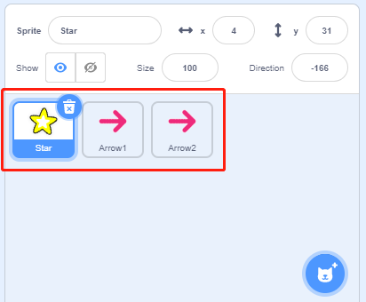
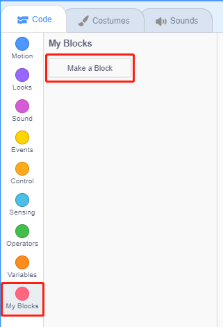
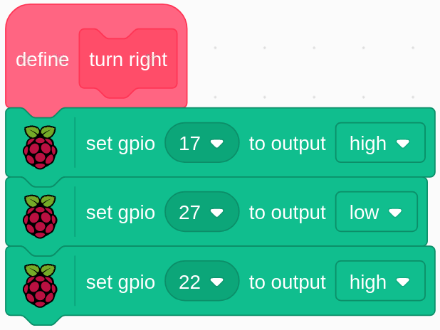

.. note:: 

    Ciao, benvenuto nella Community di appassionati SunFounder per Raspberry Pi, Arduino ed ESP32 su Facebook! Approfondisci le tue conoscenze su Raspberry Pi, Arduino ed ESP32 insieme ad altri appassionati.

    **Perché unirsi?**

    - **Supporto Esperto**: Risolvi problemi post-vendita e sfide tecniche con l'aiuto della nostra comunità e del nostro team.
    - **Impara e Condividi**: Scambia consigli e tutorial per migliorare le tue competenze.
    - **Anteprime Esclusive**: Accedi in anticipo agli annunci dei nuovi prodotti e alle anteprime.
    - **Sconti Speciali**: Approfitta di sconti esclusivi sui nostri ultimi prodotti.
    - **Promozioni Festive e Giveaway**: Partecipa a promozioni festive e giveaway.

    👉 Pronto a esplorare e creare con noi? Clicca su [|link_sf_facebook|] e unisciti oggi stesso!

1.10 Ventilatore Rotante
============================

In questo progetto, realizzeremo una stella e un ventilatore rotanti.

.. image:: img/1.17_header.png

Componenti Necessari
------------------------

.. image:: img/1.17_list.png

Costruire il Circuito
----------------------

.. image:: img/1.17_image117.png

Carica il Codice e Osserva Cosa Succede
-----------------------------------------

Carica il file di codice (``1.10_rotating_fan.sb3``) su Scratch 3.

Dopo aver cliccato sulla bandiera verde nell'area del palcoscenico, fai clic sullo sprite stella: la stella e il motore ruoteranno in senso orario; puoi cambiare la direzione della rotazione facendo clic sui due sprite **freccia**. Quando clicchi di nuovo sulla **stella**, essa e il motore smetteranno di ruotare.

Suggerimenti per lo Sprite
----------------------------

Elimina lo sprite predefinito, seleziona lo sprite **Star** e **Arrow1**, quindi duplica Arrow1 una volta.

Nell'opzione **Costumi**, cambia la direzione di Arrow2 scegliendo un costume differente.

.. image:: img/1.17_motor2.png

Regola le dimensioni e la posizione dello sprite in modo appropriato.

.. image:: img/1.17_motor3.png

Suggerimenti sul Codice
-------------------------

**Diagramma di Flusso**

.. image:: img/1.17_scratch.png

Nel codice, vedrai 2 blocchi rosa, **turn left** e **turn right**, che sono blocchi personalizzati (funzioni) creati da noi.

.. image:: img/1.17_new_block.png

**Come Creare un Blocco?**

Impariamo a creare un blocco (funzione). Il blocco (funzione) semplifica il programma, soprattutto se esegui la stessa operazione più volte. Racchiudendo queste operazioni in un nuovo blocco, ottieni una gestione più efficiente.

Per iniziare, trova **I Miei Blocchi** nel menu dei blocchi, quindi seleziona **Crea un Blocco**.

Inserisci il nome del nuovo blocco.

.. image:: img/1.17_motor5.png

Dopo aver scritto la funzione del nuovo blocco nell'area di codifica, salvala: potrai quindi trovare il blocco nel menu dei blocchi.

.. image:: img/1.17_motor6.png

**turn left**

Questo è il codice all'interno del blocco **turn left** per far ruotare il motore in senso antiorario.

.. image:: img/1.17_motor12.png
  :width: 400

**turn right**

Questo è il codice all'interno del blocco **turn right** per far ruotare il motore in senso orario.

