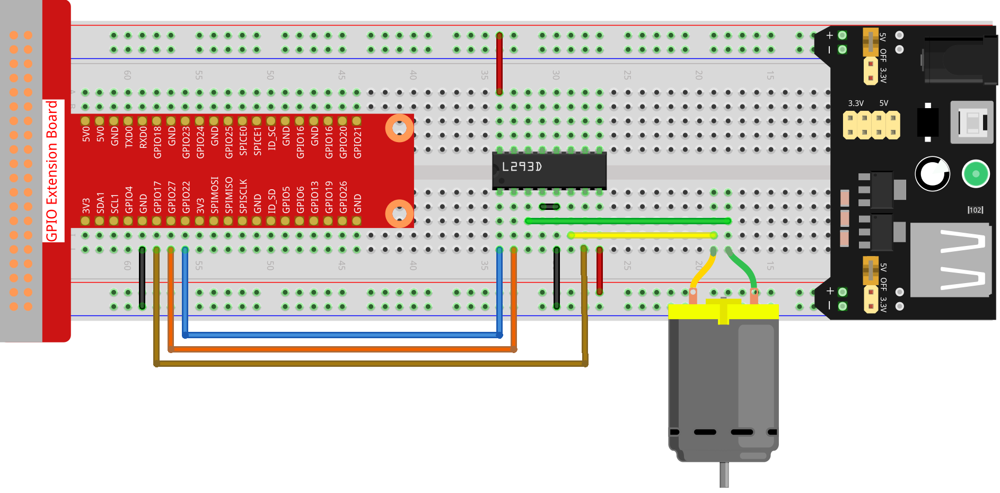
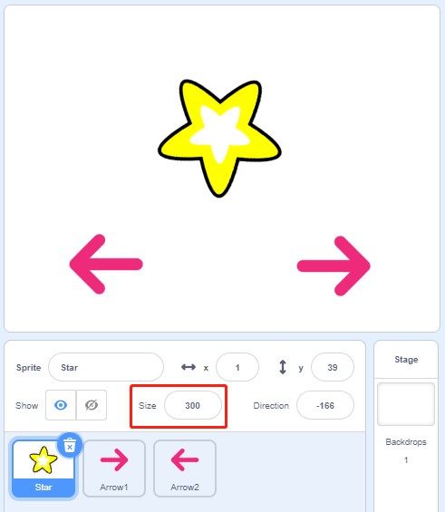
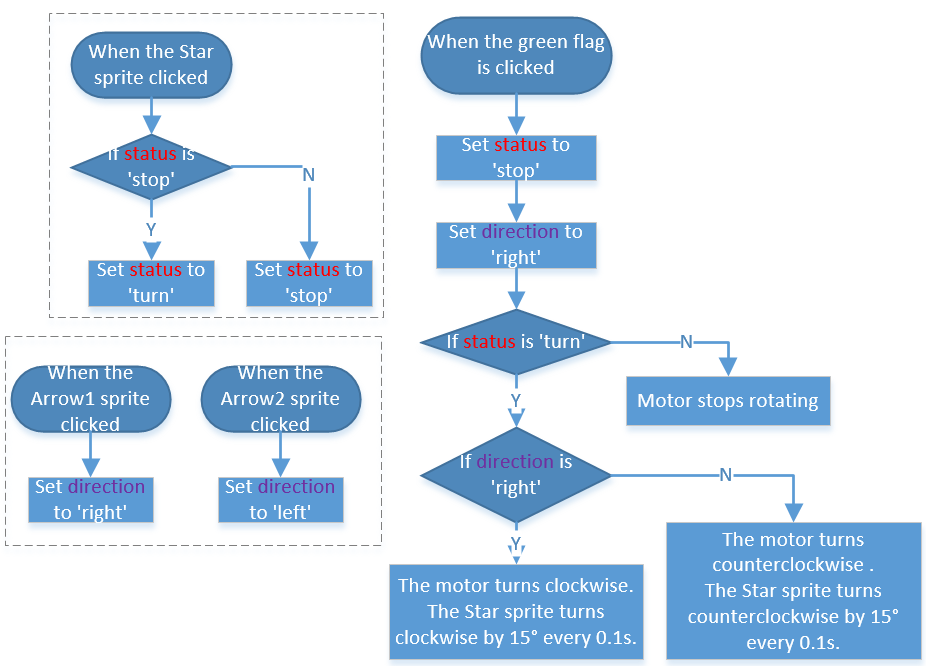
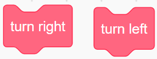
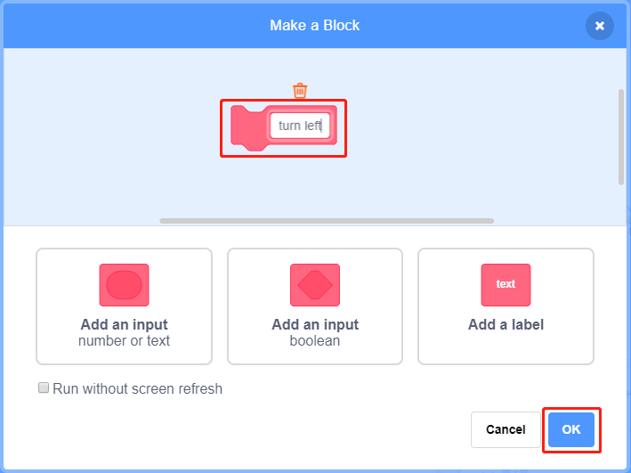

.. note::

    こんにちは、SunFounderのRaspberry Pi & Arduino & ESP32愛好家コミュニティへようこそ！Facebook上でRaspberry Pi、Arduino、ESP32についてもっと深く掘り下げ、他の愛好家と交流しましょう。

    **参加する理由は？**

    - **エキスパートサポート**：コミュニティやチームの助けを借りて、販売後の問題や技術的な課題を解決します。
    - **学び＆共有**：ヒントやチュートリアルを交換してスキルを向上させましょう。
    - **独占的なプレビュー**：新製品の発表や先行プレビューに早期アクセスしましょう。
    - **特別割引**：最新製品の独占割引をお楽しみください。
    - **祭りのプロモーションとギフト**：ギフトや祝日のプロモーションに参加しましょう。

    👉 私たちと一緒に探索し、創造する準備はできていますか？[|link_sf_facebook|]をクリックして今すぐ参加しましょう！

1.10 回転扇
==================

このプロジェクトでは、回転する星のspriteとファンを作成します。

.. image:: media/1.17_header.png

必要な部品
-----------------------

.. image:: media/1.17_list.png

回路を構築する
---------------------

コードをロードして、何が起こるかを確認します
--------------------------------------------

コードファイル( ``1.10_rotating_fan.sb3`` )をScratch3にロードします。

ステージ上の緑色の旗をクリックした後、star spriteをクリックすると、それとモーターが時計回りに回転します。 2つの arrow spritesをクリックすると、回転方向を変更できます。 star spriteをもう一度クリックすると、star spriteとモーターの回転が停止します。

Spriteに関するヒント
--------------------

デフォルトのspriteを削除してから、Star spriteと Arrow1 spriteを選択し、Arrow1を1回コピーします。

.. image:: media/1.17_motor1.png

Costumes オプションで、Arrow2 spriteを別の方向のcostumeに変更します。

.. image:: media/1.17_motor2.png

spriteのサイズと位置を適切に調整します。

コードに関するヒント
--------------------

**流れ図**

このコードでは、カスタムブロック（関数）である2つのピンクのブロックが左に曲がって右に曲がっています。

**ブロックを作る方法は？**

ブロック（関数）の作り方を学びましょう。 ブロック（関数）は、プログラムを単純化するために使用できます。特に同じ操作を複数回実行する場合です。 これらの操作を新しく宣言されたブロックに入れると、非常に便利です。

最初にblock paletteで My Blocks を見つけてから、Make a Block を選択します。

.. image:: media/1.17_motor4.png

新しいブロックの名前を入力します。

coding areaに新しいブロックの機能を書き込んだ後、それを保存すると、blocks paletteでブロックを見つけることができます。

.. image:: media/1.17_motor6.png

**turn left**

これは、モーターを反時計回りに回転させるための左折ブロック内のコードです。

.. image:: media/1.17_motor12.png
  :width: 400

**turn right**

これは、モーターを時計回りに回転させるための右折ブロック内のコードです。

.. image:: media/1.17_motor11.png
  :width: 400

