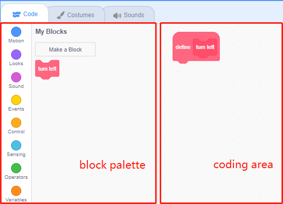
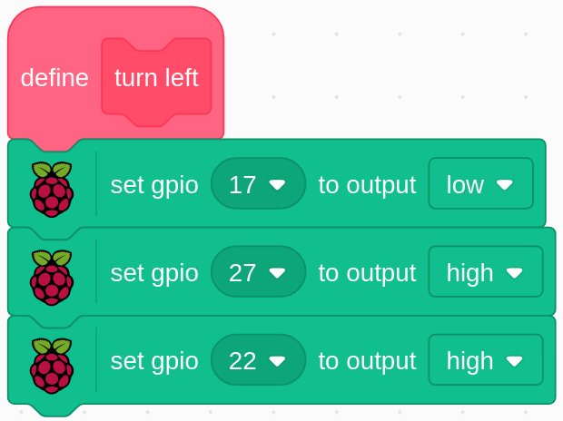

.. note::

    ¡Hola! Bienvenido a la comunidad de entusiastas de SunFounder para Raspberry Pi, Arduino y ESP32 en Facebook. Únete a otros apasionados y profundiza en el mundo de Raspberry Pi, Arduino y ESP32.

    **¿Por qué unirte?**

    - **Soporte Experto**: Resuelve problemas posventa y supera desafíos técnicos con el apoyo de nuestra comunidad y equipo.
    - **Aprende y Comparte**: Intercambia consejos y tutoriales para mejorar tus habilidades.
    - **Acceso Exclusivo**: Obtén acceso anticipado a anuncios de nuevos productos y adelantos especiales.
    - **Descuentos Especiales**: Disfruta de descuentos exclusivos en nuestros productos más recientes.
    - **Promociones Festivas y Sorteos**: Participa en sorteos y promociones durante las festividades.

     👉 ¿Listo para explorar y crear con nosotros? Haz clic en [|link_sf_facebook|] y únete hoy.

1.10 Ventilador Giratorio
============================

En este proyecto, haremos que un sprite en forma de estrella y un ventilador giren.

.. image:: img/1.17_header.png

Componentes Necesarios
------------------------

.. image:: img/1.17_list.png

Construye el Circuito
-------------------------

.. image:: img/1.17_image117.png

Carga el Código y Observa Qué Sucede
---------------------------------------

Carga el archivo de código (``1.10_rotating_fan.sb3``) en Scratch 3.

Después de hacer clic en la bandera verde en el escenario, haz clic en el sprite de la estrella; entonces, tanto la estrella como el motor girarán en el sentido de las agujas del reloj. Puedes cambiar la dirección de rotación haciendo clic en los dos sprites de **flecha**. Si vuelves a hacer clic en el sprite de **estrella**, tanto el sprite como el motor se detendrán.

Consejos sobre el Sprite
--------------------------

Elimina el sprite predeterminado y luego selecciona el sprite **Estrella** y el sprite **Flecha1**; duplica Flecha1 una vez.

.. image:: img/1.17_motor1.png

En la opción **Disfraces**, cambia el sprite Flecha2 a una dirección diferente.

.. image:: img/1.17_motor2.png

Ajusta el tamaño y la posición del sprite de manera adecuada.

.. image:: img/1.17_motor3.png

Consejos sobre el Código
------------------------

**Diagrama de Flujo**

.. image:: img/1.17_scratch.png

En este código, verás dos bloques rosas, girar a la izquierda y girar a la derecha, que son bloques personalizados (funciones).

.. image:: img/1.17_new_block.png

**¿Cómo Crear un Bloque?**

Aprendamos a crear un bloque (función). Un bloque (función) puede usarse para simplificar tu programa, especialmente si realizas la misma operación varias veces. Poner estas operaciones en un nuevo bloque declarado puede ser muy conveniente.

Primero, busca **Mis Bloques** en la paleta de bloques, luego selecciona **Crear un Bloque**.

.. image:: img/1.17_motor4.png

Ingresa el nombre del nuevo bloque.

.. image:: img/1.17_motor5.png

Después de escribir la función del nuevo bloque en el área de programación, guárdalo y luego podrás encontrar el bloque en la paleta de bloques.

**girar a la izquierda**

Este es el código dentro del bloque girar a la izquierda para que el motor gire en sentido contrario a las agujas del reloj.

**girar a la derecha**

Este es el código dentro del bloque girar a la derecha para que el motor gire en el sentido de las agujas del reloj.

.. image:: img/1.17_motor11.png
  :width: 400

