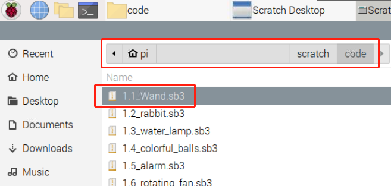

.. note:: 

    Ciao e benvenuto nella Community di appassionati di SunFounder Raspberry Pi, Arduino e ESP32 su Facebook! Approfondisci Raspberry Pi, Arduino e ESP32 insieme ad altri appassionati.

    **Perché unirsi?**

    - **Supporto Esperto**: Risolvi problemi post-vendita e sfide tecniche con l’aiuto della nostra comunità e del nostro team.
    - **Impara e Condividi**: Scambia consigli e tutorial per migliorare le tue competenze.
    - **Anteprime Esclusive**: Ottieni accesso anticipato a nuovi annunci di prodotto e anteprime.
    - **Sconti Speciali**: Approfitta di sconti esclusivi sui nostri nuovi prodotti.
    - **Promozioni Festive e Giveaway**: Partecipa a giveaway e promozioni speciali.

    👉 Pronto a esplorare e creare con noi? Clicca su [|link_sf_facebook|] e unisciti oggi!

1.1 Bacchetta Magica
===========================

Oggi utilizzeremo LED, Raspberry Pi e Scratch per creare un gioco divertente. Quando agitiamo la bacchetta magica, il LED si accenderà e lampeggerà.

Componenti Necessari
-------------------------

.. image:: img/1.1_list.png

Costruire il Circuito
-----------------------

.. image:: img/1.1_image49.png

Aggiungere Estensione GPIO
---------------------------------

Clicca sul pulsante **Aggiungi Estensione** nell'angolo in basso a sinistra, quindi aggiungi **Raspberry Pi GPIO**, un'estensione che useremo per tutti i nostri progetti Scratch.

.. image:: img/1.1_scratchled1.png
    :align: center

.. image:: img/1.1_scratchled2.png
    :align: center

.. image:: img/1.1_scratchled3.png
    :align: center

Carica il Codice e Osserva Cosa Succede
-------------------------------------------

Carica il file di codice dal tuo computer (``davinci-kit-for-raspberry-pi/scratch/code``) su Scratch 3.

.. image:: img/1.1_scratch_step1.png

Dopo aver cliccato sulla bacchetta magica nell'area di scena, vedrai il LED lampeggiare per due secondi.

.. image:: img/1.1_step3.png

Suggerimenti per lo Sprite
------------------------------------

Clicca su **Carica Sprite**.

.. image:: img/1.1_upload_sprite.png

Carica **Wand.png** dal percorso ``davinci-kit-for-raspberry-pi/scratch/picture`` su Scratch 3.

.. image:: img/1.1_upload.png

Infine, elimina **Sprite1**.

.. image:: img/1.1_delete.png

Suggerimenti sul Codice
---------------------------

.. image:: img/1.1_LED1.png
  :width: 300

Questo è un blocco evento il cui trigger è il clic sulla bandiera verde sulla scena. Un evento trigger è necessario all'inizio di ogni codice, e puoi selezionare altri eventi nella categoria **Eventi** della **palette dei blocchi**.

.. image:: img/1.1_events.png
  :width: 300

Per esempio, ora possiamo cambiare l'evento di trigger con un clic sullo sprite.

.. image:: img/1.1_LED2.png
  :width: 300

Questo è un blocco con un numero specificato di cicli. Inserendo il numero 10, gli eventi nel blocco verranno eseguiti 10 volte.

.. image:: img/1.1_LED4.png
  :width: 300

Questo blocco serve a sospendere il programma per un periodo di tempo specificato in secondi.

Poiché in Scratch si utilizza il metodo di denominazione BCM, questo codice imposta GPIO17 (BCM17) a 0V (livello basso). Poiché il catodo del LED è collegato a GPIO17, il LED si accenderà. Al contrario, se imposti GPIO(BCM17) su livello alto, il LED si spegnerà.
