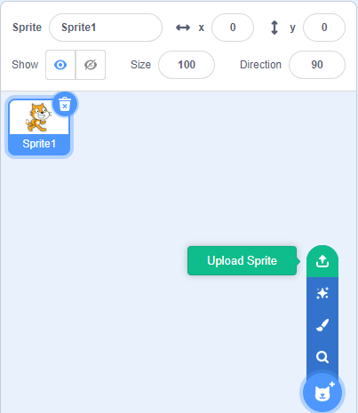

.. note::

    ¡Hola! Bienvenido a la comunidad de entusiastas de SunFounder para Raspberry Pi, Arduino y ESP32 en Facebook. Únete a otros apasionados y profundiza en el mundo de Raspberry Pi, Arduino y ESP32.

    **¿Por qué unirte?**

    - **Soporte Experto**: Resuelve problemas posventa y supera desafíos técnicos con el apoyo de nuestra comunidad y equipo.
    - **Aprende y Comparte**: Intercambia consejos y tutoriales para mejorar tus habilidades.
    - **Acceso Exclusivo**: Obtén acceso anticipado a anuncios de nuevos productos y adelantos especiales.
    - **Descuentos Especiales**: Disfruta de descuentos exclusivos en nuestros productos más recientes.
    - **Promociones Festivas y Sorteos**: Participa en sorteos y promociones durante las festividades.

    👉 ¿Listo para explorar y crear con nosotros? Haz clic en [|link_sf_facebook|] y únete hoy.

1.1 Varita Mágica
====================

Hoy usaremos un LED, Raspberry Pi y Scratch para crear un juego divertido. Cuando agitemos la varita mágica, el LED parpadeará.

.. image:: img/1.1_header.png

Componentes Requeridos
-------------------------

.. image:: img/1.1_list.png

Construir el Circuito
-------------------------

.. image:: img/1.1_image49.png

Agregar Extensión GPIO
-------------------------

Haz clic en el botón **Agregar Extensión** en la esquina inferior izquierda y luego añade la extensión **Raspberry Pi GPIO**, que utilizaremos en todos nuestros proyectos de Scratch.

.. image:: img/1.1_scratchled2.png
    :align: center

.. image:: img/1.1_scratchled3.png
    :align: center

Cargar el Código y Ver Qué Sucede
------------------------------------

Carga el archivo de código desde tu computadora (``davinci-kit-for-raspberry-pi/scratch/code``) a Scratch 3.

.. image:: img/1.1_scratch_step1.png

.. image:: img/1.1_scratch_step2.png

Después de hacer clic en la varita mágica en el área de escenario, verás que el LED parpadeará durante dos segundos.

.. image:: img/1.1_step3.png

Consejos sobre el Sprite
---------------------------

Haz clic en **Subir Sprite**.

Sube **Wand.png** desde la ruta ``davinci-kit-for-raspberry-pi/scratch/picture`` a Scratch 3.

.. image:: img/1.1_upload.png

Finalmente, elimina el sprite **Sprite1**.

.. image:: img/1.1_delete.png

Consejos sobre el Código
----------------------------

.. image:: img/1.1_LED1.png
  :width: 300

Este es un bloque de eventos cuyo disparador es hacer clic en la bandera verde en el escenario. Se necesita un evento de inicio al comienzo de todos los códigos, y puedes seleccionar otros eventos en la categoría **Eventos** de la **paleta de bloques**.

.. image:: img/1.1_events.png
  :width: 300

Por ejemplo, ahora podemos cambiar el evento de disparo para que ocurra al hacer clic en el sprite.

.. image:: img/1.1_LED2.png
  :width: 300

Este es un bloque con un número de ciclos definido. Cuando ingresamos el número 10, los eventos en el bloque se ejecutarán 10 veces.

Este bloque se usa para pausar el programa durante un tiempo en segundos.

.. image:: img/1.1_LED3.png
  :width: 500

Dado que Scratch utiliza el método de nombramiento BCM, este código configura GPIO17 (BCM17) a 0V (nivel bajo). Dado que el cátodo del LED está conectado a GPIO17, el LED se encenderá. Por el contrario, si configuras GPIO(BCM17) como alto, el LED se apagará.
