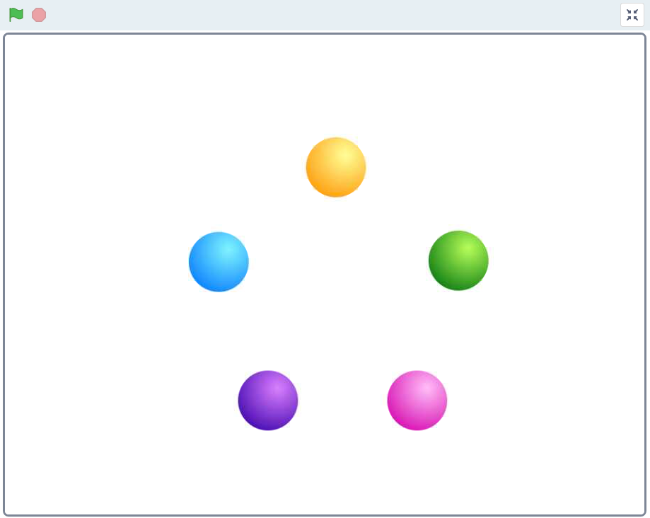
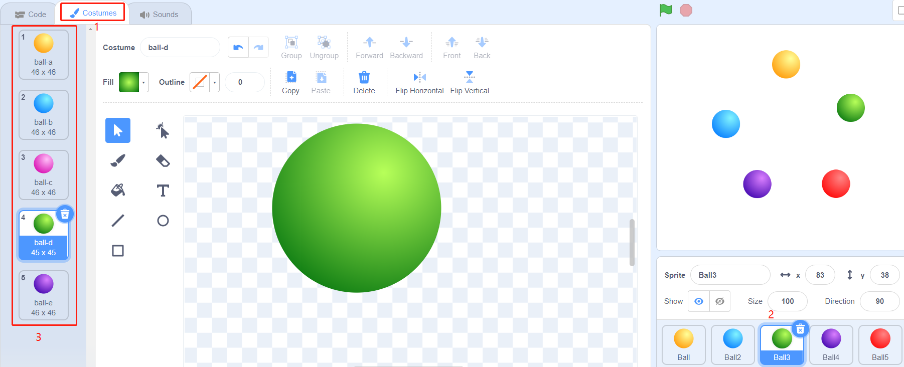

.. note::

    Hallo und willkommen in der SunFounder Raspberry Pi & Arduino & ESP32 Enthusiasten-Gemeinschaft auf Facebook! Tauchen Sie tiefer ein in die Welt von Raspberry Pi, Arduino und ESP32 mit anderen Enthusiasten.

    **Warum beitreten?**

    - **Expertenunterstützung**: Lösen Sie Nachverkaufsprobleme und technische Herausforderungen mit Hilfe unserer Gemeinschaft und unseres Teams.
    - **Lernen & Teilen**: Tauschen Sie Tipps und Anleitungen aus, um Ihre Fähigkeiten zu verbessern.
    - **Exklusive Vorschauen**: Erhalten Sie frühzeitigen Zugang zu neuen Produktankündigungen und exklusiven Einblicken.
    - **Spezialrabatte**: Genießen Sie exklusive Rabatte auf unsere neuesten Produkte.
    - **Festliche Aktionen und Gewinnspiele**: Nehmen Sie an Gewinnspielen und Feiertagsaktionen teil.

    👉 Sind Sie bereit, mit uns zu erkunden und zu erschaffen? Klicken Sie auf [|link_sf_facebook|] und treten Sie heute bei!

1.2 Bunte Kugeln
=====================

Wenn du auf verschiedenfarbige Kugeln auf der Bühne klickst, leuchtet die RGB-LED in verschiedenen Farben auf.

Erforderliche Komponenten
-------------------------------------

.. image:: media/1.2_list.png

Bauen Sie den Stromkreis auf
----------------------------------

.. image:: media/1.2_image61.png

Laden Sie den Code und sehen Sie, was passiert
--------------------------------------------------------------

Nachdem du die Codedatei (``1.2_colorful_balls.sb3``) in Scratch 3 geladen hast, leuchtet die RGB-LED gelb, blau, rot, grün oder lila, wenn du auf den entsprechenden Ball klickst.

Tipps zu Figur
----------------

Löschen Sie das Standard-Sprite und wählen Sie dann das Sprite **Ball**.

.. image:: media/1.2_ball.png

Und duplizieren Sie es 5 Mal.

.. image:: media/1.2_duplicate_ball.png

Wähle verschiedene Kostüme für diese 5 **Ball** -Sprites und bewege sie an die entsprechenden Positionen.

Tipps zu Codes
-----------------------

Bevor wir den Code verstehen, müssen wir das `RGB color model <https://en.wikipedia.org/wiki/RGB_color_model>`_ verstehen.

Das RGB-Farbmodell ist ein additives Farbmodell, bei dem rotes, grünes und blaues Licht auf verschiedene Weise addiert werden, um eine breite Palette von Farben zu reproduzieren.

Additive Farbmischung: Wenn man Rot zu Grün addiert, erhält man Gelb; wenn man Grün zu Blau addiert, erhält man Cyan; wenn man Blau zu Rot addiert, erhält man Magenta; wenn man alle drei Grundfarben addiert, erhält man Weiß.

.. image:: media/1.2_rgb_addition.png
  :width: 400

Eine RGB-LED ist eine Kombination von 3 LEDs (rote LED, grüne LED, blaue LED) in nur einem Gehäuse, Sie können fast jede Farbe durch die Kombination dieser drei Farben erzeugen. Sie hat 4 Pins, von denen einer GND ist, und die anderen 3 Pins steuern jeweils 3 LEDs.

Der Code, um die RGB-LED gelb leuchten zu lassen, lautet also wie folgt.

.. image:: media/1.2_rgb3.png

Wenn das Ball-Sprite (gelber Ball) angeklickt wird, setzen wir gpio17 hoch (rote LED an), gpio18 hoch (grüne LED an) und gpio27 niedrig (blaue LED aus), so dass die RGB-LED gelb leuchtet.

Du kannst auf die gleiche Weise Codes in andere Sprites schreiben, um die RGB-LEDs in den entsprechenden Farben aufleuchten zu lassen.
