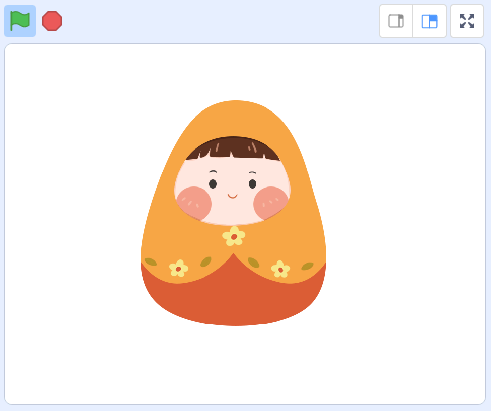
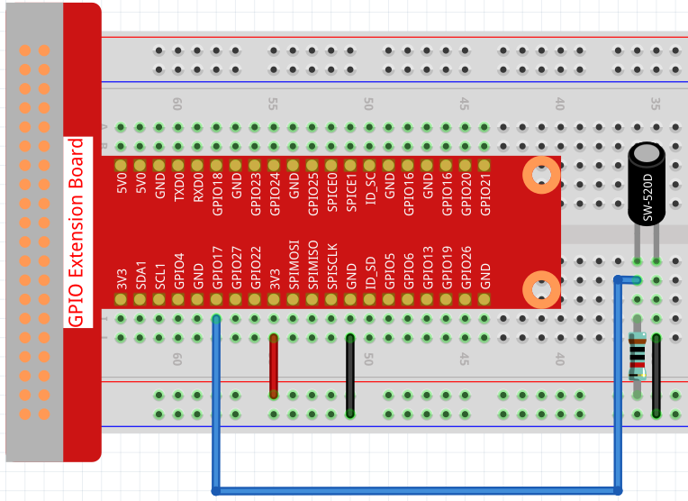
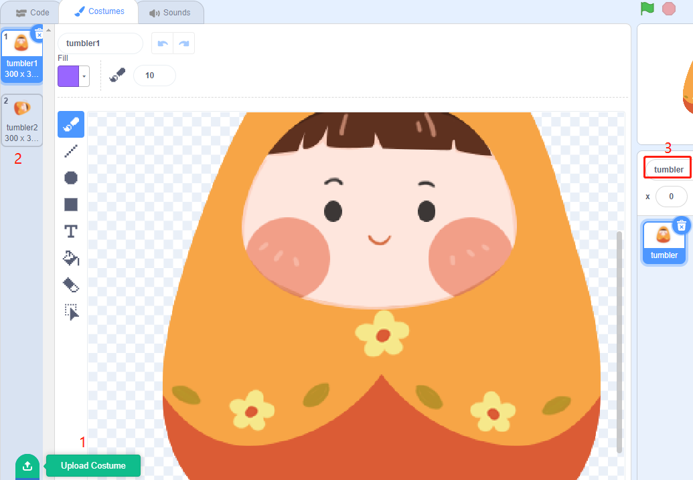
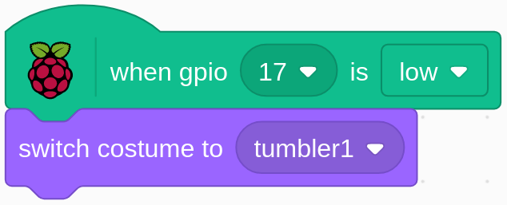

.. note:: 

    Ciao e benvenuto nella Community di appassionati SunFounder Raspberry Pi, Arduino e ESP32 su Facebook! Approfondisci Raspberry Pi, Arduino ed ESP32 insieme ad altri appassionati.

    **Perché unirsi?**

    - **Supporto Esperto**: Risolvi problemi post-vendita e sfide tecniche con l’aiuto della nostra comunità e del nostro team.
    - **Impara e Condividi**: Scambia consigli e tutorial per migliorare le tue competenze.
    - **Anteprime Esclusive**: Ottieni accesso anticipato ai nuovi prodotti e alle anteprime.
    - **Sconti Speciali**: Approfitta di sconti esclusivi sui nostri prodotti più recenti.
    - **Promozioni Festive e Giveaway**: Partecipa a giveaway e promozioni speciali.

    👉 Pronto a esplorare e creare con noi? Clicca su [|link_sf_facebook|] e unisciti oggi!

1.3 Giocattolo Tumbler
==========================

In questo progetto, realizzeremo un giocattolo basato su interruttore a inclinazione per controllare un tumbler.

Componenti Necessari
-----------------------

.. image:: img/1.3_component.png

Costruire il Circuito
----------------------

Carica il Codice e Osserva Cosa Succede
------------------------------------------

Carica il file di codice (``1.3_tumbler.sb3``) in Scratch 3.

Quando l'interruttore a inclinazione è in posizione verticale, il tumbler sta in piedi. Se lo inclini, il tumbler cadrà. Rimetti l'interruttore in posizione verticale e il tumbler tornerà a stare in piedi.

Suggerimenti per lo Sprite
-----------------------------
Seleziona Sprite1 e clicca su **Costumi** nell'angolo in alto a sinistra; carica **tumbler1.png** e **tumbler2.png** dal percorso ``davinci-kit-for-raspberry-pi/scratch/picture`` tramite il pulsante **Carica Costume**; elimina i 2 costumi predefiniti e rinomina lo sprite come **tumbler**.

Suggerimenti sul Codice
--------------------------

.. image:: img/1.3_title2.png
  :width: 400

Quando si clicca sulla bandiera verde, lo stato iniziale di gpio17 è impostato su basso.

Quando il pin17 è basso (l'interruttore a inclinazione è in posizione verticale), si cambia il costume dello sprite tumbler a tumbler1 (stato verticale).

.. image:: img/1.3_title3.png
  :width: 400

Quando il pin17 è alto (interruttore inclinato), si cambia il costume dello sprite tumbler a tumbler2 (stato inclinato).
