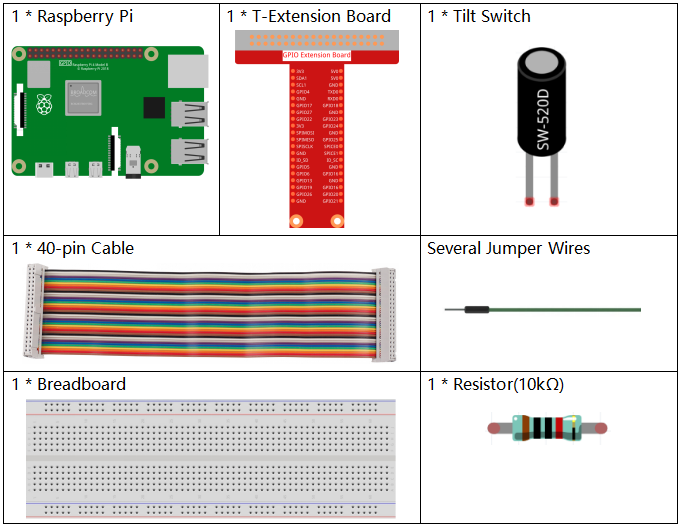

.. note::

    ¡Hola! Bienvenido a la comunidad de entusiastas de SunFounder para Raspberry Pi, Arduino y ESP32 en Facebook. Únete a otros apasionados y profundiza en el mundo de Raspberry Pi, Arduino y ESP32.

    **쯇or qué unirte?**

    - **Soporte Experto**: Resuelve problemas posventa y supera desafíos técnicos con el apoyo de nuestra comunidad y equipo.
    - **Aprende y Comparte**: Intercambia consejos y tutoriales para mejorar tus habilidades.
    - **Acceso Exclusivo**: Obtén acceso anticipado a anuncios de nuevos productos y adelantos especiales.
    - **Descuentos Especiales**: Disfruta de descuentos exclusivos en nuestros productos más recientes.
    - **Promociones Festivas y Sorteos**: Participa en sorteos y promociones durante las festividades.

    游녤 쯃isto para explorar y crear con nosotros? Haz clic en [|link_sf_facebook|] y 칰nete hoy.

1.3 Muñeco Tambaleante
===========================

En este proyecto, crearemos un juguete tambaleante controlado por un interruptor de inclinación.

.. image:: img/1.3_header.png

Componentes Necesarios
--------------------------

Construye el Circuito
--------------------------

.. image:: img/1.3_fritzing.png

Carga el Código y Observa Qué Sucede
-----------------------------------------

Carga el archivo de código (``1.3_tumbler.sb3``) en Scratch 3.

Cuando el interruptor de inclinación está en posición vertical, el muñeco tambaleante se mantiene en pie. Si lo inclinas, el muñeco también caerá. Colócalo nuevamente en posición vertical, y el muñeco volverá a pararse.

Consejos sobre el Sprite
--------------------------

Selecciona Sprite1 y haz clic en **Disfraces** en la esquina superior izquierda; sube **tumbler1.png** y **tumbler2.png** desde la ruta ``home/pi/davinci-kit-for-raspberry-pi/scratch/picture`` usando el botón **Subir Disfraz**; elimina los dos disfraces predeterminados y renombra el sprite como **tumbler**.

.. image:: img/1.3_add_tumbler.png

Consejos sobre el Código
---------------------------

.. image:: img/1.3_title2.png
  :width: 400

Cuando se hace clic en la bandera verde, el estado inicial de gpio17 se establece en bajo.

.. image:: img/1.3_title4.png
  :width: 400

Cuando pin17 está en bajo (el interruptor de inclinación está en posición vertical), cambiamos el disfraz del sprite tumbler a tumbler1 (estado vertical).

.. image:: img/1.3_title3.png
  :width: 400

Cuando pin17 está en alto (el interruptor de inclinación está inclinado), cambiamos el disfraz del sprite tumbler a tumbler2 (estado inclinado).
