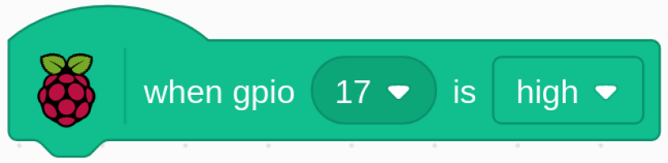

.. note::

    ¡Hola! Bienvenido a la comunidad de entusiastas de SunFounder para Raspberry Pi, Arduino y ESP32 en Facebook. Únete a otros apasionados y profundiza en el mundo de Raspberry Pi, Arduino y ESP32.

    **쯇or qué unirte?**

    - **Soporte Experto**: Resuelve problemas posventa y supera desafíos técnicos con el apoyo de nuestra comunidad y equipo.
    - **Aprende y Comparte**: Intercambia consejos y tutoriales para mejorar tus habilidades.
    - **Acceso Exclusivo**: Obtén acceso anticipado a anuncios de nuevos productos y adelantos especiales.
    - **Descuentos Especiales**: Disfruta de descuentos exclusivos en nuestros productos más recientes.
    - **Promociones Festivas y Sorteos**: Participa en sorteos y promociones durante las festividades.

    游녤 쯃isto para explorar y crear con nosotros? Haz clic en [|link_sf_facebook|] y únete hoy.

1.4 Liebre
=============

Hoy usaremos un botón, una Raspberry Pi y Scratch para crear una liebre con varios cambios.

Cuando presionamos el primer botón, la liebre en el área del escenario cambiará el color de su cuerpo; al presionar el segundo botón, la liebre cambiará de tamaño; y al presionar el tercer botón, la liebre dará un paso hacia adelante.

.. image:: img/1.4_header.png

Componentes Necesarios
--------------------------

.. image:: img/1.4_list.png

Construye el Circuito
-------------------------

.. image:: img/1.4_scratch_button.png

Carga el Código y Observa Qué Sucede
---------------------------------------

Carga el archivo de código (``1.4_hare.sb3``) en Scratch 3.

Ahora puedes intentar presionar cada uno de los 3 botones para ver cómo cambia la liebre en el escenario.

Consejos sobre el Sprite
---------------------------

Haz clic en el botón **Elegir un Sprite** en la esquina inferior derecha del área de sprites, escribe **Hare** en el cuadro de búsqueda y luego haz clic para agregarlo.

.. image:: img/1.4_button1.png

Elimina Sprite1.

.. image:: img/1.4_button2.png

Consejos sobre el Código
----------------------------

Este es un bloque de evento que se activa cuando el nivel de GPIO17 está en alto, lo que significa que el botón se ha presionado en ese momento.

.. image:: img/1.4_button4.png
  :width: 400

Este es un bloque para cambiar el color de **Hare**; el rango de valores es de 0 a 199. Si supera 199, volverá a cambiar desde 0.

Este es un bloque que se utiliza para cambiar el tamaño del sprite. A mayor valor, mayor será el tamaño del sprite.

.. note::
  El sprite no es infinitamente grande, y su tamaño máximo está relacionado con el tamaño de la imagen original.

.. image:: img/1.4_button6.png
  :width: 200

Este es un bloque que cambia los disfraces del sprite y, cuando el disfraz de **Hare** sigue cambiando, realiza una serie de acciones coherentes. Por ejemplo, en este proyecto, hace que **Hare** dé un paso hacia adelante.
