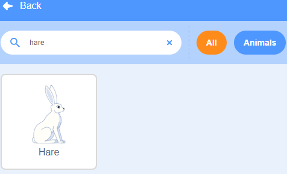

.. note:: 

    Ciao e benvenuto nella Community di appassionati di SunFounder Raspberry Pi, Arduino e ESP32 su Facebook! Approfondisci le tue conoscenze su Raspberry Pi, Arduino ed ESP32 insieme ad altri appassionati.

    **Perché unirsi?**

    - **Supporto Esperto**: Risolvi problemi post-vendita e sfide tecniche grazie all’aiuto della nostra comunità e del nostro team.
    - **Impara e Condividi**: Scambia consigli e tutorial per migliorare le tue abilità.
    - **Anteprime Esclusive**: Accedi in anticipo agli annunci dei nuovi prodotti e alle anteprime.
    - **Sconti Speciali**: Approfitta di sconti esclusivi sui nostri nuovi prodotti.
    - **Promozioni Festive e Giveaway**: Partecipa a promozioni festive e giveaway.

    👉 Pronto a esplorare e creare con noi? Clicca su [|link_sf_facebook|] e unisciti oggi stesso!

1.4 Lepre
==============

Oggi useremo un pulsante, il Raspberry Pi e Scratch per creare una lepre con diversi effetti!

Quando premiamo il primo pulsante, la lepre nell'area dello stage cambierà colore; premendo il secondo pulsante, cambierà dimensione; premendo il terzo pulsante, la lepre farà un passo avanti.

.. image:: img/1.4_header.png

Componenti Necessari
----------------------------

.. image:: img/1.4_list.png

Costruire il Circuito
------------------------

.. image:: img/1.4_scratch_button.png

Carica il Codice e Osserva Cosa Succede
-----------------------------------------

Carica il file di codice (``1.4_hare.sb3``) in Scratch 3.

Ora puoi provare a premere ciascuno dei 3 pulsanti per vedere come cambierà la lepre nello stage.

Suggerimenti per lo Sprite
-------------------------------

Clicca sul pulsante **Scegli uno Sprite** nell'angolo in basso a destra dell'area degli sprite, inserisci **Hare** nella barra di ricerca e poi clicca per aggiungerlo.

Elimina Sprite1.

.. image:: img/1.4_button2.png

Suggerimenti sul Codice
----------------------------

.. image:: img/1.4_button3.png
  :width: 400

Questo è un blocco evento che si attiva quando il livello di GPIO17 è alto, ovvero quando il pulsante viene premuto.

.. image:: img/1.4_button4.png
  :width: 400

Questo è un blocco per cambiare il colore della **lepre**; l'intervallo del valore è compreso tra 0 e 199, e oltre il valore massimo riparte da 0.

.. image:: img/1.4_button5.png
  :width: 250

Questo blocco serve per modificare la dimensione dello sprite: maggiore è il valore, più grande sarà lo sprite.

.. note::
  Lo sprite non può essere ingrandito all'infinito; la sua dimensione massima è legata alla grandezza dell’immagine originale.

.. image:: img/1.4_button6.png
  :width: 200

Questo è un blocco che permette di cambiare i costumi dello sprite; quando i costumi della **lepre** vengono cambiati in sequenza, si crea una serie di azioni fluide. In questo progetto, ad esempio, facciamo fare un passo avanti alla **lepre**.
