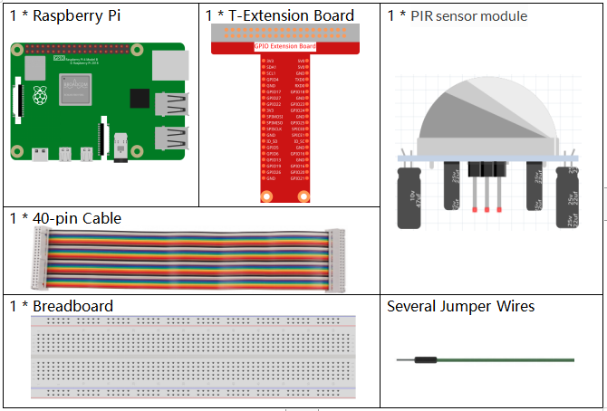
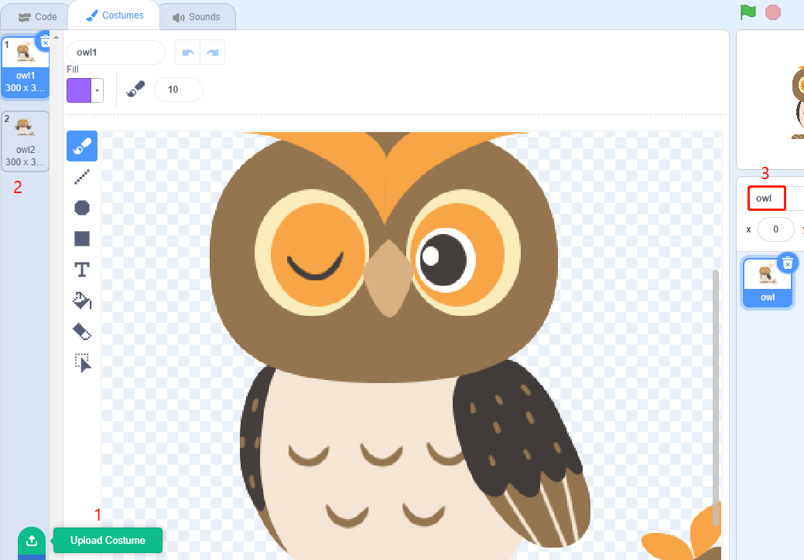
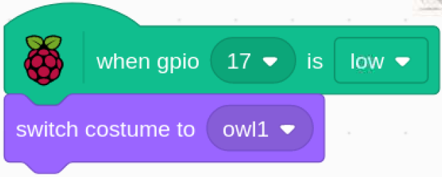

.. note::

    ¡Hola! Bienvenido a la comunidad de entusiastas de SunFounder para Raspberry Pi, Arduino y ESP32 en Facebook. Únete a otros apasionados y profundiza en el mundo de Raspberry Pi, Arduino y ESP32.

    **¿Por qué unirte?**

    - **Soporte Experto**: Resuelve problemas posventa y supera desafíos técnicos con el apoyo de nuestra comunidad y equipo.
    - **Aprende y Comparte**: Intercambia consejos y tutoriales para mejorar tus habilidades.
    - **Acceso Exclusivo**: Obtén acceso anticipado a anuncios de nuevos productos y adelantos especiales.
    - **Descuentos Especiales**: Disfruta de descuentos exclusivos en nuestros productos más recientes.
    - **Promociones Festivas y Sorteos**: Participa en sorteos y promociones durante las festividades.

    👉 ¿Listo para explorar y crear con nosotros? Haz clic en [|link_sf_facebook|] y únete hoy.

1.5 Despierta al Búho
=========================

Hoy vamos a jugar a despertar al búho.

Cuando alguien se acerca al módulo sensor PIR, el búho se despertará de su sueño.

El módulo PIR tiene dos potenciómetros: uno para ajustar la sensibilidad y otro 
para ajustar la distancia de detección. Para que el módulo PIR funcione mejor, 
debes girar ambos en sentido antihorario hasta el final.

.. image:: img/1.5_header.png

Componentes Necesarios
-------------------------

Construye el Circuito
------------------------

.. image:: img/1.5_fritzing.png

Carga el Código y Observa Qué Sucede
----------------------------------------

Carga el archivo de código (``1.5_wake_up_the_owl.sb3``) en Scratch 3.

Cuando te acerques al módulo sensor PIR, verás que el búho en el área del escenario abre sus alas y se despierta. Al alejarte, el búho volverá a dormir.

Consejos sobre el Sprite
--------------------------

Selecciona Sprite1 y haz clic en **Disfraces** en la esquina superior izquierda; sube **owl1.png** y **owl2.png** desde la ruta ``home/pi/davinci-kit-for-raspberry-pi/scratch/picture`` mediante el botón **Subir Disfraz**; elimina los 2 disfraces predeterminados y renombra el sprite como **búho**.

Consejos sobre el Código
---------------------------

.. image:: img/1.3_title2.png

Al hacer clic en la bandera verde, el estado inicial de gpio17 se establece en bajo.

Cuando el pin17 está bajo (no hay nadie cerca), cambia el disfraz del sprite búho a owl1 (estado dormido).

.. image:: img/1.5_owl2.png
  :width: 400

Cuando el pin17 está alto (alguien se acerca), cambiamos el disfraz del sprite búho a owl2 (estado despierto).

