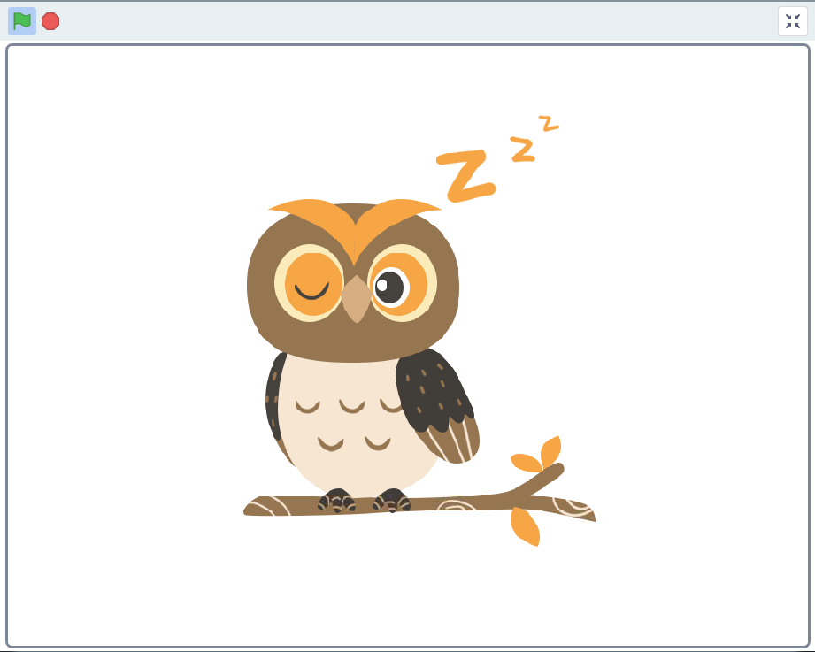
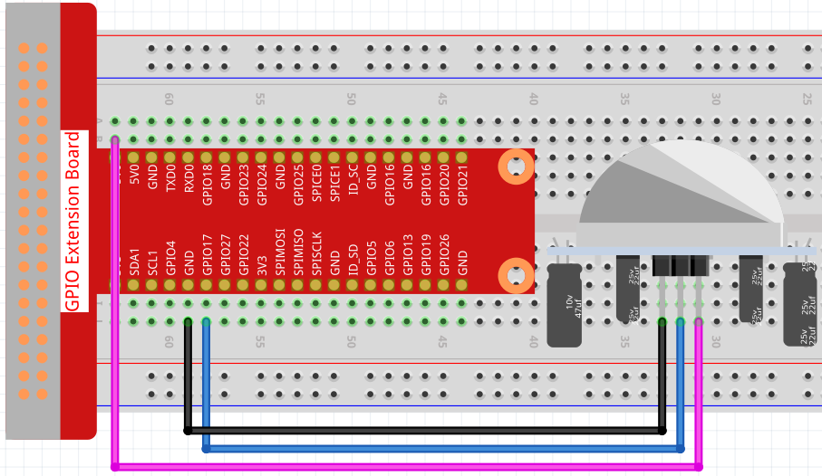
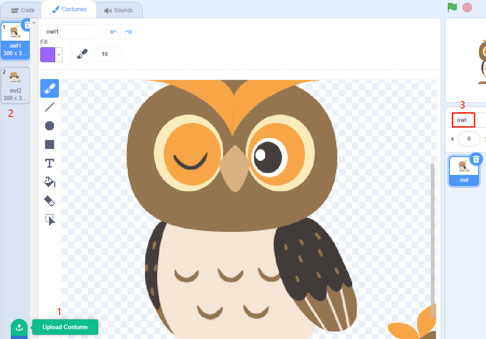
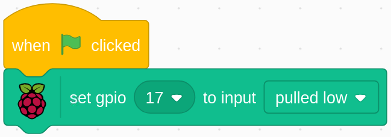
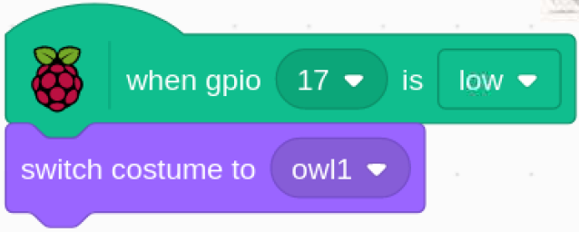
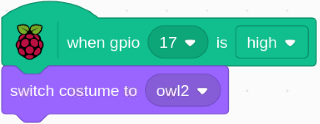

.. note::

    こんにちは、SunFounderのRaspberry Pi & Arduino & ESP32愛好家コミュニティへようこそ！Facebook上でRaspberry Pi、Arduino、ESP32についてもっと深く掘り下げ、他の愛好家と交流しましょう。

    **参加する理由は？**

    - **エキスパートサポート**：コミュニティやチームの助けを借りて、販売後の問題や技術的な課題を解決します。
    - **学び＆共有**：ヒントやチュートリアルを交換してスキルを向上させましょう。
    - **独占的なプレビュー**：新製品の発表や先行プレビューに早期アクセスしましょう。
    - **特別割引**：最新製品の独占割引をお楽しみください。
    - **祭りのプロモーションとギフト**：ギフトや祝日のプロモーションに参加しましょう。

    👉 私たちと一緒に探索し、創造する準備はできていますか？[|link_sf_facebook|]をクリックして今すぐ参加しましょう！

1.5 梟を起こす
====================

今日はフクロウを起こすゲームをします。

誰かがPIRセンサーモジュールに近づくと、フクロウは眠りから目覚めます。

PIR モジュールには 2 つのポテンショメータがあり、
1 つは感度を調整するためのもので、もう 1 つは検出距離を調整するためのものです。 
PIR モジュールがうまく機能するためには、両方を完全に反時計回りに回す必要があります。

必要な部品
-----------------------

.. image:: media/1.5_component.png

回路を構築する
---------------------

コードをロードして、何が起こるかを確認します
--------------------------------------------

コードファイル( ``1.5_wake_up_the_owl.sb3`` ) をScratch3にロードします。

PIRセンサーモジュールに近づくと、stage areaのフクロウが羽を開いて目を覚ますのがわかります。離れると、フクロウは再び眠りに戻ります。

Spriteに関するヒント
----------------------

Sprite1を選択し、左上隅にある コスチューム をクリックします。 
owl1.png と owl2.png を、[コスチュームのアップロード]ボタンを介して ``davinci-kit-for-raspberry-pi/scratch/picture`` パスからアップロードします。 
デフォルトの2つのコスチュームを削除し、スプライトの名前を owl に変更します。

コードに関するヒント
--------------------

緑の旗をクリックすると、GPIO17の初期状態がlowに設定されます。

pin17が低い（誰も近づいていない）場合は、フクロウのSpriteのcostumeをowl1（sleeping状態）に切り替えます。

pin17が高い（誰かが近づいている）とき、フクロウのSpriteのcostumeをowl2（wake up状態）に切り替えます。