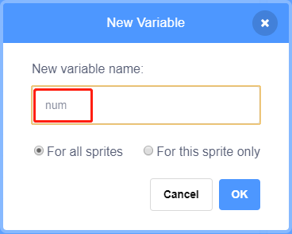
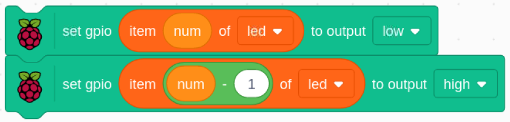

.. note::

    Bonjour et bienvenue dans la communauté SunFounder Raspberry Pi & Arduino & ESP32 Enthusiasts sur Facebook ! Plongez plus profondément dans l'univers de Raspberry Pi, Arduino et ESP32 avec d'autres passionnés.

    **Pourquoi nous rejoindre ?**

    - **Support d'experts** : Résolvez vos problèmes après-vente et vos défis techniques avec l'aide de notre communauté et de notre équipe.
    - **Apprenez et partagez** : Échangez des astuces et des tutoriels pour améliorer vos compétences.
    - **Aperçus exclusifs** : Bénéficiez d'un accès anticipé aux annonces de nouveaux produits et à des avant-premières.
    - **Réductions exclusives** : Profitez de réductions sur nos derniers produits.
    - **Promotions festives et cadeaux** : Participez à des promotions et à des cadeaux lors des fêtes.

    👉 Prêt à explorer et à créer avec nous ? Cliquez sur [|link_sf_facebook|] et rejoignez-nous dès aujourd'hui !

1.6 Lampe d'eau
====================

Aujourd'hui, nous allons utiliser une barre de LED, un Raspberry Pi et Scratch pour fabriquer une lampe d'eau.

Les LED de la barre s'allumeront dans l'ordre, en suivant la direction des flèches sur la scène.

.. image:: img/1.12_header.png

Composants nécessaires
--------------------------

.. image:: img/1.12_list.png

Construire le circuit
-------------------------

.. image:: img/1.12_image66.png

Charger le code et voir ce qui se passe
------------------------------------------

Chargez le fichier de code (``1.6_water_lamp.sb3``) depuis votre ordinateur dans Scratch 3.

En cliquant sur **Flèche1**, les LED de la barre s'allumeront une par une, de gauche à droite, puis s'éteindront. Cliquez sur **Flèche2** et les LED s'allumeront dans l'ordre inverse.

Conseils sur le sprite
-------------------------

Supprimez le sprite par défaut et choisissez le sprite **Flèche1**.

.. image:: img/1.12_graph1.png

Nous aurons besoin de deux sprites **Flèche1**, que vous pouvez dupliquer à l'aide du bouton de duplication.

.. image:: img/1.12_scratch_duplicate.png

Cliquez sur le sprite **Flèche2** et changez la direction de la flèche en sélectionnant le costume 2.

.. image:: img/1.12_graph2.png

Créons maintenant une variable.

.. image:: img/1.12_graph3.png

Nommez-la **num**.

Suivez la même méthode pour créer une liste appelée **led**.

.. image:: img/1.12_graph6.png

Après l'ajout, vous devriez voir la variable **num** et la liste **led** dans la zone de scène.

Cliquez sur **+** pour ajouter 10 éléments à la liste et entrez les numéros de broches dans l'ordre (17, 18, 27, 22, 23, 24, 25, 2, 3, 8).

.. image:: img/1.12_graph7.png

Conseils sur le code
------------------------

Ceci est un bloc d'événement déclenché lorsque le sprite actuel est cliqué.

.. image:: img/1.12_graph8.png
  :width: 300

La valeur initiale de la variable **num** détermine quelle LED s'allumera en premier.

Réglez la broche correspondant à **num** dans la liste led sur bas pour allumer la LED, puis réglez la broche correspondant à **num-1** sur haut pour éteindre la LED précédente.

