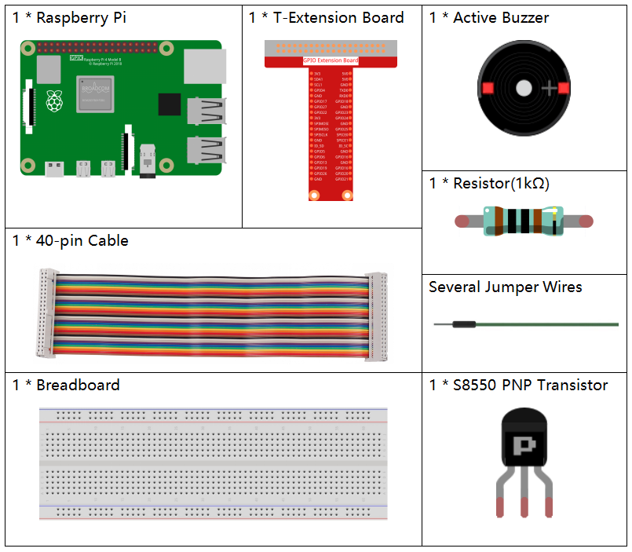
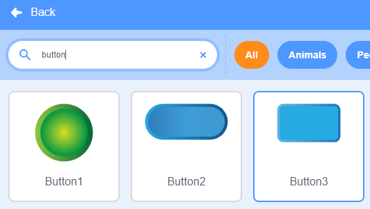
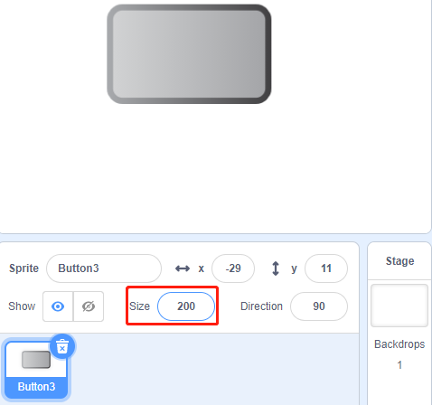

.. note::

    ¡Hola! Bienvenido a la comunidad de entusiastas de SunFounder para Raspberry Pi, Arduino y ESP32 en Facebook. Únete a otros apasionados y profundiza en el mundo de Raspberry Pi, Arduino y ESP32.

    **¿Por qué unirte?**

    - **Soporte Experto**: Resuelve problemas posventa y supera desafíos técnicos con el apoyo de nuestra comunidad y equipo.
    - **Aprende y Comparte**: Intercambia consejos y tutoriales para mejorar tus habilidades.
    - **Acceso Exclusivo**: Obtén acceso anticipado a anuncios de nuevos productos y adelantos especiales.
    - **Descuentos Especiales**: Disfruta de descuentos exclusivos en nuestros productos más recientes.
    - **Promociones Festivas y Sorteos**: Participa en sorteos y promociones durante las festividades.

    👉 ¿Listo para explorar y crear con nosotros? Haz clic en [|link_sf_facebook|] y únete hoy.

1.7 Timbre
============

Hoy haremos un timbre. Al hacer clic en el sprite del botón3 en el escenario, el zumbador sonará; si haces clic nuevamente, el zumbador dejará de sonar.

.. image:: img/1.13_header.png

Componentes Necesarios
------------------------

Construye el Circuito
-------------------------

.. image:: img/1.13_image106.png

Carga el Código y Observa Qué Sucede
--------------------------------------

Carga el archivo de código (``1.7_doorbell.sb3``) en Scratch 3.

Haz clic en la bandera verde en el escenario. Cuando hagas clic en el sprite **Botón3**, se pondrá azul y el zumbador sonará; si haces clic nuevamente, el sprite **Botón3** volverá a gris y el zumbador dejará de sonar.

Consejos sobre el Sprite
---------------------------

Elimina el sprite predeterminado y elige el sprite **Botón 3**.

Luego, ajusta el tamaño a 200.

Consejos sobre el Código
---------------------------

.. image:: img/1.13_buzzer4.png
  :width: 400

Este bloque permite cambiar el disfraz del sprite.

.. image:: img/1.13_buzzer5.png
  :width: 400

Configura gpio17 en bajo para que el zumbador suene; configúralo en alto para que el zumbador no suene.

Aquí se utiliza el interruptor **estado**, y usaremos un diagrama de flujo para ayudarte a comprender todo el código.

Cuando se hace clic en la bandera verde, el **estado** se establece inicialmente en 0 y espera a que se haga clic en el sprite; si se hace clic en el sprite **botón3**, cambiará al disfraz **botón-b** (azul) y el **estado** se establecerá en 1. Cuando el programa principal recibe el **estado** en 1, hará que el zumbador suene a intervalos de 0,1 segundos.
Si se hace clic en **botón3** nuevamente, cambiará al disfraz **botón-a** (gris) y el **estado** se restablecerá a 0.

.. image:: img/1.13_scratch_code.png

